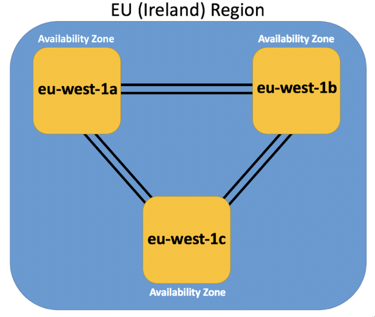

## AWS Global Infrastructure

The components of AWS Global Infra are:

- Availability Zones (AZs)
- Regions
- Edge Locations
- Regional Edge Caches

**Availability Zones (AZs)**

- Physical data-centers of AWS
- Multiple Physical data-centers close enough together form one Availability Zone
- Each AZ will have at least nearby sister AZ(probably in nearby city) which is connected via very low latency private fibre optic
  - Note Both AZ will be separate power resources and network connectivity
  - This is all because of resilience and availability purpose.
- Making use of 2 AZs in one Region ensures your infra remains stable, available, and resilient even in worse times

**Region**

- Collection of AZs that are located geographically close to each other
- Every Region works independently of others and will have atleast 3 AZs
- Having global regions allows organisation to comply with local laws to store data
- Use mulitple region if you are a global organisation and downtime may cost money
- Currently there 20 Regions and 61 AZs. (Note : this number may have changed)
- Note : not all services are available in every region. IAM and CloudFront are global Services
- AWS GovCloud is a region only available to approved US Companies
- Naming convention of region : region-direction-number

**Edge Locations :**

- AWS Sites deployed in Major Cities and highly populated areas across the globe.
- Outnumber AZs
- Utilised for services such as CloudFront and Lambda to cache data and reduce latency for end-users by using Edge Locations as CDN.

**Regional Edge Cache**

- These Edge Location sit between your CloudFront Origin servers and the Edge Locations.
- Large Cache-width than each of individual Edge Locations
- Data is retained at Regional Edge Cache while it expires at Edge Locations

