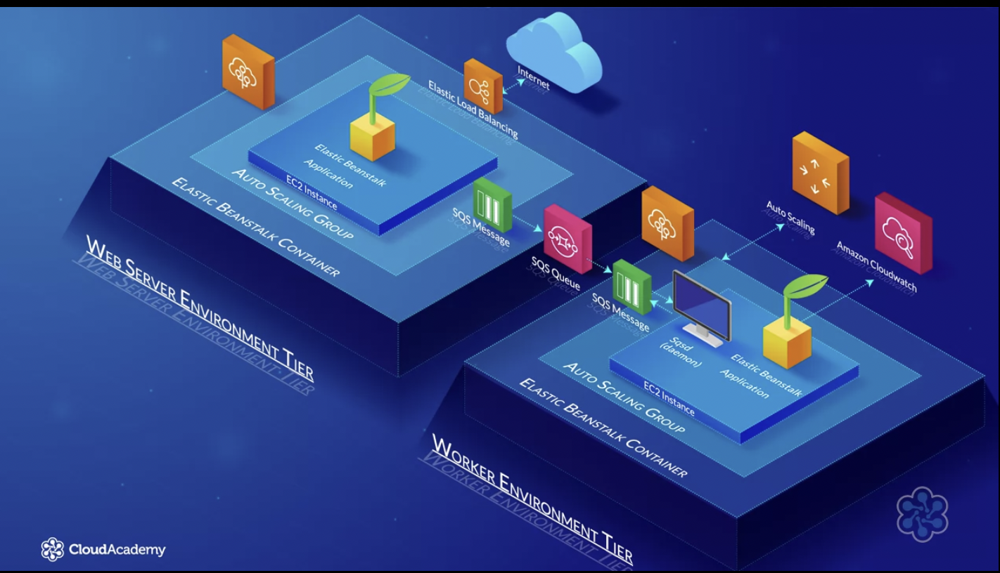
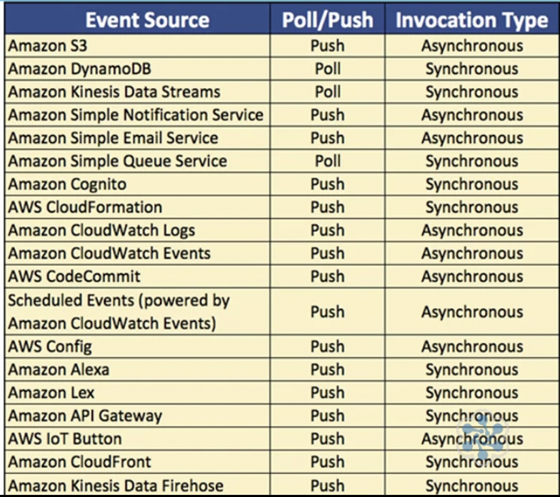

## Compute

#### What is Compute ?

Physical Server within a data center would be considered as Compute resource as it may have multiple CPUs/GBs of RAM.

[Resource Link](https://aws.amazon.com/products/compute)

### Amazon EC2

EC2 allows you to deploy virtual servers within your AWS environment.

Components

- Amazon Machine Images (AMIs)
  - templates of pre-configured EC2 Instance for quick setup
  - you can create your own AMIs for deployments
  - AWS Marketplace : market to buy from AMIs from trusted vendors like Citrix,etc
  - Community AMIs
  - Instances : Micro (small) , General Purpose, Compute Optimized, GPU, FPGA (genomics, financial), Memory Optimised Instances
- Instance Purchasing Options : 
  - On-Demand : Launched at any time, usually short-term uses
  - Reserved : set period of time purchase for reduced cost
  - Scheduled : similar to reserved instance but recurring/ fixed schedule
  - Spot : Bid for a unused EC2 compute resources, fluctuating price
  - On-Demand Capacity Reservations : Reserve capacity based on platform, tenancy and area availability
- Tenancy
  - Shared Tenancy : EC2 is launched on any available host with required host, same host may be used by multiple customers.
  - Dedicated Instances : hosted on hardware that no other customer can access
  - Dedicated Hosts : Additional visibility and control on physical host

- User Data : allows to enter commands that will run during the first boot cycle of instance.
- Storage Options : Purely varying option as per need
  - Persistent Storage : Available by attaching EBS volume (network attached devices served by AWS network)
  - Ephemeral Storage : Created by EC2 instances using local storage : Physically attached to underlying host. All data gets terminated if you stop or terminate the instance, while during reboots data remains intact.

- Security
  - Security Group : Creates a security network rules which govern ingress/egress traffic.
  - Public Key/ Private Key

#### EC2 Autoscaling

We can setup scaling up and down based on CPU Utilization and helps size of EC2 fleet be cost effective.

- Automation
- Greater Customer Satisfication
- Cost reduction

Components of EC2 Auto Scaling

1. Create a Launch Configuration/Template
2. Create a Auto Scaling Group

### AWS Elastic Beanstalk

*AWS Elastic Beanstalk is an AWS managed service that automatically provisions and deploys resources required to run web application based on uploaded source code.*

Resources : AWS services and features such as EC2, Route 53, Auto Scaling, Health-Monitoring and ELB (Elastic Load Balancing)

AWS Elastic Beanstalk can operate with different platforms and lanaguages : Packer Builder, Single Container Docker, MultiContainer Docker, Preconfigured Docker, Go, Java SE, JAVA with Tomcat, .NET on Windows Server with IIS, Node.js, PHP, Python, Ruby.

**Note: AWS Elastic Beanstalk is free, only the resources that are created will cost money according to their charges. **

- Application Version : A specific version/section of code
- Environment : refers to application version taht has been deployed on AWS, comprised of all the resouces created by ECB
- Environment Configuration : Collection of parameters and settings that control environment
- Environmnet Tier : how Elastic Beanstalk provisions resources based on the application
- Configuration Template : provides baseline for creating a new, unique, environment configuration
- Platform : combination of components on which we build our Application like OS, Language etc.
- Application : collection of different elements like environment, environment configuration, etc.

#### Environment Tiers

Reflects on how Elastic Beanstalk provisions resources based on what the application is designed to do.

- HTTP Requests ---> Web Server Environment
- SQS Queue ---> Worker Environment

##### Web Server Tier

- Typically used for standard web application serving requests over **port 80**
- This tier typically uses following services and features : **Route 53**, **Elastic Load Balancer**, **Auto Scaling**, **EC2** Instances and **Security Groups**.

- A host manager is installed on every EC2 Instance
- **Host manager** responsibilities includes
  - Aid in deployment of application
  - Collecting different metrices and different events from EC2 instances which can be reviewed from within the console, or vial AWS CLI or API
  - It generates instance level events
  - It monitors both the application log files and application server itself
  - It can be used to patch instance components
  - manages log files allowing them to be published to S3

##### Worker Tier

- Used by application that will have a backend processing task, interacting with AWS SQS
- This tier typically uses the following AWS resources in the environment : **SQS Queue**, **IAM service roles**, **Auto Scaling** and **EC2** Instances

- A minimum of one EC2 instance is used and is attached to auto scaling groups
- Each EC2 instance in the environment will read from the same SQS Queue
- A **daemon** is installed on every EC2 instance to pull request from the SQS queue
- You can develop and add your **own** Elastic Beanstalk configuration files withing your application **source code**. These file need to be save as `.config` file extension and stored withinn `.ebextensions` folder of source code.

#### Deployment Options

- All at once (Default Option) : Abruptly resources deploy the application
- Rolling : minimise disruption and deploys in batches (2 versions of application up at a time)
- Rolling with Additional Batch : updated in batched until all resources have the new update, added batch ensures application availability
- Immutable : create an entirely new set of instances and serve through a temporary autoscaling group behind your ELB

#### Health Monitoring

- Basic Health Reporting

  - High level overview of how environment is performing
  - resources will send metrices to Amazon CloudWatch in 5 minutes interval
  - 4 colors within AWS Elastic Beanstalk dashboard that show the health status
  - Every 10s ELB will send a health check request to every instance in the auto scaling group and wait for response to confirm health status

  - For single instance environments the health of instance is determined by its EC2 instance status check
  - Elastic Beanstalk will ensure that in a web environment, an autoscaling group has a min of 1 instance running that is healthy
  - Check to ensure the CNAME in Route 53 is redirected to correct ELB
  - Check the security groups for EC2 instances that allows port 80 inbound
  - In worker environments, check to ensure SQS queue being used is being polled every 3 minutes at a minimum.

- Advanced Health Reporting

  - Enhanced health monitoring display additional information to that over basic
  - AMIs used for EC2 instances have a health agent installed and running
  - Health Agent Captures additional Information about system metrices & logs
  - Metrices can be sent to AWS CloudWatch as custom metrices, for additional cost

### AWS Lambda

It is serverless compute service that allows you to run your application code without having to maange EC2 instances.

Responsibility to maintain and administer the EC2 instances is passed over to AWS to manage for you.

Only pay for compute power when Lambda is in use via Lambda Functions. AWS Lambda charges compute power per 100ms of use only when your code is running, in addition to the number of times your code runs.

Four Steps to Operation

- Write/Upload source code to Lambda
- Configure your Lambda functions to execute upon specific triggers from supported event sources (like file upload on s3 bucket)
- Once triggered, Lambda will run code using required compute power
- AWS records the compute time in milliseconds and the quantity of Lambda functions run to ascertain the cost of service.

Components for AWS Lambda

- Lambda Function : parts of our own code that want Lambda to invoke
- Event Sources : AWS services that can be used to trigger Lambda Function
- Downstream Resources : resources that are required during the execution of your Lambda function
- Log Streams : helps to identify issues and troubleshoot issues with your Lambda functions

*Always use 644 permissions on zip file uploaded to Lambda*

#### Event Sources

An event source is an AWS service that produces the events that your Lambda function responds to by invoking it

- Push Based Services : BucketS3, CloudWatch, etc.
- Poll Based Services : Amazon Kinesis, Amazon SQS, Amazon DynamoDB, etc.

Event Source Mapping : configuration that links events source to Lambda function

- Push-based service : mapping is maintained within event source
  - requires specific access to allow your event source to invoke the function
- poll-based service : configuration mapping is held within lambda function
  - Permission is required in the execution role policy

Synchronous Invocation :

- It enables you to access the result before moving onto the next operation required
- Controls the flow of invocations
- Poll Based event sources are always synchronous while push based events it varies with service.

#### Monitoring and Troubleshooting

Monitoring statistics related to Lambda function with Amazon CloudWatch is by default already configured. This also includes monitoring your function as they are running.

Mertices : Invocations, Errors, Dead Letter Errors (SQS Queues drop), Duration, Throttles, Iterator Age, Concurrent Executions, Unreserved Concurrent Execution.

