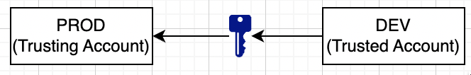
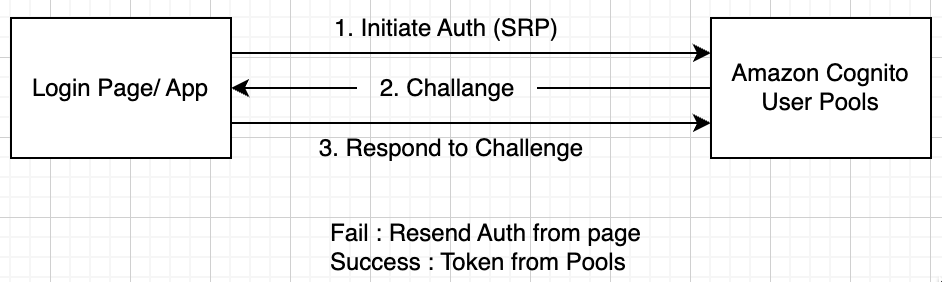
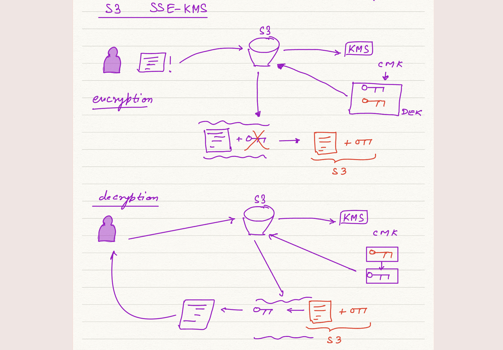

## Security, Identity and Compliance

### AWS IAM

**What is Identity and Access Mangement**

- Identity : more related to “who” you are.
- Access Management : more related to “what” you can do.

**Access Control :** method of accessing secured resources.

**IAM Features**

- provides the component to maintain this management of access, but it is only as strong and secure as ***you configure it***.
- Best Practices
  - Priniciple of Least Priviledge Access
  - Enable Identity Federation (SSO, SAML, etc)
  - Enable MFA (Multi-Factor Authentication)
  - Rotate Credentials Regularly
  - Enable IAM Access Analyser

**Users : ** Identity Object (arn) : Real person or application

**User Groups :** Object : Collection of *IAM Users* and *Associated Policies*. 

- These policies allow **authorised** group members access to certain AWS Resource.
- There is no **authentication** involved in groups.

**Roles :** Allows IAM users/other application and services to adopt a set of temporary IAM permission to access AWS Resources

- Identity with access to associated objects.
- Are not associated to a person, they are supposed to assumed by a user.

**Policies :** 

- AWS Managed Policies : Library of usable policies
- IN-Line Policies : written by consumers. Associates with a user/role.

- These can be applied to User Groups and Roles

**Identity Providers : ** Auth, SSO, SAML, etc.

**Password Policies : ** applies to all users.

**Cross Account Access** : 

1. Create a new role within trusting account(prod).
2. Specify permissions attached to this newly created role which users in dev will assume to carry out tasks and actions
3. Switch to Trusted Account (dev) to grant permissions to develop to allow them to use newly created roles in Trusting Account (prod)
4. Test the configs by Swithching Roles.

- Dev Account temporarily gets access to Prod Resources through above process. (For Security and Compliance)

**IAM Policy Types**

- Identity Based : Users, User-Groups, Roles
- Resource Based : Resources (principal to config user identity)
- Permission Boundaries : Roles/Users only
- Organization Service Control Policies (SCPs) : Boundary of Max. Permission

### Amazon Cognito

- An authentication and user management service
- has strong integration with 3rd-party providers such as Apple, Facebook, Google and Amazon
- allows federating identity from your own Active Directory Services

**User Pools : ** 

- To create and maintain directory of your users for mobile and web applications

- Deals with both signing up, and signing in, your new & returning users.

- **User Pools Auth Flow**

  

**Identity Pools**: 

- Provide Temporary access to AWS crendentials for users or guests
- Can work in tandem with User Pools, allowing users to operate & access whatever specific feature they need from AWS

### KMS (Key Management Service)

Types of Encryption

- Symmetric : Same Key decrypts and encrypts data.
  - Not Safe for secure communication
  - Ex : AES, Blowfish, DES, Triple DES, etc.
- Asymmetric : Private/Public Key craeted at same Time. 
  - Ex : RSA, Diffie-Helman, Digital Signature Algorithms, etc.

**KMS : ** managed service, used to craete and store encryption keys that are used by other AWS Services and Applications

- KMS is only for Encryption at Rest. Use **SSL** for data in transit.
- KMS is multi-region service now.

#### CMK (Customer Master Keys)

- Can Encrypt data upto 4KB in size
- Typically used in relation to DEK
- CMK can generate, encrypt, decrypt these DEK

Types :

- Customer Manged CMKs : Greater flexibility
- AWS Managed CMKs : used by AWS Services

**DEK : ** Data Encryption Keys can encrypt your data of any size.

**Key Policies : ** tied with CMKs, resource bassed policies. Each different CMK will have different policies.

- Key Policies defines who can use and define keys in KMS

**Grants : **

- controlling access and use of the CMKs held within KMS
- allows to delegate a subset of your own access to CMK for principals
- less risk of someone altering the access control permission of CMK

To manage access to your CMK, you must use a key policy associated with your CMK.

Can’t be generated by IAM alone.

- Key Policies : Resource based policy tied to your CMK json
- Key Policies with IAM Role : 

- Key Policies with Grants : resources based policy to delegate your permissions to another AWS principal with your AWS Account.