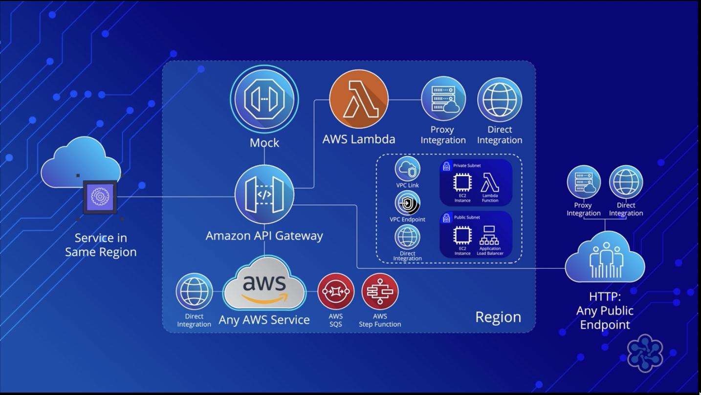
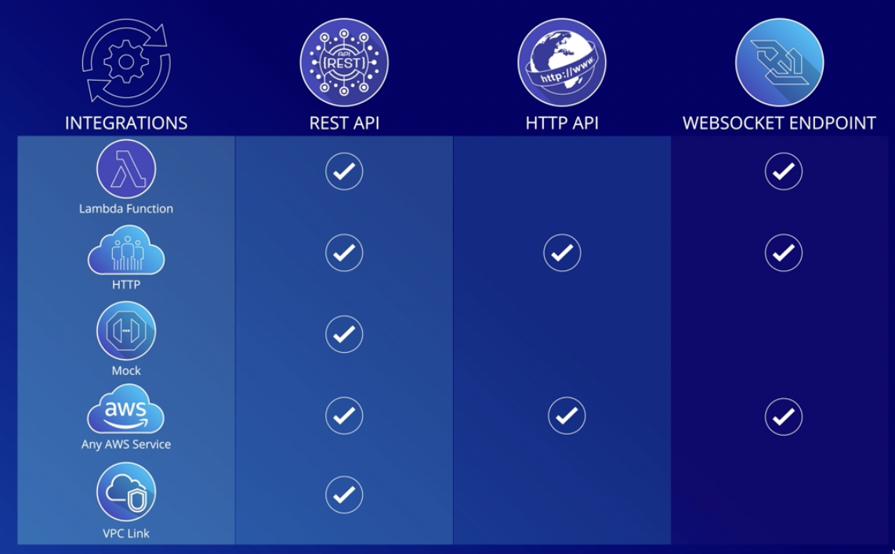
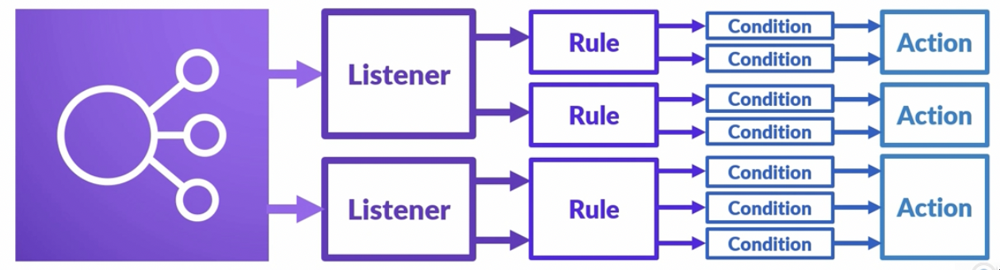

## Network & Content Delivery

### What is an API ?

API : Application Programming Interface, provides users or programs a clean and clear method of interacting with the underlying service.

Internet is based on Request/Response model based on HTTP protocols.

Most common requests are : GET, POST, PUT, DELETE. Response codes are returned are 1xx,2xx,3xx,4xx,5xx.

- 1xx ~ Information
- 2xx ~ Success
- 3xx ~ Redirection
- 4xx ~ Client Error
- 5xx ~ Server Error

HTTP is a communication protocol, while REST API set of constraints defined on a communication protocol. REST : Representational State Transfer. REST is more like an architecture design pattern, it could easily be build upon other protocols like TCP. Just because of a lot of usage with HTTP it is used interchangeably with HTTP.

- Lightweight, loose coupling between client and server.
- No assumptions by client or server.
- Requests should not be stored by server.
- Clients can only access resources using URI

### Amazon Gateway

Amazon API Gateway provides complete solution related to publishing, maintaining, monitoring, building and securing an API using its services.

It supports serverless, generic servers and containerized workloads.

You don’t need to manage infrastructure and its cost effective as you pay for what you use.

How does requests come into the API ? API Endpoints

- Edge-Optimized API Endpoint
    - many geographically distinct and distributed clients
    - all requests are forwarded to closed cloudfront
    - reduces TLS overhead and overall improves response speeds

- Regional API Endpoint
    - when user wished to use their own CDN or doesn’t want to use CDN

- Private API Endpoint
    - can only be accessed within VPC, microservices or internal applications

#### Supported Protocols

1. HTTP (REST) Endpoints

   - REST Api : 
     - Single price for all inclusive features to manage, publish API

   - HTTP API (NEW)
     - Building proxy APIs for AWS Lambda or any HTTP endpoint
       - Building modern APIs that are equipped with OIDC and OAuth2
       - Workloads that are likey to grow very large APIs for latency-sensitive workloads

2. Websocket Endpoints
   - Creates real-time communication apps
   - requires a good connection
   - use case specific

#### API Integration

Two ways to do API Integration

1. Proxy Integration : 
   1. easy to setup
   2. almost everything is handled in the backend service
   3. great for rapid prototyping
2. Direct Integration :
   1. Decouples Amazon API Gateway for backend’s request and response payloads, headers and status code
   2. Make changes and not be locked into the backend service’s response

#### Integration Types

[Pictures : From CloudAcademy :)]

#### API Gateway Authorizers

- IAM Authorizer
    - client requirements : signature v4, “execute API” permissions
    - rest api, http api, websocket endpoints
- AWS Lambda
    - legacy or third party auth providers
    - rest api, http api, websocket endpoints
- Cognito Authorizer
    - complete auth solution
    - only rest api
- JWT Authorizer
    - Auth2 compliant anything like openID authorizers
    - only with http

AWS WAF are available by default protects users APIs using DDOS prevention.

#### API Management and Usage

You can set up for consumers usage plans like, premium user and basic user. 

API keys can be distributed to consumers and can manually be set up with throttling and quota for consumers.

Only Rest API versions can access this feature.

#### Caching Responses

Builtin into the API Gateways, useful for speed and costs. TTL can be setup between 0 and 3600 seconds. Usually having 1sec cache can greatly improve application.

Only Rest API version can access this feature.

#### Monitoring Metrices

These metrices can be sent to Cloud Watch where it can visualised, set and alarm and do multiple things with the exam.

- CacheHitCount
- CacheMissCount
- Count
- Integration Latency
- Latency

Rest API being expensive features niche features but HTTP API is most cost friendly.

### Amazon CloudFront

AWS’s fault-tolerant and globally scalable content delivery network service. It provides seamless integration with other Amazon Web Services to provide an easy way to distribute content.

Speeds up distribution of your static and dynamic content through its global network of edge locations which answer to closest user rather than the source increasing overall speeds.

Its main aim is distribution, not to store data for you. Its more used to cache data.

CloudFront uses distribution to control which data needs to be distributed.

- Web Distribution
    - Speed up static and dynamic content
    - distribute media files using HTTP or HTTPS
    - add, update or delete objects and submit data from web forms
    - use live streaming to stream an event in real-time
- RTMP Distribution
    - distribute streaming media services, adobe flash media services
    - resource data can only stored in s3 bucked not ec2 instances

If using an S3 bucket as origin, then for additional security you can create a CloudFront user called an **origin access identity** (OAI)

This OAI can access and serve content from your bucket.

### Elastic Load Balancer (ELB)

ELB manages and controls the flow of inbout requests destined to a group of targets by distributing these request evenly across targeted resource group.

Targets could be fleet of EC2 instances, Lambda function, range of ip addresses and even containers.

Targets could be from different zones.

There are three types of Load Balancers

- Application Load Balancer
    - for web application running HTTP or HTTPS
    - operates at request level
    - Advanced routing, TLS termination and visibility features targeteted at application architecture
- Network Load Balancer
    - ultra high performance while maintaining very low latencies
    - operates at the connection level, routing traffic to targets within your VPC
    - handles millions of request per second
- Classic Load Balancer
    - used for application that were built in the existing EC2
    - Classic environment

#### ELB Components

- Listener : for each load balancer we must configure at least one listener
- Target Groups : group of resource where traffic is routed by ELB
- Rules : defines how an incoming requests gets routed to which target group

All listeners ends up to a single actions.

Health check of Target Groups can be taken to check if target is healthy for traffic or not

Internet facing ELB : shields servers from external traffic and then route traffic accordingly.

Internal ELB only responds to traffic withing VPC only

### SSL Server Certificates

When using HTTPS as listener 

- HTTPS allows encrypted communication channel to be setup between clients initiating the request and your ALB
- To allow your ALB recieve encryted traffic over HTTPS it will need a server certificate and an associated security policy
- SSL (Secure Sockets Layer) is a cryptographic protocol much like TLS (transport layer security). 

The server certificate used by ALB is X.509 certificate, which is digital ID provisioned by Certificate Authority such as AWS certificate Manger (ACM)

This certificate is used to terminate the encrypted connection recieved from the remote client, and then the request is decrypted and forwarded to the resources in the ELB target group.

#### Application Load Balancer

ALB operates at layer 7, the application layer in OSI Model. It provides application processes or services it offers are http, ftp, smtp and nfs.

Target groups can be configured to respond to different protocols.

#### Network Load Balancer

Conceptually both are same but Network Load Balancer sits right at layer 4, Transport Layer. It operates and balancer request purely based on UDP/TCP protocol.

NLB cross-zone load balancing can be enabled or disabled.

#### Classic Load Balancer

Its supports all TCP, SSL/TLS, HTTP and HTTPS protocols. It lets you load balancing an existing applciation running in EC2 classic network.

EC2 classic is no longer supported for newer AWS accounts.

It supports sticky sessions using application-generated cookies.

