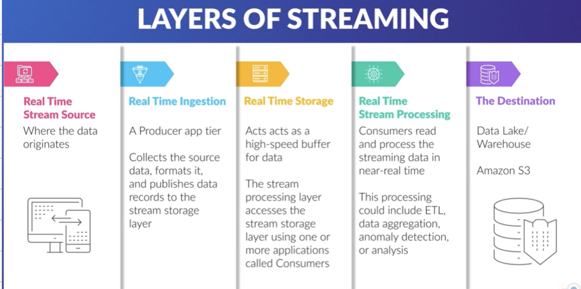
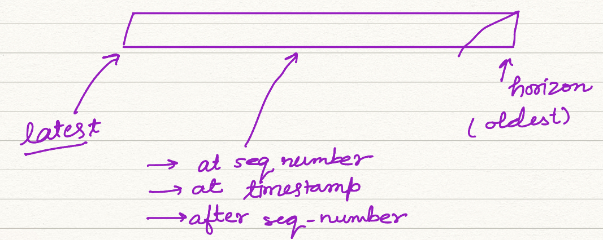

## Analytics

- Amazon Kinesis was desinged to address complexity and costs of streaming data in AWS cloud
- Data in Cloud is processed by Kinesis. (Event Logs, Social Media Data, Clickstream data, App Data, IOT Sensor Data)
  - Connect
  - Process
  - Analyze
- Processes in real time or near real time.
- Amazon Kinesis processes
  - Video Streams (binary encoded)
  - Data Streams (base64 encoded)
  - Data Firehose (base64 encoded)
  - Data Analytics (base64 encoded)

- Layers of Streaming
  - Source
  - Stream Ingestion (Kinesis Agent/Producer Library/ SDK)
  - Stream Storage (Kinesis Data Streams) : Data here is *immutable*, Data only expires (24hrs-365days).
  - Stream Processing (Kinesis Data Analytics/Data Firehose/Consumer Library)
  - Destination

#### Amazon Kinesis Video Streams

- Stream binary encoded data (not limited to video only)
- AWS SDK makes it possible to securely stream data into AWS for playback, storage, analytics, ML or other processing
- supports WebRTC --> 2 Way communication
- *doesn’t have ability to autoscale*
- Kinesis Producers can be created using : AWS SDKs, Kinesis Agent, Kinesis API, Kinesis Provider Lib

**SHARD** : contains sequence of data records namely : (Sequence No, Partition Key, Data Blob)

- There is a charge for retrieving data older than 7 days from a Kinesis Data Stream using this API : `GetRecords()`
- There is no charge for long term data retrieval when using *Enhanced Fanout Consumer* : `SubscribeToShard()`

Consumer can consume data using two methods

| Classic               | Enhanced Fanout                                              |
| --------------------- | ------------------------------------------------------------ |
| pulls data from shard | push method : subscription method                            |
| Polling               | shard limits are removed                                     |
|                       | every consumer gets 2 mbps of provisioned throughput per shard |

### Kinesis Data Firehose

- fully managed data delievary service
- Ingested data can dynamically
  - tranformed
  - scaled auto
  - auto delivers
- uses producers to load data streams in batches once inside the stream data is delieverd to a data store
- There is no need for custom code or application to processes data in data streams
- Buffer Size : 60-900s
- Data Stores : Elastisearch, RedShift, S3, Splunk, Generic HTTP Endpoints, MongoDB, DataDog, New Relic
- No Free Tier
- Costs are incurred when data is in stream
- There is no bill for provisioned capacity, only used for capacity

### Kinesis Data Analytics

- Ability to read from streams in real time and do aggregation and analysis on data while it is in motion
- leverages SQL Queries (Firehose) or Apache Flink (Data Streams)
  - Uses Java/Scala to do time series analytics, feed real time dashboard & metrices
- Use Cases ETL, generation of const metrices and doing real-time analytics
- No free tiers

### Fundamentals of Stream Processing

- Not all data is created equally, its *value changes over time*
- traditionally data is stored in RDS or Enterprise cloud server which is later processed in batches

**Batch Processing :** data is collected, stored, and analyzed in chunks of fixed size on a regular interval

- regular interval depends on freq of data collection, relative `value`(*Central Idea of this concept*) of insight gained
- Advantages
  - Evenly Spaced
  - Predictable
- Disadvantages
  - Has no intelligence. (session intermixing due to fixed batch size)
  - Wait until specific amount of data is accumulated

**Stream Processing** : solves latency, session boundaries and inconsistent loads

- DataSources : Application, Networking devices, server log files, web activity, location
- Events are recieved from stream which in turn can do any of of following
  - Trigger an action
  - update an aggregate or similar statistic
  - cache the event for future reference

**Consumers :** Application that process the data from stream, can create new streams too.

- Stream Application has 3 important parts
  1. Producers
  2. Data Stream
  3. Consumers
- Benefits of Streaming Data
  - Never ending streams of data
  - best processed in flight (realtime)
  - limited storage capacity (price)
  - detect patterns, inspect results, intermix streams
  - reaction in RealTime (no logs)
  - Decouples architecture and improves operation efficiency
- Benefits of Batch Application
  - predictable in terms of pricing/cost
  - response is not required to be *instant*

#### A Streaming Framework :

- Common use cases of streaming data : Industrial Automation, Smart Home, log analytics, datalakes, IOT
- Events : Search result, financial transactions, user activity, Telemetry data, log files, application metrices.
- data is processed in motion
  - MI/AI applications
  - trigger other events
- Data is immutable, consumer subscribe and create new stream out of it.
- Stream matches real world application high velocity and volume data

Use Cases for data Streaming

- Clickstream Analysis
- Preventive Maintenance
- Fraud Detection (used by credit card companies)
- Sentiment Analysis (ML/AI Applications)
- Dynamic Price Engine



Challanges

- “High Touch System” : very difficult to automate
- difficult to setup : `# of moving parts`
- Expensive
- Issues with scaling operation

Streaming as a managed Service : *Amazon Kinesis*

- Minimize chance of data loss
- Provision resources automatically on request
- fully scalable (not shards)
- highly integrated with AWS

### Elements of Kinesis Data Stream

- No free tier, cost is for `open shards` and for Data Records stored in stream

Creating an AWS Kinesis Stream

```bash
aws kinesis create-stream --stream-name myStream --shard-count 3
```

Other important flags : `--describe-stream-summary`

- Each shard has unique id, hash key range (unique) and doesn’t overlap
- Capacity of each shard is limited to 1000 each shard
- Concept of *Hot Shard* <-- lots of data records go into one shard. 
  - ***Resharding*** is used to add more shards for increasing throughput limit of 1000 Records
- Data Retention Period : 365 days (earlier 24 days)
- Data Stream Limitations
  - Max Size of 1 MB (for Records)
  - Shard can accept 1k records/s
  - default retention : 24hrs
  - size of data records cannot be increased but retention period can be extended upto 7 days for additional charge upto a year
- Producer(writes) ----> Shard
  - limitation : 1MB/s per shard
  - returns : `ProvisionedThroughputExceededException`
- Consumers
  - Classic Consumer : 2MB/s read
    - Throttle if read more than 2 MB/s
    - polls data
  - Enhanced Fanout Consumer : 2MB/s read
    - can’t pull data of shard
    - keeps requesting subscribe to stream call
    - uses HTTP/2
    - utilised a push mechanism

#### Shard Capacity and Scaling

2 types of limits

1. Write Rate : 1k records/s ~ 1MB/s
2. Std Consumer : 5 txn at 2MB/s

- It becomes essential to utilise all shards equally basically there should not be hot/cold shards
- Total throughput = Sum of all shards
- Kinesis streams are elastic but scaling is not supported/managed by AWS

**Shard Splitting** : adds throughput, increases capacity by 1 MB/s and can be used to divide hot shard

- For splitting shard is closed (to stop producer from writing), data stays till its expires(consumers can read data till shard split happens)

**Merging Shards** : useful for cold shards to reduce costs

***Resharding*** is managed programitically using API

- Update Shard Count
- Split Shard
- Merge Shard

**Update API Limitations**

- Max Number of Shards : double of current shard cnt
- Min Number of Shards : half of current shard cnt
- Max of 10 times reshard in 24 hrs
- Not possible to scale past shard limits

default shard quota

- AWS US East/West or AWS Europe : 500/account
- other regions : 200/account
- This quota can be increased by talking to Amazon Tech Support

*10k shard is default hard limit of Kinesis*

### Kinesis Data Stream

- A real time data ingestion service from AWS “Stream Storage Layer”
- firehose (needs to be prefixed by lambda) easier to work with S3
- Putting data in Kinesis Data Stream, requires 3 inputs : Stream Name, Partition Key, Data
  - `putRecord()`
  - `putRecords()` (preferred)
- 200ms min time consumers can request data
- 5 locations to access shards from consumers
- Data Stream Design



**Retryable** : Exponential Back-off (Retry Timer)

- partial failures are considered as success so don’t rely on 200 response

**Network Latency: **

- Traffic spikes may put records in streams unevenly which results in spikes in throughput
- use interface VPC endpoint to normalize traffic
- Producer ----> VPC Endpoint ----> Data Stream
- handle Backpressure (resistance to flow of data) to relieve stream of spikes.

**KPL** : Kinesis Producer Library for putting data in stream

**SDK** : helps keeping cost calculation simple

- KPL can do data aggregation while KCL can do deaggregation
- KPL improves throughput and reduces cost

- KPL has builtin retrying functionality
- KCL has a checkpoint feature which keeps track of resume point in case of client failure.
  - Amazon DynamoDB tracks subsequence, can be a throttle subsequence

#### Kinesis Data Stream Security

Principle of Least Privilege is still very important.

1. Organisational
2. Technical
3. Personal

- Real about IAM, Access and Management
- Defaults : deny (permissions)
- Policy to grant acess
  - Effect : allow/deny
  - Action :
  - Resource : ‘arn:aws....’

IAM Best Practices through 4 policies

- Administrators : Create/Delete/Tags

- Stream Resharding : Merge/Split
- Producers : Writing, Put, Describe
- Consumer : Read, Get

Kinesis Data Streams can be encrypted using HTTPs Endpoints : Using KMS

- FIPS : Federal Infromation Processing Standard