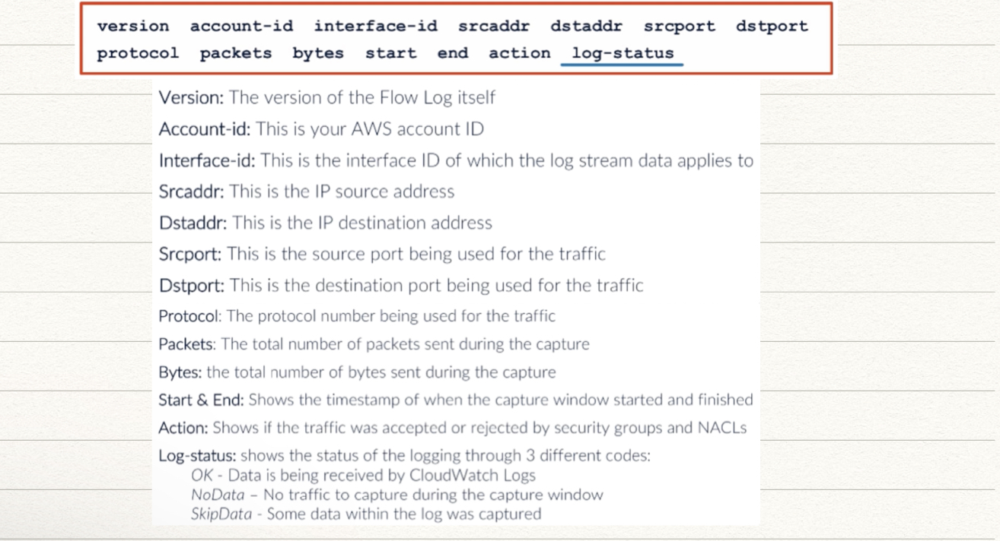

## Management and Governance

### Amazon Cloudwatch

- window to monitor (Health, Operation Performance) of your (Apps & Infra).
- By window ---> Meaningful data ---> Insights on Manual or Automated responses (changes/modification to apps or Infra)
- Cost : 5 min free metrices for EC2
- Every minute insights costs fee

Different Services

- CloudWatch Dashboards
- CloudWatch Metrices and Anomaly Detection : One of the reasons AWS is famous !!
- CloudWatch Alarms (automated action based on several condition) : SNS, SQS, SQE
- CloudWatch EventBridge (Connect ot other AWS services based of events), Rules(event bus) ---> Target
- CloudWatch Logs (Real Time Monitoring)
- CloudWatch Insights (Container Lambda logs)

### CloudWatch Dashboards

- Can be created by yourself or generated automatically.
- can use visual editor to play with widget or programatically (JSON)
- Line, Stacked Area, Number, Bar, Pie charts, Text Widget, Log Tables, Alarm Status.
- Can apply general mathematical operation on graph like normalization etc
- 3 Dashboard with 50 widgets are free more than that is 8$/month per dashboard

Best Practice

- Large Graphs for important graphs
- Keep all metrices in single screen
- Display Timezones (UTC) - Teams may be in different TZ
- Annotate but not point entire ROME on it

### CloudWatch Anomalies Detection

- powered by machine learning
- Automates creation and maintenance of cloudwatch alarms
- learns from past data, so model improves over time
- **FUNNY STORY :** EC2 was left idle for a long time and when used after a while will be treated as anomaly.
- Intially model maybe jancky, gets better eventually

### CloudWatch Subscriptions

- Centralised Realtime feed of logs which can be filtered from Cloudwatch to trigger events on other AWS Services (S3, Firehose, Kinesis)
- Filter (log group name, filter pattern, destination, role arn, distribution method)
- can be shared among vairous aws accounts

## AWS Cloudformation

*Very important topic recently, was asked 10 question from this topic along  :)*

- dashboard within management console allows you to setup and config the associated resouces you are interested in
- dashboard is helpful for simple workflows that are pretty much daily chore of multiple services --> Automate
- Use Templates `yml/json`
- Security Standards to enforce regulations
- Infrastructure Replication

Components of AWS CloudWatch

1. **Stack** : Set of AWS resources that can be provisioned/updated or deleted all at once.
2. **Template** : `json/yml` : describes env and resources to build
3. **Stack Set** : manage all stack across a number of AWS account across region
4. **Designer** : allows you to visually create env through drag n drop interface

Important Ques : What are minimum parameters needs to be defined in a Template in CloudFormation.

### VPS Flow Logs

- Capture IP traffic information that flows within your VPC
- Resolve incidents with network communication and traffic flows
- helps spot traffic reaching a destination that should be prohibited.
- VPC flow logs -----> CloudWatch
- VPC peered connection are being used, you can only see information b/t VPCs under your account

**Limitation** : Not Logged

- DHCP Traffic within VPC
- Traffic from instances destined for Amazon DNS Servers
- Traffic destined to IP Addresses for the VPC default router
- `169.254.169.254` : Amazon Instance Meta Data
- `169.254.169.123` : Amazon Time Sync
- Traffic from windows activation license from AWS
- Traffic b/t Network Load Balancer and Interface and Endpoint Network Interface

3 places to enable log 

1. Network Interface
2. VPC
3. VPC Subnets

**Flow Record Log Example**

