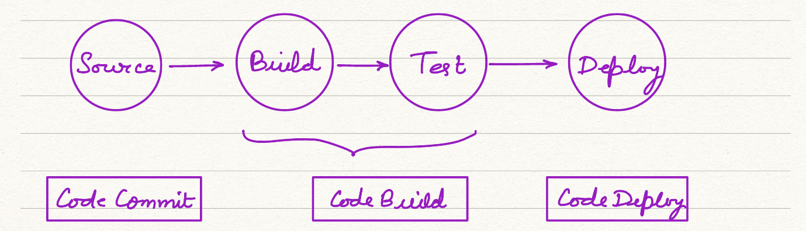
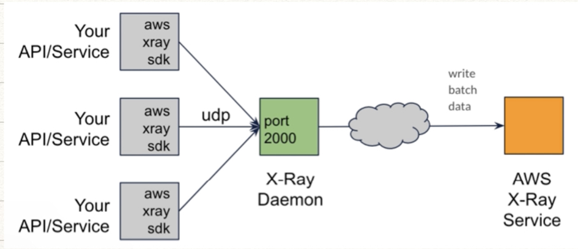

## AWS Developer Tools

### AWS CodeCommit

- fully managed private Repository Hosting
- All features of git are supported
- Integration with Cloudwatch Events, SNS Subscription
- IAM
    - HTTPS git credentials
    - SSH
- Codecommit permissions

### CI/CD Pipeline

### AWS Code Build

- fully managed build service
- uses docker build containers/allows custom images
- `buildspec file` ----> defines build artifacts(Lambda, S3 Hooks, etc) can be stored

### AWS Code Deploy

- fully managed deploy service
- it can deploy artefacts from builds
- can be automated on successful build
- Agent install ~ need to choose OS to deploy Code
- `appspec` file : (For EC2 deploy `yml`) , for lambda it can be `yml` or `json`
- deployment groups will have agent installed

### AWS Code Pipeline

- continous delievary system
- features
    - automation of build,test & release
    - manual approvals
    - pipelines history reports
    - pipeline status visualisation
- very good integration with other code services
- Pipeline Concepts : Pipeline, Stage, Action, Transition
- Action Types : Approval, Source, Build, Test, Deploy, Invoke
- Integration Options
    - Pipeline Action Types
    - CloudWatch Events
    - Invoke Lambdas

### AWS Codestar

- quickly launch CI/CD pipeline that suits your requirements
- Dashboard Visualisation
- Team Membership Management
- Issues and Ticket Tracking Management

### AWS X-ray

- Trend : Monoliths ----> Microservices
- Challange : Distributes Applications are harder to debug !!!
- *Has too many moving parts, they are difficult to keep track of efficiency issue*
- provides visibility in working microservices and trace pathways and find error, bottlenecks in application.
- X-Ray Sampling is a great way to debug performance issues in distributed applications

