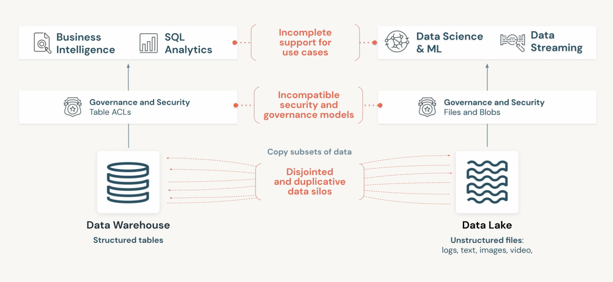
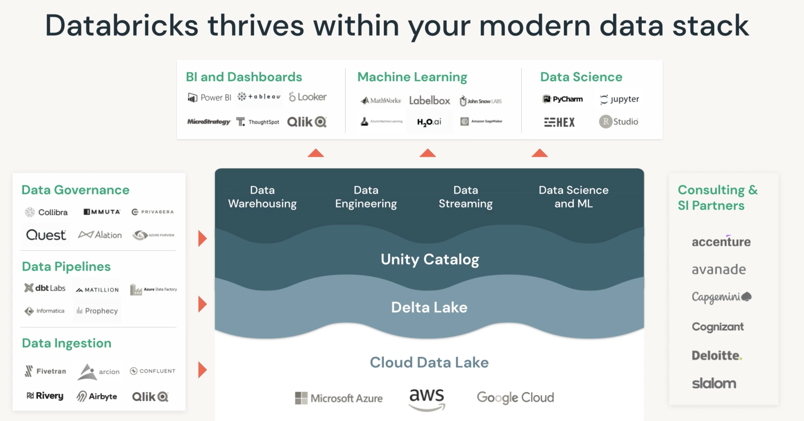
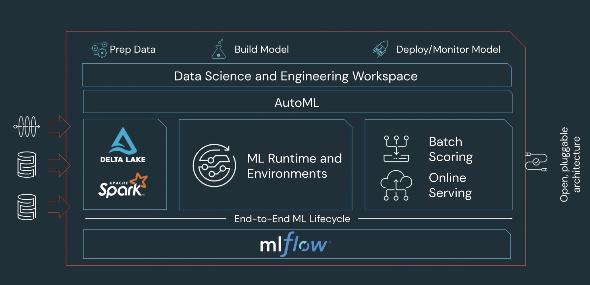

## Introduction

Databricks : The Data + AI Company

- Inventor and pioneer of the data lakehouse
- Creator of highly successful OSS data projects : Delta Lake, Apache Spark, and MLflow

The Databricks Lakehouse **Platform**

- unify all data in one place (platform)
- open source standards and format ---> no vendor lock-in

Why Databricks ?

1. Big Data is difficult to manage and more than 80% of project fail to manage big data
2. All firms require consolidated data security policy which should be government recognised like GDPR, HIPPA.
3. reduce redundancy of same data available for different use cases, makes difficult to enforce pt-2 ^

### The Lakehouse Platform

**Data Warehouse** : 

- Strengths
    - Purpose-built for BI and reporting
    - Meant to unify disparate systems
- Downside
    - Poor support for Unstructured Data, data science, AI and streaming
    - Closed and Proprietary formats
    - Expensive to scale

**Date Lake** :

- Strengths
    - Store any kind of data
    - Inexpensive Storage
    - Good starting point
- Downsides
    - Complex to setup
    - Poor BI performance
    - Can become unreliable data swamps

**DataBricks Lakehouse Platform** : Mixture of both of above paradigm.

- Simple, Open, multicloud
- ACID Txn
- Schema Enforcement
- Governance Support
- Direct access to source data (BI Data)
- Fully scalable
- Open format
- Structured, unstructured or semi-structured 
- Real time data collection and reporting

### Databricks Lakehouse Components

Data lands in organisation’s open data lake, by adding Delta lake to that you achieve lakehouse part of platform.

**Delta Lake**

- Reliability -> ACID : Quality data accelerates innovation
- Performance -> Indexing : Lower TCO with a simple architecture
- Governance -> Unity Catalog : Automation increases productivity
- Quality -> Expectation : Reduces Security Risk

Quality of Data

- Bronze : Raw ingestion and history
- Silver : Filtered, Cleaned, Augmented

### Databricks Platform Security

Databricks can directly connect to consure lake house and utilise federated access like SSO to allow users to access the Data. While users can manage their data using keys on public cloud, in databricks users don’t have to worry about certficates and encryption as its handled by databricks.

Some features for ensuring privacy :

- Optional Consumer managed VPC/VNET
- IP Access List
- Code Isolation
- Private network between data plane (managed by cloud provider) and control plane(managed by databricks in backend)
- Secure cluster connectivity

### Databricks Unity Catalog

- Unify governance across clouds : Fine grained governance for data lakes across clouds - based on open standards of ANSI SQL
- Unify data and AI assets : Centrally share, audit,  secure and manage all types of data in simple interface
- Unify existing catalogs : Works in concert with existing data, storage and catalogs - no hard migration required