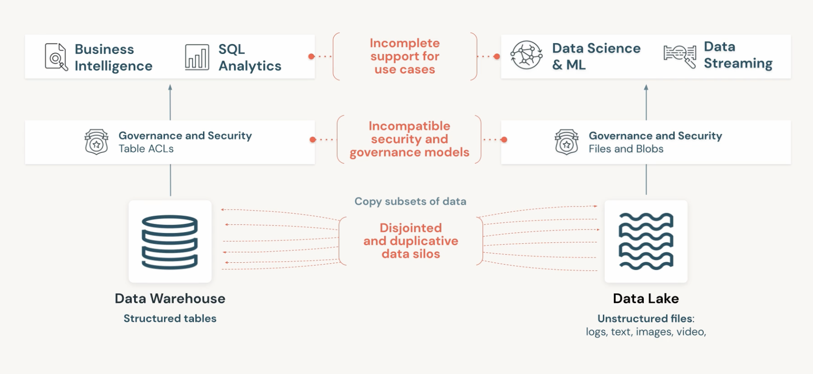
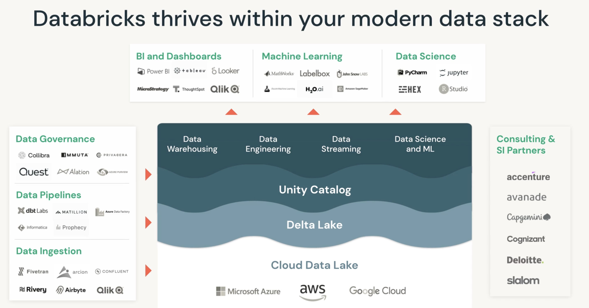
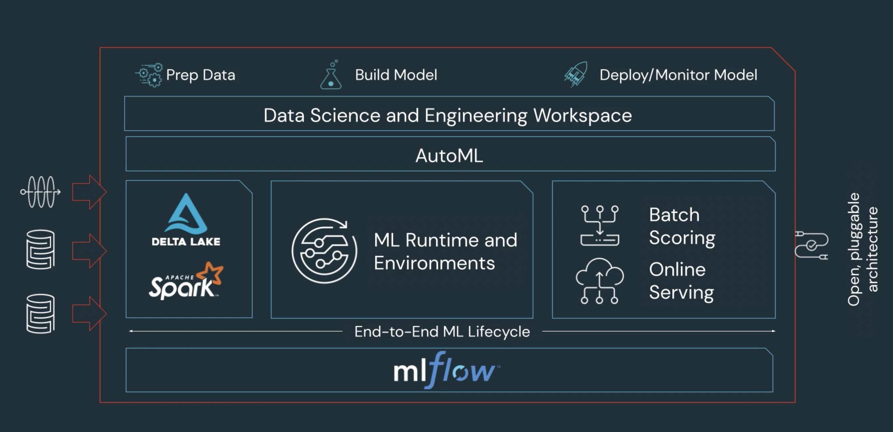

## Introduction

Databricks: The Data + AI Company

- Inventor and pioneer of the data lakehouse
- Creator of highly successful open-source projects: Delta Lake, Apache Spark, and MLflow

The Databricks Lakehouse **Platform**

- Unify all data in one place
- Built on open source standards and formats — no vendor lock-in

Why Databricks?

1. Big data is difficult to manage and more than 80% of projects fail to manage it effectively
2. All firms require a consolidated data security policy that meets regulatory standards like GDPR and HIPAA
3. Redundant copies of the same data for different use cases make enforcing those policies harder

### The Lakehouse Platform

**Data Warehouse**

- Strengths
    - Purpose-built for BI and reporting
    - Meant to unify disparate systems
- Downsides
    - Poor support for unstructured data, data science, AI, and streaming
    - Closed and proprietary formats
    - Expensive to scale

**Data Lake**

- Strengths
    - Store any kind of data
    - Inexpensive storage
    - Good starting point
- Downsides
    - Complex to set up
    - Poor BI performance
    - Can become unreliable "data swamps"

**Databricks Lakehouse Platform**: Combines the best of both paradigms.

- Simple, open, multi-cloud
- ACID transactions
- Schema enforcement
- Governance support
- Direct access to source data for BI
- Fully scalable
- Open format
- Supports structured, unstructured, and semi-structured data
- Real-time data collection and reporting

### Databricks Lakehouse Components

Data lands in an organisation's open data lake. By adding Delta Lake on top, you achieve the lakehouse part of the platform.

**Delta Lake**

- Reliability → ACID transactions: quality data accelerates innovation
- Performance → Indexing: lower TCO with a simpler architecture
- Governance → Unity Catalog: automation increases productivity
- Quality → Expectations: reduces security risk

**Data Quality Tiers (Medallion Architecture)**

- Bronze: raw ingestion and history (landing zone)
- Silver: filtered, cleaned, and augmented data
- Gold: aggregated, business-ready data used for reporting and ML

*MLflow integrates natively with the lakehouse to track experiments, manage models, and serve predictions.*

### Databricks Platform Security

Databricks connects directly to your lakehouse and supports federated access (e.g. SSO) for users. Encryption and certificate management are handled by Databricks — users don't need to manage them manually.

Key security features:

- Optional customer-managed VPC/VNET
- IP access lists
- Code isolation
- Private network between the data plane (managed by the cloud provider) and the control plane (managed by Databricks)
- Secure cluster connectivity (no open inbound ports required)

### Databricks Unity Catalog

Unity Catalog is the unified governance layer for the lakehouse.

- **Unify governance across clouds**: fine-grained governance for data lakes across clouds, based on ANSI SQL open standards
- **Unify data and AI assets**: centrally share, audit, secure, and manage all types of data through a single interface
- **Unify existing catalogs**: works alongside existing data, storage, and catalogs — no hard migration required
- **Three-level namespace**: `catalog.schema.table` structure organises all assets
- **Attribute-based access control**: row-level and column-level security policies
- **Data lineage**: automatic end-to-end lineage tracking across tables, notebooks, jobs, and dashboards
