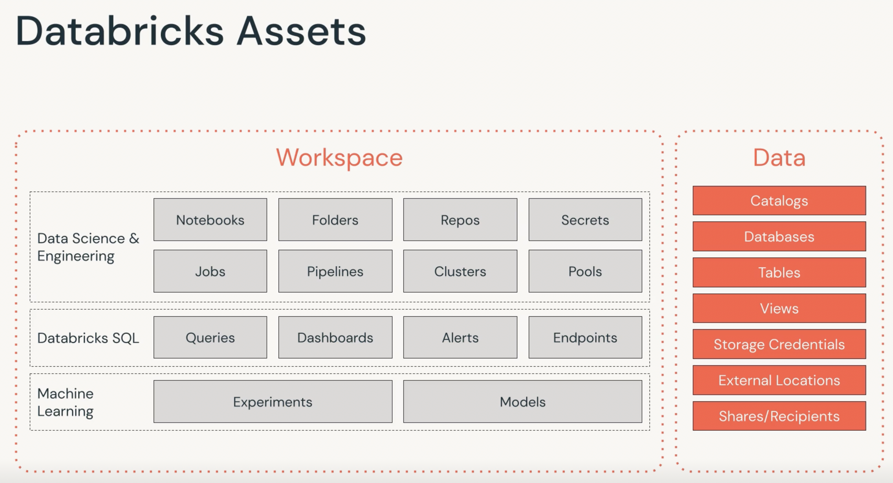

## Databricks Data Science and Engineering Workspace

Databricks Assets Map :

- Notebooks : web-based interface that documents the containers using series of cells.
- Folders : file-system like constructs.
- Repos : provide to ability to sync/push/pull events for ci/cd tools
- Jobs : automatic tasks, can be implemented using notebooks, jars, python scripts, Scala, java etc.
- Pipelines : DAG that targets data-sources to target datasets. Implemented using notebooks.
- Clusters : Computation-Resources
- Pools : reduces cluster start and scaling times by maintaining sets of idle compute resources. Cluster are attached to pool.
