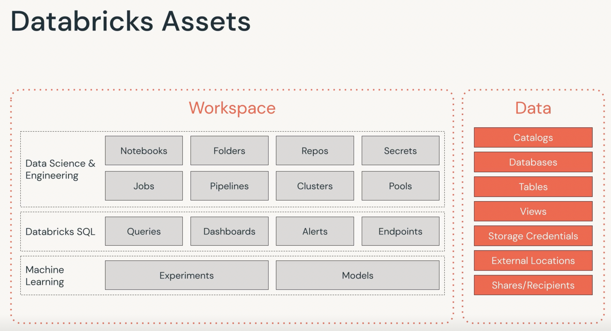

## Databricks Data Science and Engineering Workspace

Databricks Assets Map:

### Core Assets

- **Notebooks**: web-based interface for interactive code. Organised as a series of cells supporting Python, Scala, SQL, and R. Can be attached to a cluster and executed interactively or scheduled as jobs.
- **Folders**: file-system-like constructs for organising notebooks, files, and other assets within a workspace.
- **Repos**: integrate with Git repositories to enable version control, CI/CD, and collaboration across workspaces. Supports GitHub, GitLab, Bitbucket, and Azure DevOps.
- **Jobs**: non-interactive, scheduled or triggered task execution. Can run notebooks, Python scripts, JARs, Scala code, dbt tasks, or SQL queries. Supports multi-task pipelines with dependency graphs.
- **Pipelines (Delta Live Tables)**: declarative ETL framework using a DAG to transform source data into target datasets. Defined in notebooks using Python or SQL. Handles retries, data quality checks, and incremental processing automatically.
- **Clusters**: computation resources for running notebooks and jobs. Two types:
  - *All-purpose clusters*: interactive use, shared by multiple users
  - *Job clusters*: spun up for a single job and terminated on completion
- **Pools**: reduce cluster start and auto-scaling times by maintaining a set of idle, pre-configured instances. Clusters attach to a pool to acquire nodes instantly.

### Databricks File System (DBFS)

DBFS is a distributed file system abstraction mounted on the workspace, backed by cloud object storage. It provides a POSIX-like path interface (`/dbfs/...`) for accessing files from notebooks and jobs.

### Auto Loader

Auto Loader incrementally ingests new files arriving in cloud object storage (S3, ADLS, GCS) using file notification or directory listing. It tracks processed files automatically, making it ideal for streaming ingestion pipelines.
