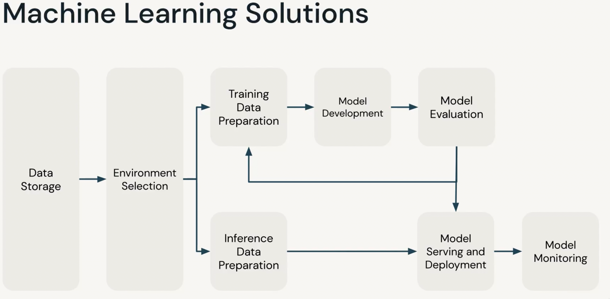

## Databricks Machine Learning

- helps manage end-to-end databricks machine learning lifecycle

- Production Machine Learning depends on code and data
- ML requires many different roles to get involved
- ML requires integrating many different components

### Common Machine Learning Problems

- Data Quality (while storage/loading of data)
- Struggle with Compute Resources (autoscaling etc.)
- Feature development (training models or inference data preparation)
- Model Development
- Governace and Security (access restriction and policies)
- Machine Learning Operations (serving and deployment)
- Automation

### Databricks Workflow

**Automating Data Work**

- Non-interactively run AI workflows on a schedule or on-demand
- Automate Machine Learning pipelines
- Full control of execution environment

### Databricks Repos

- Syncronize projects with git repositories
- Supports Gitlab, GitHub, Bitbucket
- Collaborate across workspaces or development environments

### MLflow Components

- Tracking : track your model runs and compare results
- Models : manage and deploy models from variety of ML libraries to a variety of models serving and inference platforms
- Projects : package ML code in reusable, reproducible form to share 
- Model Registry : centralize a model store for managing models full lifecycle stage transition
- Model Serving : host MLflow Models for real-time serving