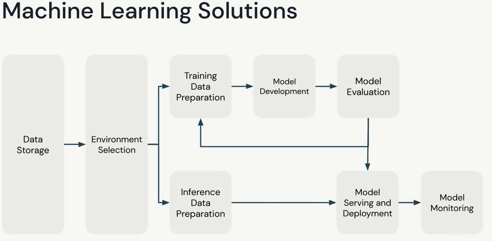

## Databricks Machine Learning

Databricks ML helps manage the end-to-end machine learning lifecycle — from data preparation to model deployment.

- Production ML depends on both code and data
- ML requires many different roles: data engineers, data scientists, ML engineers, and business stakeholders
- ML requires integrating many different components: feature engineering, training, evaluation, deployment, and monitoring

### Common Machine Learning Challenges

- **Data quality**: issues during storage, loading, or transformation
- **Compute resources**: managing autoscaling, GPU clusters, and cost
- **Feature development**: preparing consistent features for training and inference
- **Model development**: experiment tracking, hyperparameter tuning
- **Governance and security**: access restrictions and compliance policies
- **ML operations**: model serving, deployment pipelines, and monitoring
- **Automation**: triggering retraining on data drift or schedule

### MLflow Components

MLflow is the open-source ML lifecycle platform natively integrated with Databricks.

- **Tracking**: log and compare metrics, parameters, and artifacts across model runs
- **Models**: manage and deploy models from a variety of ML libraries (scikit-learn, PyTorch, TensorFlow, etc.) to diverse serving platforms
- **Projects**: package ML code in a reusable, reproducible format for sharing
- **Model Registry**: centralised model store for managing the full model lifecycle — staging, production, and archival transitions
- **Model Serving**: host MLflow models as REST endpoints for real-time inference

### Databricks AutoML

AutoML automates the process of building baseline ML models. Given a dataset and a target column, it:
- Runs a series of trials with different algorithms and hyperparameters
- Generates editable Python notebooks for each trial so you can inspect and customise the approach
- Supports classification, regression, and forecasting tasks

### Feature Store

The Databricks Feature Store is a centralised repository for creating, storing, and sharing ML features.

- Features are written once and reused across training and inference pipelines
- Automatically tracks lineage between features and the models that use them
- Supports point-in-time lookups to prevent data leakage during training

### Databricks Workflows for ML

- Run ML pipelines non-interactively on a schedule or on-demand
- Automate retraining, evaluation, and promotion workflows
- Full control over the execution environment (cluster type, dependencies)

### Databricks Repos

- Synchronise projects with Git repositories
- Supports GitHub, GitLab, Bitbucket, and Azure DevOps
- Collaborate across workspaces and development environments
- Enables CI/CD patterns for ML pipelines
