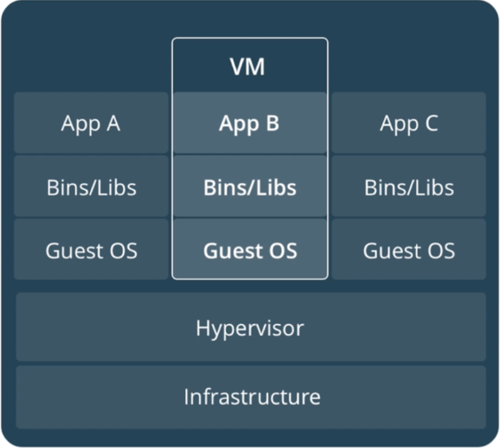
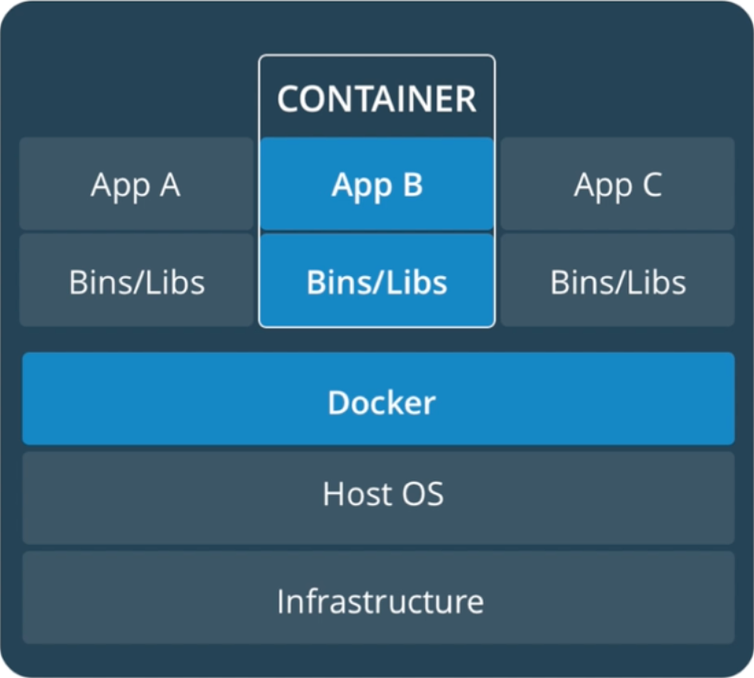
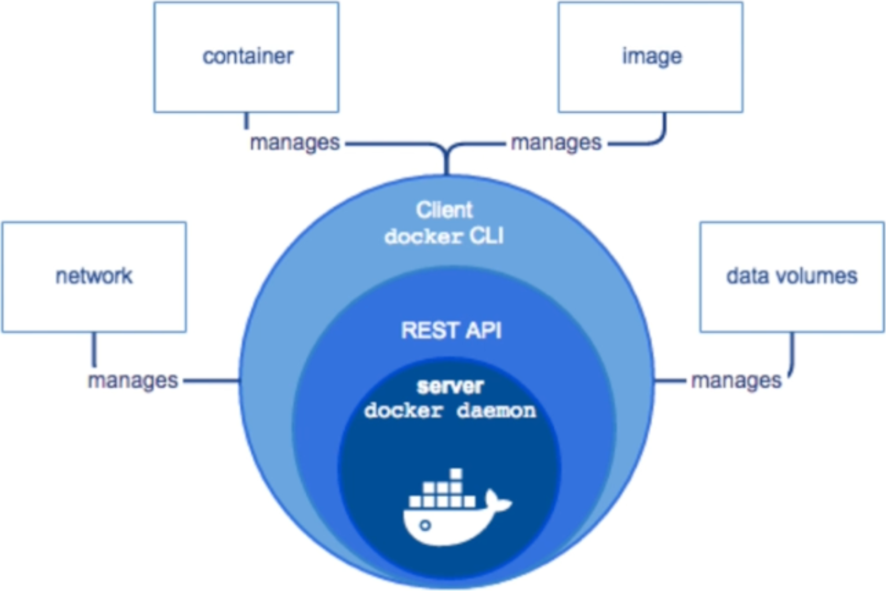
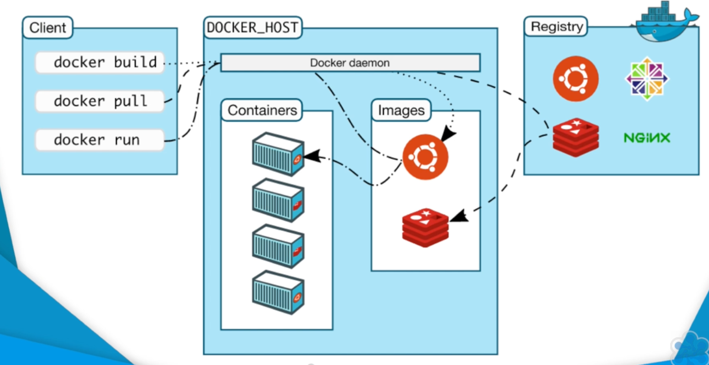

# Concepts

## Docker vs Virtual Machines

Both isolate applications from the host - but in fundamentally different ways.

| | Docker | Virtual Machine |
|---|---|---|
| **Isolation** | Process-level (shares host kernel) | Full OS per VM (hypervisor) |
| **Startup** | Milliseconds | Seconds to minutes |
| **Disk size** | MB | GB |
| **Overhead** | Near-zero | Hypervisor + guest OS |

| Docker | VM |
|:---:|:---:|
|  |  |

Docker containers share the host OS kernel. Each container gets an isolated view of the filesystem, network, and processes - but there's no separate kernel or hardware emulation.

## Architecture

Docker uses a client-server model.

| High-Level Architecture |
|:---:|
|  |

| Client ↔ Daemon |
|:---:|
|  |

- **Docker Daemon** (`dockerd`) - runs on the host, manages images, containers, networks, and volumes
- **Docker CLI** (`docker`) - the client; sends commands to the daemon over a REST API
- **Docker Hub** - the default registry; where images are pulled from and pushed to

The CLI and daemon can be on the same machine or remote.

## How Containers Actually Work

Docker isn't magic - it's built on three Linux kernel features that existed long before Docker popularised them.

### Namespaces

Each container gets its own isolated view of the system:

| Namespace | What it isolates |
|---|---|
| `pid` | Process tree - container can't see host processes |
| `net` | Network interfaces - container has its own IP and ports |
| `mnt` | Filesystem mount points |
| `ipc` | Interprocess communication |
| `uts` | Hostname and domain name |
| `user` | User and group IDs (rootless Docker) |

### Control Groups (cgroups)

Limits and tracks resources per container:

- CPU time
- Memory
- Disk I/O
- Network bandwidth

Without cgroups, a single container could starve all others of resources.

### UnionFS (Union Filesystem)

Images are built from **stacked layers**. Each `RUN`, `COPY`, or `ADD` instruction in a Dockerfile creates one layer.

- All image layers are **read-only**
- Docker adds a thin **writable layer** on top when a container starts
- Layers are shared: if two images both use `node:22-alpine` as a base, they share those layers on disk

This is why Docker is space-efficient - 10 containers from the same image share the same read-only layers and only differ in their writable layer.

## Key Terminology

| Term | Meaning |
|---|---|
| **Image** | Read-only blueprint for a container (like a class in OOP) |
| **Container** | A running instance of an image (like an object) |
| **Dockerfile** | The recipe for building an image |
| **Registry** | Storage for images - Docker Hub, AWS ECR, GitHub Container Registry |
| **Tag** | Version label on an image (`nginx:1.27`, `nginx:latest`) |
| **Volume** | Persistent storage managed by Docker |
| **Compose** | Tool for defining multi-container apps declaratively in YAML |
| **Swarm** | Docker's built-in cluster orchestration |
