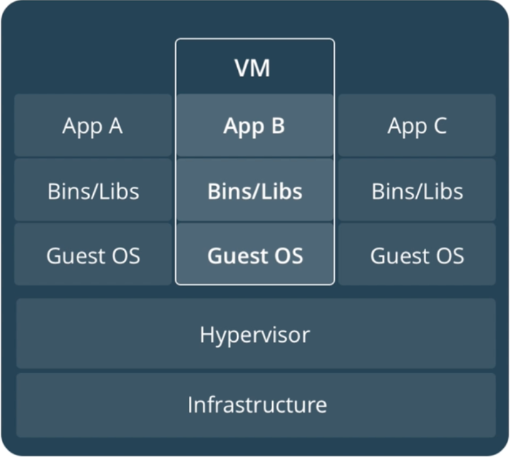
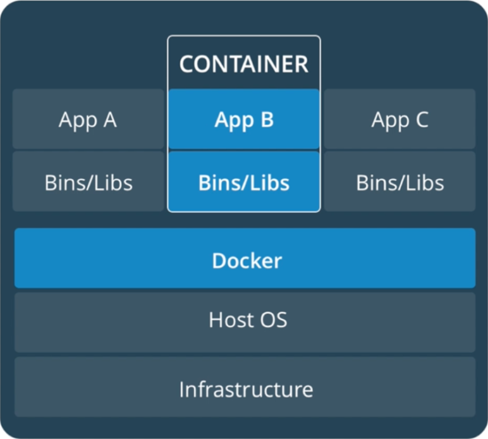
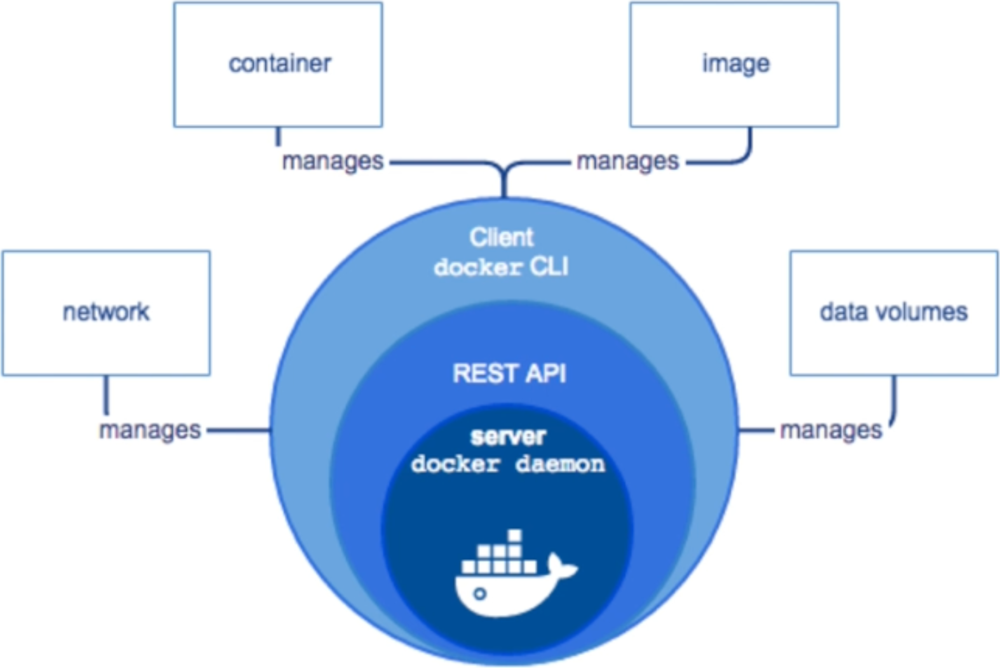
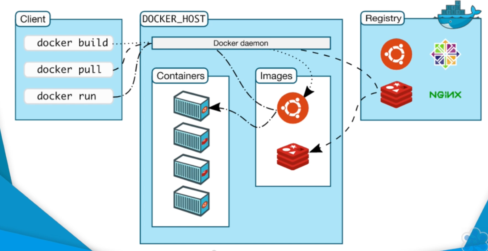

# Introduction to Docker

## What is Docker

- Container Platform that separates the application from underlying infrastructure by bundling up code & its dependency into an entity which always runs similarly on all environments.
- Solves problem of inconsistent development environments across different machines especially production
- Often compared to VMs, OS on VMs runs on a virtualised hardware while in case of Docker Guest OS dependency is removed via sharing kernel with host OS.

|                            Docker                            |                              VM                              |
| :----------------------------------------------------------: | :----------------------------------------------------------: |
|  |  |

## The Docker Architecture

- Docker uses a client-server model
    - Server : Docker Daemon (Manages Object (Network/Container/Image/..))
    - Client : Docker CLI

|                High Level Docker Architecture                |
| :----------------------------------------------------------: |
|  |

|    Docker Client Interacting with Docker Server (Daemon)     |
| :----------------------------------------------------------: |
|  |

- Containers is not a new concept, Docker just made it popular, Hypescale is the defacto standard
- Docker Popularity
    - Market Demand
    - Well Established Technology

Docker utilises several features of Linux Kernel Namespaces to provide functionality. Docker supports several features :

#### Namespaces

- The pid namespace: Process Isolation (PID: Process ID)
- The net namespace: Managing Network Interfaces (NET: Networking)
- The ipc namespace: Managing access to IPC resources (IPC: Interprocess Communication, SysV)
- The mnt namespace: Managing filesystem mount points (MNT: Mount)
- The uts namespace: Isolating Kernel and version Identifiers. (UTS: Unix Timesharing System)

#### Control Groups

- Resource Limiting
- Prioritization : some groups are given larger share of cpu or i/o utilisation
- Accounting : measures a group’s usage
- Control : Freezing grps of process

#### UnionFS

- Merging : overlay filesystem branches to merge changes
- Read/Write: branches can be read-only or read-write

## Installing Docker

Follow this guide : https://docs.docker.com/desktop/

Make sure to start docker daemon before trying out all commands

Check if docker installed correctly : `docker run hello-world`

[Page2](part1b.md)
