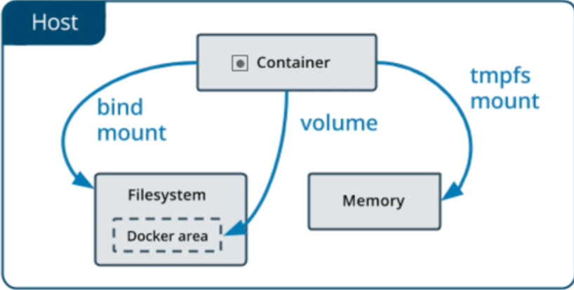

# Introduction to Docker

## Creating and Executing your First Container Using Docker

Start a simple ubuntu container interactively with bash : `docker run -it ubuntu bash`

If Docker is not able to find ubuntu image locally it will fetch from DockerHub. Task: Try similar with alpine OS (alpine doesn’t come with bash, so use sh).

## Images vs Container

- Both are different in the sense of one being an executable(image) while other running application(container)
- Images are based on concept of layers. There is a Base Layer on top of which we create multiple layers. This is provided by UnionFS and help rebuild image faster in case only one layer is changed.
- List all images : `docker images`
- List all running containers : `docker ps`
- Explore more about docker in `/var/lib/docker`, how images are organised and find the layers of different images. Use `docker inspect alpine` directly to view the information about image.
- To run a container with its name: `docker start <container_name>`, and then to attach to container : `docker attach <container_name>`
- NOTE : `docker run` always creates new containers, can be proved by creating a file in the container and then running docker run again.
- To remove all container : `docker container prune`
- To remove a image : `docker rmi <image_id>`

## Images from the Dockerfile

- Create a simple go file named `hello.go` & create a `hello` binary

````go
package main

import "fmt"

func main() {
  fmt.Println("Hello World! :D")
}
// you have to build binary using this architecture and os for exec to work
// env GOARCH=386 GOOS=linux go build hello.go
````

- Sample Dockerfile

````dockerfile
# scratch is a base image to start with
FROM scratch
# copy a file into the layer
COPY hello /
# executes the command when container boots up
CMD ["/hello"]
````

To simply build a container: `docker build .` then run : `docker run <container_id>`

To build a container and tag it with a repo name (greeting): `docker build -t greeting .` then run : `docker run greeting`

## Images from Containers

By default changes to containers don’t persist outside their scope.

We can create image from a containers’s change : `docker commit <container_id> <repo:tag>`

## Port Mapping

````go
package main

import (
	"fmt"
	"net/http"
	"os"
)

func hostHandler(w http.ResponseWriter, r *http.Request) {
	name, err := os.Hostname()

	if err != nil {
		panic(err)
	}

	fmt.Fprint(w, "<h1>HOSTNANME: %s</h1><br>", name)
	fmt.Fprint(w, "<h1>ENVIRONMENT VARS:</h1><br>")
	fmt.Fprint(w, "<ul>")
	for _, evar := range os.Environ() {
		fmt.Fprint(w, "<li>%s</li>", evar)
	}
	fmt.Fprint(w, "</ul>")
}

func rootHandler(w http.ResponseWriter, r *http.Request) {
	fmt.Fprint(w, "<h1>Awesome site in Go!</h1><br>")
	fmt.Fprint(w, "<a href='/host/'>Host info</a><br>")
}

func main() {
	http.HandleFunc("/", rootHandler)
	http.HandleFunc("/host/", hostHandler)
	http.ListenAndServe(":8080", nil)
}

// you have to build binary using this architecture and os for exec to work
// env GOARCH=386 GOOS=linux go build web-app.go
````

Dockerfile

````dockerfile
FROM scratch
COPY web-app /
EXPOSE 8080
CMD ["/web-app"]
````

Build the image : `docker build -t "webapp" .`

Run the container: `docker run webapp` : this will run the container that is indefinitely waiting for traffic.

To run the container in background/detached mode : `docker run webapp -d`

To fetch container ip : `docker inspect webapp`

To get the webapp page : `curl <container_ip>:8080/`

Generally to access the web-page as if it was available on local machine, we use network bridge to bind container port with local machine port. To Publish all ports from container to Host.

```bash
docker run -d -P webapp			# this exposes/publishes all ports from container
```

To stop & prune the container : `docker stop <container_id> & docker prune`

To map a specific port on the Host : `docker run -d -p 3000:8080 webapp`

## Networking

Dockerfile

````dockerfile
FROM ubuntu:16.04

RUN apt update && apt install -y \
		arp-scan \
		iputils-ping \
		iproute2
		
COPY web-app /

CMD ["/bin/bash"]
````

Execute following to view network stack : `docker network ls`

Build the image : `docker build -t ubuntu_net .`

Run the image : `docker run -it ubuntu_net`

Inside the container we can check networking stack in the container : `ip addr show`

Detaching from container without terminating it (press) : `<C-p><C-q>`

Now try creating few containers and notice their IP patterns and then try pinging one container from other container. Lets do an arp-scan : `arp-scan --interface=eth0 --localhost`

This should return all the hosts on the Network Bridge

Running an application on Host Network (doesn’t need EXPOSE Directive) : `docker run -d --network=host ubuntu_net /webapp`

Third option is `none` network mode : `docker run -it --network=none ubuntu_net` (Only loopback network is up and ping to any ip should fail)

## Introduction to Persistent Storage

Last Layer in Docker app is writable and is not a solution for writing data permanently.

Docker provide 3 option

- Bind Mounts : mounting a file/directory from host
- Volumes : similar to bound mount except docker handles the storage
- In-memory (tmpfs) : for temporary data

| Docker Persistent Storage                                    |
| ------------------------------------------------------------ |
|  |

 Mounting a Host FS :

````bash
docker build -t <container> .
docker run -d \
	--mount type=bind,src="<host_path>",dst=<container_path> \
	<container_name>
````

Volume Mount (Managed by Docker, created if doesn’t exist)

````bash
docker run -d \
	--mount type=volume,src="<volume_name>",dst=<container_path> \
	<container_name>
docker volume inspect <volume_name>
````

tmpfs : data is erased when container is stopped (Useful for sensitive info required only while container is running like Access Token, Passwords, etc)

````bash
docker run -it \
	--mount type=tmpfs,dst=/logs \
	ubuntu
# echo something in a file in logs
echo "smk" > /logs/a
exit
# now container doesn't have that file
````

## Tagging

An image can have multiple tags which helps in versioning of the image. They are very important in Continous Delievery world!

By default docker assigns : `latest` as the tag

Tagging a image : `docker tag <image>:latest <image>:v1`

To publish a image on dockerhub :

````bash
docker login
docker push <image>:<tag> # This will fail
docker push <username>/<image>:tag # this is correct
````


<center><- [Prev](part1.md)		[Next](part2.md) -></center>

