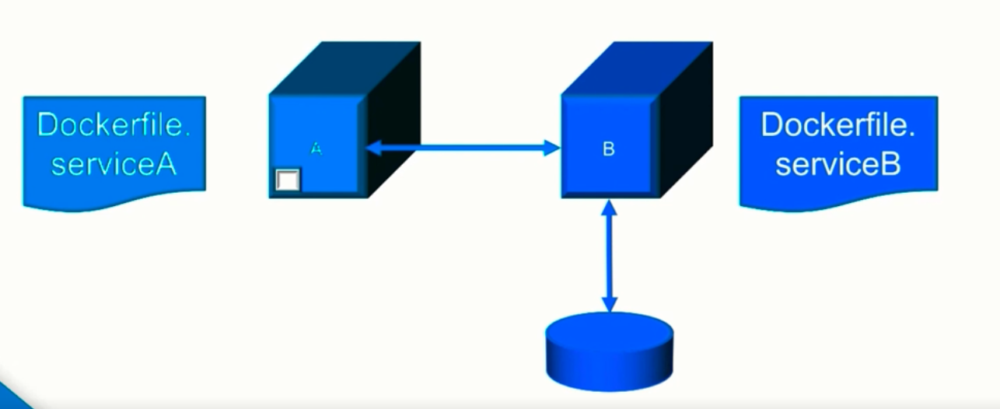

# Managing Application with Docker Compose

## Docker Compose Overview

Helps create complex interacting docker containers with ease, rather than handling every container.

| Docker Compose Motivation                                    |
| ------------------------------------------------------------ |
|  |

Creating Following Container Setup will require these commands

````bash
# setup
docker network create --driver bridge app_network
docker volume create serviceB_volume
docker build -f Dockerfile.serviceA .
docker build -f Dockerfile.serviceB .
docker run -d -name serviceA --network app_network -p 8080:3000 service A
docker run -d -name serviceB --network app_network \
	-- mount src="serviceB_volume",target=/data serviceB
	
# tear down entire setup	
docker stop serviceA serviceB
docker rm serviceA serviceB
docker rmi serviceA serviceB
docker volume rm serviceB_volume
docker network rm app_network
````

We could create 2 scripts and check them out in Version Control but this is imperative approach, and docker already have better declarative solution.

It took 10 docker commands to simulate this env. So we use a simple compose file to automate this setup with just one command : `docker-compose up .` (assumes `docker-compose.yml` is present)

````yaml
# save as compose-file.yaml
# to run it : docker-compose -f compose-file.yaml up -d
version: '3'
services:
  web:
    image: app
    ports:
    - "5000:5000"
    volumes:
    - logvolume01:/var/log
    depends_on:
    - redis
  redis:
    image: redis
volumes:
  logvolume01:{}
````

## How to Create Docker Compose Files using YAML

### YAML

- yaml : yaml ain’t markup language
- Data serialization
- .yaml or .yml extensions

#### YAML Collection : Mappings

````yaml
# Mapping Examples
## Mapping
key: value
key1: value1
key2: value2
## Nested Mapping
outKey:
	innerKey: innerValue
## Inline Mapping
outerKey: {innerKey: innerValue}

# YAML Sequences
## sequence
- value
- value1
- value2
## nested sequence
-
	- value1
	- value2
## inline sequence
[ value1, value2]

# both of above syntax can be combined to provide powerful structures
````

### Root Elements of File Mapping

- version : maps feature provided by docker engine
- services : each service can be defined inside this
  - important keys : image, volumes, ports, environment, logging, security_opt
  - some configuation work in swarm mode/ specified on cmd, for e.g. memory/cpu limits
  - Dependecies can be defined : depends_on, links (NOTE: **it doesn’t wait for 1st service to come up**). It just runs it before its dependents.
  - you can pass a command with args to override CMD in docker file like this => command: [“redis-server”, “--appendonly”, “yes”]
- volumes
  - keys : named-volume, external-volume
- networks
  - one network created by default
  - service don’t need to specify port access for each other, only Host to container containers requires port declaration

### Variable Substitution

- shell env variables are substituted in compose file

````yaml
services:
	proxy:
		image: 'redis:${REDIS_TAG}'
````

### Extension Fields

- reuse config fragments
- Version (3.4+)
- Root keys beginning with x-
- uses yaml anchors

````yaml
version: '3.4'
x-logging:
	&default-logging
	options:
		max-size: '10m'
		max-file: 7
	driver: json-file
services:
	web:
		image: repo/app
		logging: *default-logging
	cache:
		image: redis
		logging: *default-logging
````

## Features & Commands of Compose CLI

#### Compose CLI Features

- run multiple isolated envs
- parallel execution model
- compose file change detection
- open source

USAGE : `docker-compose [OPTIONS] [COMMAND] [ARGS]`

- tries to find default : `docker-compose.(yml|yaml)` (-f can be used to override)
- projects to represent isolated apps
  - defaults to directory as project_name (-p can supply custom_name)

#### Main Commands

- `up` : creates everything defined in yaml file (change detection if previous compose up is running)
- `down` : tear down everything except (volume/images) by default

## Deploying & Configuring a Web Application with Compose

Wordpress Example :

````yaml
version: '3.1'

services:

  wordpress:
    image: wordpress
    restart: always
    ports:
      - 8080:80
    environment:
      WORDPRESS_DB_HOST: db
      WORDPRESS_DB_USER: exampleuser
      WORDPRESS_DB_PASSWORD: examplepass
      WORDPRESS_DB_NAME: exampledb
    volumes:
      - wordpress:/var/www/html

  db:
    platform: linux/x86_64		# required for running on m1
    image: mysql:5.7
    restart: always
    environment:
      MYSQL_DATABASE: exampledb
      MYSQL_USER: exampleuser
      MYSQL_PASSWORD: examplepass
      MYSQL_RANDOM_ROOT_PASSWORD: '1'
    volumes:
      - db:/var/lib/mysql

volumes:
  wordpress:
  db:
````

Complete Tear Down Command

```bash
docker-compose -f wordpress.yml down --rmi all --volumes --remove-orphans
docker prune images -a
```

## Building in Compose

### Compose File `build` Key

- Build image if present
- Two forms:

````yaml
build: ./dir
# or
build:
	context: ./dir
	dockerfile: the.dockerfile
	args:
		buildno: 1
	image: name:tag				# optional sets the name:tag
````

Two ways to build:

````bash
docker-compose up --build
docker-compose build --no-cache --pull
````

## How Compose Handles and Combines Multiple Files

### Multiple Compose Files

- compose can combine combose files
  - Base config + overrides
  - Default files:
    - docker-compose.yml
    - docker-compose.override.yml
- `config` to view effective configuration
- -H allows to connect to remote hosts

````dockerfile
# python Dockerfile
FROM python:3
ADD . /src
WORKDIR /src
RUN pip install -r requirements.txt
CMD ["python", "app.py"]
````

````yaml
# base : docker-compose.yml
version: '3'
services:
	web:
		build: .
		- '5000:5000'
	redis:
		image: redis
````

````yaml
# layer : dev.docker-compose.yml
version: '3'
services:
	web:
		volumes:
			- .:/src

````

To check run config : `docker-compose -f docker-compose.yml -f dev.docker-compose.yml config`


### Production Consideration

- remove any volumes for source code
- use restart:always
- avoid specific host ports ( docker can assign them at runtime)
- production mode env variables
- additional services like logging


[Next](part3.md)
