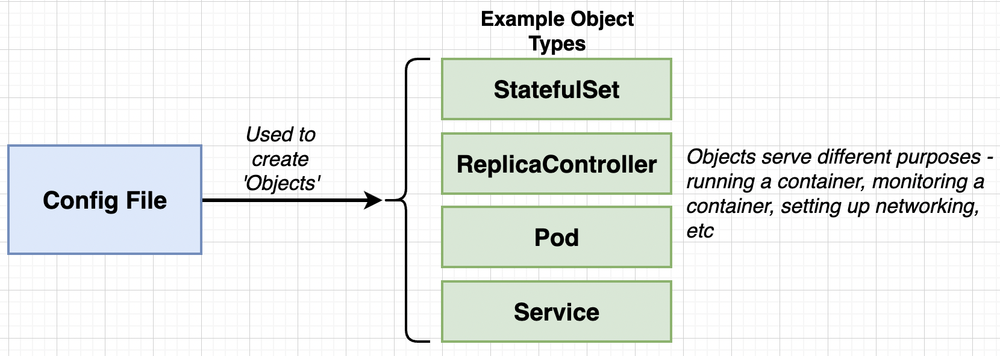

## Notes : Docker and Kubernetes

These notes are based on famous course on Docker and Kubernetes by Stephen Grinder.

### Section 11 : Onwards to Kubernetes!

#### Why’s and What’s of Kubernetes

Let’s say our application starts to get a lot of traffic then we need to scale things up. The most important or processing heavy part of our previous application was worker container. If we had a way to replicate the worker container then we could easily handle the traffic.


Why don’t we rely on AWS EB ? Reason is because for each scaling of multi-container app its going to spawn multipe multi-container instances. More machines but very little control over what each one of those containers are doing.


But we only need a worker container to replicate as per the load. Thats where Kubernetes comes in. Following is the diagram of very simple cluster.


Nodes in Kubernetes can run any number of containers and a cluster can have any number of Nodes. Master controls what each Node does, and we can interact with Master. We have a Load Balancer that will relay traffic optimally to Nodes.

- What : System for running different containers over multiple different machines.
- Why : When we need to run many different containers with different images.

#### Kubernetes in Development and Production

- Development : We use `minikube` to create small cluster.
- Production : We use managed solutions : Amazon Elastic Container Service for Kubernetes (EKS), Google Cloud Kubernetes Engine (GKE) or Do it yourself.

We use `kubectl` is used to manage containers in node while `minicube` which in reality is used for managing the VM itself. NOTE : `minicube` is used locally only.

##### Setting up Kubernetes on MacOS

Just go to docker desktop and enable Kubernetes from it.

#### Mapping Existing Knowledge

Goal : Get the **multi-client** image running on our Kubernetes running on a cluster.

Each entry in our last project represented containers we wanted to create and defined its network requirements.

|                        Docker Compose                        |                    Kubernetes                     |
| :----------------------------------------------------------: | :-----------------------------------------------: |
| Each entry can optionally get docker-compose to build an image | Kubernetes expects all images to already be built |
|     Each entry represents a container we want to create      |   One config file per object we want to create    |
|    Each entry defines the networking requirements (ports)    |     We have to manually set up all networking     |

- Make sure our image is hosted on docker hub
- Make one config file to create the container
- Make one container to setup networking.

Get the **multi-container** image running on our local Kubernetes Cluster running as a container.

#### Adding Configuration Files

To avoid mistakes, you are suggested to use image hosted at `image: stephengrinder/multi-client` or use yours if it is correct.

The reason why your configuration might fail is because in `default.conf` we had `try_files $uri $uri/ /index.html` which resolved React Router Issues with the app but it will break the `pod` we are about to create.

Make a folder name `simplek8s` : `k8s` is abbreviation of Kubernetes.

Make two files `client-pod.yaml` and `client-node-port.yaml` with contents as

````yaml
apiVersion: v1
kind: Pod
metadata:
  name: client-pod
  labels:
    component: web
spec:
  containers:
    - name: client
      image: stephengrinder/multi-client
      ports:
        - containerPort: 3000
````

and

````yaml
apiVersion: v1
kind: Service
metadata:
  name: client-node-port
spec:
  type: NodePort
  ports:
    - port: 3050
      targetPort: 3000
      nodePort: 31515
  selector:
    component: web
````

Config file describes the containers we want and Kubernetes doesn’t actually made a containers instead it makes something called as Objects.



Pod usually runs the containers and service provides networking to container. And Each Api version actually defines different types of objects we can have.

- apiVersion: v1
  - componentStatus
  - configMap
  - Endpoints
  - Events
  - Namespace
  - Pod
- apiVersion: apps/v1
  - Controller Revision
  - StatefulSet

#### Running Containers in Pods


`minicube start` creates a virtual machine which is called as a Node. That Node is used by Kubernetes to run some number of Objects. Most basic object is a Pod. Pod is grouping of containers with similar purpose.

In world of Kubernetes there is no way to create a container only. There is always a overhead because we have Objects. Smallest thing we can have is Pod running a container.

Technically Pod can have any type of containers but we always have similar working or tightly integrated containers inside the pod.

A example of Tightly Integrated Containers : database connected to logger and backup-manager.


So our first file `client-pod.yaml` defined the pod with running a container and `client-node-port` actually is Service which sets up the networking in a Kubernetes cluster.

#### Service Config Files in Depth

Pods is only of one type but Service can have multiple types

- ClusterIP
- NodePort : Exposes a container to the outside world (only for dev purposes)
- LoadBalancer
- Ingress

A browser sends requests to a Kube-proxy which transfers the traffic to NodePort which in turn sends the request to Pods. Now there may be multiple NodePort so its responsibility of Kube-proxy to direct traffic to those NodePort.

For directing the traffic we use **label selector system** (component:web, or tier:frontend) which connects two Objects get linked up.

Other Pods can connect or interact with each another with the help of NodePort Service.


#### Connecting to running Containers

We use `kubectl apply -f <filname>` to load up the Kubernetes Cluster. We need to do same for both yaml file.

To check status of both objects we created by `kubectl get pods` for all pods or `kubectl get Services`

NOTE: kubernetes service is internal service and we don’t have to worry about it.

NOTE : READ CAREFULLY : if you are using kubernetes from docker-desktop then **DO NOT USE MINIKUBE** Just visit the **localhost:31515**. In case you are using virtualbox drivers then you may follow `minikube` .

**Virtual Box Drivers (only)**

Now to access to pod we will need to visit using a specific IP address rather than `localhost`. Type `minikube ip` to get IP.

And access the website at the IP:31515 in your browser.

Or if you are not able to connect using IP you can use following command to port foward the service to localhost.

`minikube port-forward service/client-node-port 7080:3050`

Then visit localhost:7080 to visit the page.

#### The Entire Deployment Flow

If you type `docker ps` then you will see many containers running. Now even if you kill containers, Kubernetes will restart it again.

On Kubernetes there are 4 programs running called as Master, and `kube-apiserver` reads the deployment files and creates Objects and in case if some of containers go offline, it instructs Nodes to restart it again.

`kubectl` command communicates with Master not the Nodes itself. Its master who has the responsibility of managing the Nodes based on what our `yaml` file desires.

#### Imperative vs Declarative Deployments

Summary :

- Kubernetes is a system to deploy containerized apps.
- **Nodes** are individual machines (or vm’s) that run containers.
- **Masters** are machines (or vm’s) with set of programs to manage nodes
- Kubernetes didn’t build our images - it got them from somewhere else
- Kubernetes (the master) decided where to run each container - each node can run a dissimilar set of containers
- To deploy something, we update the desired state of the master with a config file.
- The master works constantly to meet your desired state.

Imperative Deployments : Do exactly these steps to arrive at this container setup

Declarative Deployments : Our container setup should look like this make it happen.

Which one should you choose ? This certainly depends on what your use cases are, there are lots of blogs, tutorials which will say you should choose this and that, in the end it depends on how much clear understanding of the kubernetes you have and how well you understand what you need.

### Section 13: Maintaining Sets of Containers with Deployments

#### Updating Existing Objects

Goal : Update our existing pod to use muti-worker image.

Imperative Approach : Run a command to list out current running pods -> Run a command to update the current pod to use a new image.

Declarative Approach : Update our config file that originally created the pod -> Throw the updated config file into `kubectl`.

Every config file has 2 parameters (*name*, *kind*) which help **master** uniquely identify objects inside of cluster. By using name: *client-pod*,  kind :*pod* and image as `multi-worker` (changed), Master is able to uniquely identify that this is a pod that exists and we want a new image up there.

After making appropriate changed in yaml config file, execute `kubectl apply -f <config_file>`.

To inspect already running objects use `kubectl describe <object_type> [Object_name]`.

````
kubectl describe pods
````

````bash
kubectl describe pod multi-worker
````

Note we can only update few things about pod only, you check this out by changing port and rerunning and you will see the error message print out.

So we will make use a new object, **Deployment** maintains a set of identical pods ensuring that they have the correct config and that the right number exists.

Generally we use pods in development environment only, while we use Deployment is used in production. Note : So we don’t actually doesn’t use pod, but remember Deployment is just a pod with more abilities and allows editing config files.

#### Deployment Configuration Files

Create a file `client-deployment.yaml` with contents

````yaml
apiVersion: app/v1
kind: Deployment
metadata:
  name: client-deployment

spec:
  replicas: 1
  selector:
    matchLabels:
      component: web
  template:
    metadata:
      labels:
        component: web
    spec:
      containers:
        - name: client
          image: stephengrider/multi-client
          ports:
            - containerPort: 3000
````

Inside of template section is all information about the every pod created by this deployment.

Replicas is number of differnet pods this *Deployment* will create. Deployments itself doesn’t create the pod, instead the Deployment using kubernetes API calls out to master and the *selector* acts as a handle for the pods that master will create.

##### Deleting an existing object

````
kubectl delete -f <config_file>
````

Remove the old pod running and create the new *Deployment*.

#### Why Use Services

Execute :

````bash
kubectl get pods -o wide
````

Every pod is assigned a internal IP address. If pod get deleted or updated then its quite possible that pod gets new IP address. Service watches pods with *selector* and direct traffic to correct pod.

If you make changes to deployment files, lets say ports then what Deployment does is that it entirely deletes the existing pod and recreates a new one, which can be inferred using `kubectl get pods` to get the age of the pod.

#### Updating Deployment Images

1. Change deployments to use multi-client again.
2. Update the multi-client image, push to Docker Hub.
3. Get the deployment to recreate our pods with the latest version of multi-client.

Note : Step-3 is very challanging.

Visit this discussion [LINK](https://github.com/kubernetes/kubernetes/issues/33664).

In order to pull the latest image there is no system present to detect this, since there is no changes to the file and if we use `kubectl apply` it will not update the pods.

Workarounds to the problem

- Manually delete pods to get the deployment to recreate them with the latest version : (Issues : we could end up deleting very important pods, or maybe we may be having downtime of few minutes which may be catastrophe in real life situation)
- Tag images with a real-version numbers, certainly this is an actionable change to config file and deployment will certainly update the pods. (Adds in an extra step in deployments)
-  Use an imperative command to update the image version the deployment should use. (Uses an imperative command).

Certainly first method is very very bad. Mehod 2 seems good but it becomes painful to change files too much, so method 3 kind of becomes reasonable solution but its not best one.

#### Imperatively Updating a Deployment’s Image

Push updates to the docker hub with tags.

Then execute the following command.

````bash
kubectl set <property> <object_type>/<object_name> <container_name> = <new_property>
````

````bash
kubectl set image <obj_type>/<obj_name> <container_name> = <new Image>
````

````bash
kubectl set image deployment/client-deployment client=stephengrider/multi-client:v5
````

