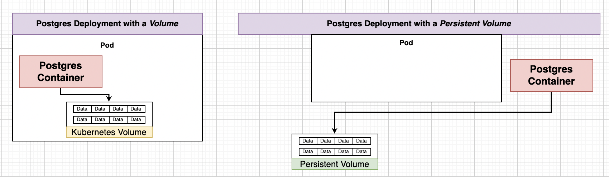
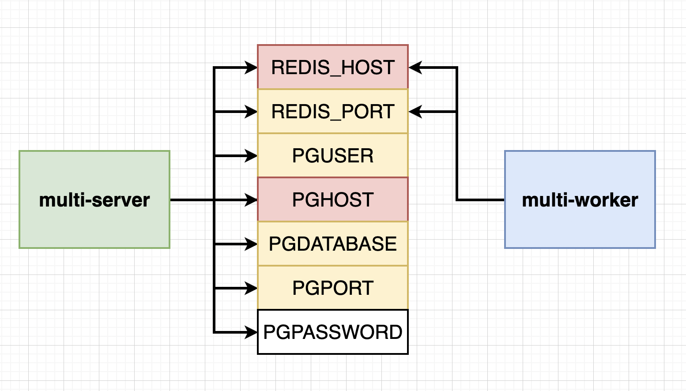

## Notes : Docker and Kubernetes

These notes are based on famous course on Docker and Kubernetes by Stephen Grinder.

### Section 14 : A Multi-Container App with Kubernetes

#### Path to Production

We will first develop everything in single Node locally and when we deploy it off to some service like AWS we will have option of multiple Nodes.


So we will have a lots of config files for pods and services :)

Clone the following repository [Link](https://github.com/mightyjoe781/fibCalculator/tree/checkpoint-1_k8s) , checkout the branch: checkpoint_k8s  and execute:

````bash
docker compose up --build
````

#### Recreating the Deployment

Remove the nginx folder since we will be using *Ingress* Service. Remove the aws deployment file, travis.yaml, and Docker compose files. Now directory should have only 3 folders : client, server, worker.

We we be recreating everything using Kubernetes. We will need to create 9-10 config files. Make a new directory k8s inside complex.

Create a file `client-deployment.yaml` 

````yaml
apiVersion: apps/v1
kind: Deployment
metadata:
  name: client-deployment
spec:
  replicas: 3
  selector:
    matchLabels:
      component: web
  template:
    metadata:
      labels:
        component: web
    spec:
      containers:
        - name: client
          image: stephengrider/multi-client
          ports:
            - containerPort: 3000
````

#### NodePort vs Cluster IP

NodePort: Exposes a set of pods to outside world (only good for dev purposes).

Cluster IP: Exposes a set of pods to other objects in the cluster. We use Ingress with it to allow external access.

Create a new file, `client-cluster-ip-service.yaml`

````yaml
apiVersion: v1
kind: Service
metadata:
  name: client-cluster-ip-service
spec:
  type: ClusterIP
  selector:
    component: web
  ports:
  - port: 3000
    targetPort: 3000
````

To apply above two file inside of k8s directory.

````
kubectl apply -f k8s
````

#### Express API Deployment Config

We will create 2 more files with almost similar config files.

Create a new file `server-deployment.yaml`

````yaml
apiVersion: apps/v1
kind: Deployment
metadata:
  name: server-deployment
spec:
  replicas: 3
  selector:
    matchLabels:
      component: server
  template:
    metadata:
      labels:
        component: server
    spec:
      containers:
        - name: server
          image: stephengrider/multi-server
          ports:
            - containerPort: 5000
````

Note : Remember multi-server expects a bunch of environment variables.

Cluster IP for Express API

Create a new file `server-cluster-ip-service.yaml`

````yaml
apiVersion: v1
kind: Service
metadata:
  name: server-cluster-ip-service
spec:
  type: ClusterIP
  selector:
    component: server
  ports:
  - port: 5000
    targetPort: 5000
````

#### Combining Config into Single Files

We said we will have 9-10 config files, you can organize multiple config files into a single file.

Each of config should be separated by three dashes

````yaml
config_file-1
---
config_file-2
````

#### Worker Deployment

Create a file named `worker-deployment.yaml`

````yaml
apiVersion: apps/v1
kind: Deployment
metadata:
  name: worker-deployment
spec:
  replicas: 1
  selector:
    matchLabels:
      component: worker
  template:
    metadata:
      labels:
        component: worker
    spec:
      containers:
        - name: worker
          image: stephengrider/multi-worker
          env: 
            - name: REDIS_HOST
              value: redis-cluster-ip-service
            - name: REDIS_PORT
              value: 6379
````

Now remember we will eventually need more replicas since worker is actually the part of application that handles most of calculation.

Also note no port and ClusterIP file needed since it connects to other and does the work.

#### Creating and Applying Redis config

Create a file `redis-deployment`

````yaml
apiVersion: apps/v1
kind: Deployment
metadata:
  name: redis-deployment
spec:
  replicas: 1
  selector:
    matchLabels:
      component: redis
  template:
    metadata:
      labels:
        component: redis
    spec:
      containers:
        - name: redis
          image: redis
          ports:
            - containerPort: 6379
````

Create a file `redis-cluster-ip-service.yaml`

````yaml
apiVersion: v1
kind: Service
metadata:
  name: redis-cluster-ip-service
spec:
  type: ClusterIP
  selector:
    component: redis
  ports:
  - port: 6379
    targetPort: 6379
````

#### PostgreSQL config

Create a file `postgresql-deployment.yaml`

````yaml
apiVersion: apps/v1
kind: Deployment
metadata:
  name: postgres-deployment
spec:
  replicas: 1
  selector:
    matchLabels: 
      component: postgres
  template:
    metadata:
      labels:
        component: postgres
    spec:
      containers:
        - name: postgres
          image: postgres
          ports:
            - containerPort: 5432
````

#### The Need for Volumes with Databases

We can certainly create database and storage inside containers/pods. But wait what if there is some error in pod what does Master does ? :) creates new pods and data is lost.

We use PVC (Persistent Volume Claim) as separate storage solution i.e. Volumes which provide consistent data storage solution.

As indicated earlier we can certainly have more than one replicas of Postgres but if there are 2 replicas of postgres and they are sharing one filesystem for storage and they are not aware of each other then its recipe for disaster.

Volume in Docker was related to mechanism that allows a container to access a filesystem outside itself. Volume in Kubernetes is an object that allows containers to store data at the pod level.

Note in Kubernetes there is PVC, Persistent Volume, Volume (we don’t want it for data that needs to persist)(Also not same as volume in dockers). Be careful what documentation refers to.

If we create a Volume (we should not) then there are containers and volumes within pod, and if containers did crash volume will persist but what if entire pod gets deleted then entire volume and containers will be gone that is why we use Persistent Volume. Even if pod now gets deleted there will be no effect to Persistent Volume.



#### PV vs PVC

PVC is just a claim its not an actual storage, instead it advertises the options available to you. There are 2 ways to provision your Volumes

- Statically provisioned Volume
- Dynamically provisioned Volume

#### Claim Config Files

Create a file name database-persistent-volume-claim.yaml

````yaml
apiVersion: v1
kind: PersistentVolumeClaim
metadata:
  name: database-persistent-volume-claim
spec:
  accessModes:
    - ReadWriteOnce
  resources:
    requests:
      storage: 2Gi
````

Note Volume Claim is not actual storage ! There are 3 types of access modes

- ReadWriteOnce : Can be used by a single node
- ReadOnlyMany : Multiple nodes can read from this
- ReadWriteMany : Can be read and written to by many nodes.

##### Where does Kubernetes Allocate Persistent Volumes ?

When you ask Kubernetes for storage in local development context then it will take a slice of your hard-drive otherwise it have PlugIn support for many services out there for example, Google Cloud Persistent Data, Azure Files, Azure Disk, AWS Block Store, etc.

Visit this [Page](https://kubernetes.io/docs/concepts/storage/storage-classes/) for more details.

Add following property in `spec` of Kubernetes config file of `postgres-deployment.yaml`

````yaml
    spec:
      volumes: 
        - name: postgres-storage
          persistentVolumeClaim:
            claimName: postgres-persistent-volume-claim
      containers:
        - name: postgres
          image: postgres
          ports:
            - containerPort: 5432
          volumeMounts:
            - name: postgres-storage
              mountPath: /var/lib/postgresql/data
              subPath: postgres
````

subPath is specific to postgres, it just stores data in a folder name postgresql.

#### Defining Environment Variables



Here Red Variables are the ones that keep changing and Yellow one are consistent. To connect to cluster just provide the name of the Cluster-IP-service you want to connect to it.

Add following to `worker-deployment.yaml` env right after image tag

````yaml
          image:
          env: 
            - name: REDIS_HOST
              value: redis-cluster-ip-service
            - name: REDIS_PORT
              value: 6379
````

and to `server-deployment.yaml`

````yaml
          ports:
          env: 
            - name: REDIS_HOST
              value: redis-cluster-ip-service
            - name: REDIS_PORT
              value: 6379
            - name: PGUSER
              value: postgres
            - name: PGHOST
              value: postgres-cluster-ip-servicec
            - name: PGPORT
              value: 5432
            - name: PGDATABASE
              value: postgres
````

#### Creating Encoded Secret

`PGPASSWORD` should not be plain text. We will use new object in Kubernetes that is Secrets which securely stores information in the cluster, such as database password.

To create a secret we use following command

````bash
kubectl create secret generic <secret_name> --from-literal key=value
````

Example : Run the following command

````bash
kubectl create secret generic pgpassword --from-literal PGPASSWORD=12345asdf
````

To add this to `server-deployment.yaml `

````yaml
- name: PGPASSWORD
  valueFrom:
    secretKeyRef:
      name: pgpassword
      key: PGPASSWORD
````

and for `postgres-deployment.yaml`

````yaml
image:
env:
  - name: POSTGRES_PASSWORD
    valueFrom:
      secretKeyRef:
        name: pgpassword
        key: PGPASSWORD
````

NOTE : In recent documentation its necessary to name the variable POSTGRES_PASSWORD in `postgresql-deployment.yaml`

Note : you always provide Environmental variable in strings i.e. pass ports as string. If you get a not able to convert error its probably because you passed the ports as numbers.

All file should now match the repository at this point [link](https://github.com/mightyjoe781/fibCalculator/tree/checkpoint-2_k8s)

### Section 15: Handling Traffic with Ingress Controllers

#### Load Balancer Services

LoadBalancer : Legacy way of getting network traffic into a cluster.

Load Balancer won’t give access to multiple nodes that is the reason we are not using it. Traditionally load balancers were provided by the cloud providers ( still being provided) but some people thing these loadbalancers are deprecated, yet kubernetes official documentaion doesn’t provide any such indication.

#### A Quick Note on Ingress

In Kubernetes there are multiple implementations of Ingress and we are gonna use Ngnix Ingress.

- We are using *nginx-ingress*, a community led project.
- We are **not** using *kubernetes-ingress*, a project led by nginx company.

**NOTE**: Setup of ingress-ngnix changes depending on your environment(local, GC, AWS, Azure). We are going to set up ingress-nginx on local and GC.

#### Behind the scenes of Ingress

In Kubernetes world anything that contstantly work to reach some desired state is called as *Controller*. For examples, our deployments was constantly making sure pods run, they are also a *Controller*.

We are going write a config file and the kubectl will generate Ingress Controller which will handle traffic for Nodes.


For Google Cloud Setup of Ingress-Nginx


Behind the scenes on Google Cloud still loadBalancer is used. 

To read more about Ingress Nginx[ Refer Here ](https://www.joyfulbikeshedding.com/blog/2018-03-26-studying-the-kubernetes-ingress-system.html)

After this point instruction won’t work on latest M1 chip, use other drivers rather than `docker desktop`. Still you can try port forwarding , read more on the website.

#### Setting up Ingress Locally with Minikube

Navigate to `https://kubernetes.github.io/ingress-ngnix` then to Deployment -> Generic Deployments and follow instructions.

Install a ingress addon using kubectl

#### Creating the Ingress Configuration

Create a file named `ingress-service.yaml`

````yaml
apiVersion: networking.k8s.io/v1
# UPDATE API
kind: Ingress
metadata:
  name: ingress-service
  annotations:
    kubernetes.io/ingress.class: 'nginx'
    nginx.ingress.kubernetes.io/use-regex: 'true'
    # ADD ANNOTATION
    nginx.ingress.kubernetes.io/rewrite-target: /$1
    # UPDATE ANNOTATION
spec:
  rules:
    - http:
        paths:
          - path: /?(.*)
            # UPDATE PATH
            pathType: Prefix
            # ADD PATHTYPE
            backend:
              service:
                # UPDATE SERVICE FIELDS
                name: client-cluster-ip-service
                port:
                  number: 3000
          - path: /api/?(.*)
            # UPDATE PATH
            pathType: Prefix
            # ADD PATHTYPE
            backend:
              service:
                # UPDATE SERVICE FIELDS
                name: server-cluster-ip-service
                port:
                  number: 5000
````

