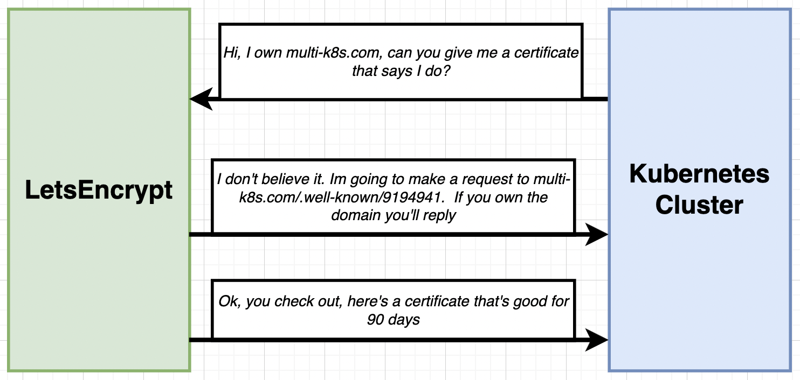
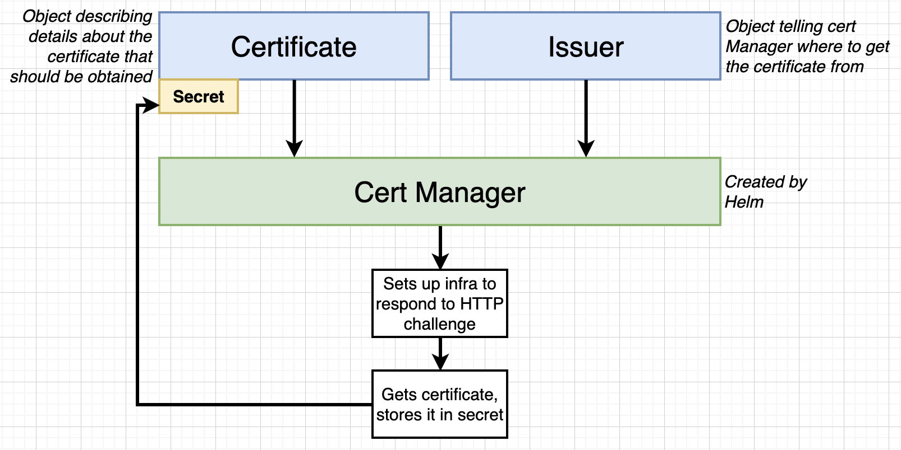
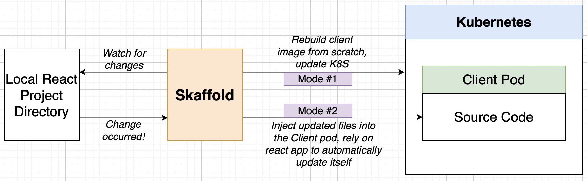

## Notes : Docker and Kubernetes

These notes are based on famous course on Docker and Kubernetes by Stephen Grinder.

### Section 16: Kubernetes Production Deployment

#### The Deployment Process

Production will follow the following workflow

1. Create Github Repo
2. Tie repo to Travis CI
3. Create google cloud project
4. **Enable billing for the project**
5. Add deployment scripts to the repo

#### Google Cloud vs AWS for Kubernetes

- Google created Kubernetes
- AWS only “recently” got Kubernetes support
- Far, far easier to poke around Kubernetes on Google Cloud
- Excellent documentation for beginners

Create a Repository, take a [Reference](https://github.com/StephenGrider/multi-k8s) and link it to Travis.

#### Create a Google Cloud Project

Visit console.cloud.google.com (Google Cloud Console). Click Create Project and name is `multi-k8s`. After Project is created select the active project.

We will need to enable billing from Nav Menu on top left burger button.

1. Click the Hamburger menu on the top left-hand side of the dashboard.

2. Click **Kubernetes Engine**

3. Click the **ENABLE** button to enable the Kubernetes API for this project.

4. After a few minutes of waiting, clicking the **bell** icon in the top right part of the menu should show a **green** checkmark for **Enable services: container.googleapis.com**

5. If you refresh the page it should show a screen to create your first cluster. If not, click the hamburger menu and select **Kubernetes Engine** and then **Clusters**. 
   Once you see the screen below, click the **CREATE** button.

6. A **Create Cluster** dialog will open and provide two choices. Standard and Autopilot. Click the **CONFIGURE** button within the **Standard** cluster option

7. A form similar to the one shown in the video will be presented. Set the **Name** to **multi-cluster** (step 1). Confirm that the **Zone** set is actually near your location (step 2). The Node Pool that is discussed in the video is now found in a separate dropdown on the left sidebar. Click the downward-facing arrow to view the settings. No changes are needed here (step 3). Finally, click the **CREATE** button at the bottom of the form (step 4).

   

   

8. After a few minutes, the cluster dashboard should load and your multi-cluster should have a **green** checkmark in the table.

#### Don’t Forge to Cleanup !

**Remember, as long as this cluster is running you will be billed real life money!**

**Steps to clean up:**

1. Click the project selector on the top left of the page

2. Click the 'gear' icon on the top right

3. Find your project in the list of projects that is presented, then click the three dots on the far right hand side

4) Click 'Delete'

#### Travis Deployment Overview

Google Cloud SDK CLI allows login to Docker CLI and manipulate directly the kubernetes cluster.

- Install Google Cloud SDK CLI
- Configure the SDK with out Google Cloud Auth Info
- Login to Docker CLI
- Build “test” version of multi-client
- Run tests
- If test are successful, run a script to deploy newest images
- Build all our images, tag each one, push each to docker
- Apply all configs in the “k8s” folder
- Imperatively set latest images on each deployment

Create a `.travis.yaml` file

````yaml
sudo: required
services:
  - docker
before_install:
	# openssl command after encrytion from travis cmd line
	# openssl aes-256-cbc -K ...
	# install google-cloud sdk
  - curl https://sdk.cloud.google.com | bash > dev/null;
  - source $HOME/google-cloud-sdk/path.bash.inc
  # install minikube
  - gcloud components update kubectl
  # authenticate
  - gcloud auth activate-service-account --key-file service-account.json
````

#### Creating a Service Account

1. Click the Hamburger menu on the top left-hand side of the dashboard, find **IAM & Admin**, and select **Service Accounts**. Then click the **CREATE SERVICE ACCOUNT** button.
2. In the form that is displayed, set the **Service account name** to **travis-deployer** (step 1), then click the **CREATE** button (step 2).
3. Click in the **Select a role** filter and scroll down to select **Kubernetes Engine** and then **Kubernetes Engine Admin**.
4. Make sure the filter now shows **Kubernetes Engine Admin** and then click **CONTINUE**
5. The Grant users access form is optional and should be skipped. Click the **DONE** button.
6. You should now see a table listing all of the service accounts including the one that was just created. Click the **three dots** to the right of the service account you just created. Then select **Manage Keys** in the dropdown.
7. In the **Keys** dashboard, click **ADD KEY** and then select **Create new key**.
8. In the **Create private key** dialog box, make sure **Key type** is set to **JSON,** and then click the **CREATE** button.
9. The JSON key file should now download to your computer.

Now we should install Travis CLI to encrypt and upload the json file to our Travis account. In travis.yml add code to unencrypted the json file and load into GCloud SDK.

#### Running Travis CLI in a Container

Travis CLI need Ruby !! Pain to be setup on windows :). well you could use a container to install ruby. Lets get a Docker image that has pre-installed, then we can install CLI in there.

Remember now we have to use github tokens to login.

````bash
docker run -t v $(pwd):/app ruby:2.4
gem install travis
# we can use --com or --pro
travis login --github-token YOUR_TOKEN --com
# copy json file into the 'volumed' diectory so we can use it in the container
travis encrypt-file service-account.json -r USERNAME/REPO --com
````

Remove the `service-account.json` before uploading to the repository !!! Keep the `service-account.json.enc` file and upload it to the repo.

#### More on Google Cloud CLI config

````yaml
sudo: required
services:
  - docker
env:
	global:
	  # git sha for tagging images, for more see section below
	  - SHA=$(git rev-parse HEAD)
	  # no input prompt
	  - CLOUDSDK_CORE_DISABLE_PROMPTS=1
before_install:
	# openssl command after encrytion from travis cmd line
	# openssl aes-256-cbc -K ...
	# install google-cloud sdk
  - curl https://sdk.cloud.google.com | bash > dev/null;
  - source $HOME/google-cloud-sdk/path.bash.inc
  # install minikube
  - gcloud components update kubectl
  # authenticate
  - gcloud auth activate-service-account --key-file service-account.json
  - gcloud config set project skilful-ber-214822
  - gcloud config set compute/zon us-central1-a
  - gcloud container clusters get-credentials multi-cluster
  - echo "$DOCKER_PASSWORD" | docker login -u "$DOCKER_USERNAME" --password-stdin
  - docker build -t stephengrider/react-test -f ./client/Dockerfile.dev ./client
script:
  - docker run -e CI=true USERNAME/react-test npm test
# ... (1)
````

#### Custom Deployment Providers

Continuing on the Travis file

````yaml
script:
  - docker run -e CI=true USERNAME/react-test npm test
# ... (1)
deploy:
  provider: script
  # we use this custom deploy file
  script: bash ./deploy.sh
  on:
    branch: master
````

Create a new bash file `deploy.sh`.

````bash
#!/bin/bash
# Building images
docker build -t stephengrider/multi-client:latest -t multi-client:$SHA -f ./client/Dockerfile ./client
docker build -t stephengrider/multi-server:latest -t multi-server:$SHA -f ./server/Dockerfile ./server
docker build -t stephengrider/multi-worker:latest -t multi-worker:$SHA -f ./worker/Dockerfile ./worker
# Pushing images to Dockerhub
docker push stephengrider/multi-client:latest
docker push stephengrider/multi-server:latest
docker push stephengrider/multi-worker:latest
docker push stephengrider/multi-client:$SHA
docker push stephengrider/multi-server:$SHA
docker push stephengrider/multi-worker:$SHA
# Take all k8s config 
kubectl apply -f k8s
kubectl set image deployments/server-deployment server=stephengrider/multi-server:$SHA
kubectl set image deployments/client-deployment client=stephengrider/multi-client:$SHA
kubectl set image deployments/worker-deployment worker=stephengrider/multi-worker:$SHA
````

#### Unique Tags for Built Images

We have a git repository and with every commit a hash SHA is generated, we could use it as a tag along with latest tag.

Tagging images with git sha is good practice because at any point in time we know exactly what code is running in the clusters.

We are still tagging images with latest because it saves the trouble of finding the latest image among many sha for new engineers.

#### Configuring the GCloud CLI on Cloud

We had created a secret for kubernetes Secrets Objects earlier. Find the Active Cloud Shell and click it.

Execute Following to select correct project and zone.

````bash
# Select the correct project
gcloud config set project skilful-berm-214822
# Set the zone
gcloud config set compute/zone us-central1-a
# Get Credentials
gcloud container clusters get-credentials
````

Create a Secret

```bash
kubectl create secret generic pgpassword --from-literal PGPASSWORD=mypgpassword123
```

#### Helm Setup

Google Cloud doesn’t yet know what Ingress-Nginx is ! So we gonna install it with the help of Helm. Note we could easily have gone : mandatory and provider specific commands but we gonna need helm later on.

Helm is used to administer third party software inside Kubernetes. Helm and Tiller go hand in hand.

Installing Helm, run following command in Google Cloud Console run

````bash
curl -fsSL -o get_helm.sh https://raw.githubusercontent.com/helm/helm/master/scripts/get-helm-3
chmod 700 get_helm.sh
./get_helm.sh
````

[Link](https://helm.sh/docs/intro/install/#from-script)

#### Kubernetes Security with RBAC

Google GKE hosted Kubernetes platform enables RBAC by default. You will need to create Tiller Server.

Helm Client relays our commands to Tiller Server and its Tiller Server which will change Kubernetes Cluster.

RBAC : Role Based Access Control : limit who can access and modify object in our cluster. Enable by default. Tiller wants to make changes to our cluster, so it requires permissions to make changes.

- User Accounts : Identifies a *person* administering the cluster
- Service Accounts: Identifies a *pod* administering a cluster
- ClusterRoleBinding: Authorizes an account to do a certain set of actions across the entire cluster
- RoleBinding : Authorizes an account to do a certain set of actions in a *single namespace*

We will create a Service Account for Tiller and then allow ClusterRoleBinding to it.

 ````bash
 # service account creation
 kubectl create serviceaccount --namespace kube-system tiller
 # binding
 kubectl create clusterrolebinding tiller-cluster-rule --clusterrole=cluster-admin --serviceaccount=kube-system:tiller
 ````

#### Installing Ingress-Nginx

````bash
helm repo add ingress-nginx https://kubernetes.github.io/ingress-nginx
helm install my-release ingress-nginx/ingress-nginx
````

Updating Cluster Version (only if you are prompted to)

````bash
gcloud container clusters upgrade  YOUR_CLUSTER_NAME --master --cluster-version 1.16
````

[Upgrading a Cluster](https://cloud.google.com/kubernetes-engine/docs/how-to/upgrading-a-cluster)

Switch to workloads tab and notice the Names of workloads

A default backend no longer ships with ingress-nginx, so, if you only see a controller and you get a **404 Not Found** when visiting the IP address, this is perfectly expected.

#### Finally Deployment

Commit everything and we expect CI to build images and update Kubenetes cluster.

Remeber Travis CI runs Build test for all branches but only pushes the code if its commited to main branch. So recommended workflow is to have a branch write some code, and if its built correctly merge it to main branch.

### Section 17: HTTPS Setup with Kubernetes

#### HTTPS Setup Overview

Setting up HTTPS require 10$ for domain name.

LetsEncrypt is a free service that allows us to get free certificates.



Its really hard to craft response for LetsEncrypt to verify ourselves.

We gonna use Cert Manager Plugin provided in Helm.

Buy the Domain.

Set the A record with following entry for the ip

Name : @ ,Type : A ,TTL:5min, IP: 30.14.13.54

Name : www ,Type : CNAME ,TTL:5min, IP: k8s-multi.com.

#### Installing Cert Manager

1. Create the namespace for cert-manager:

   `kubectl create namespace cert-manager`

2. Add the Jetstack Helm repository

   `helm repo add jetstack https://charts.jetstack.io`

3. Update your local Helm chart repository cache:

   `helm repo update`

4. ```bash
   # install the cert-manager helm chart
   helm instsall cert-manager jestack/cert-manager --namespce cert-manager --version v1.2.0 --create-namespace
   ```

5. ````bash
   # install the CRDs
   kubectl apply -f https://github.com/jetstack/certmanager/releases/download/v1.2.0/cert-manager.crds.yaml
   ````

[Official Installation Documentation](https://cert-manager.io/docs/installation/kubernetes/#installing-with-helm)

#### Setting up Cert Manager

We are going to use Objects in our Kubernetes project to store certificate and reply to lets encrypt.



Also LetsEncrypt allows a practice server for allowing responses using multi-issuers. Lets avoid them for now.

[Issuer Manifest Setup](https://docs.cert-manager.io/en/latest/tasks/issuers/setup-acme/index.html#creating-a-basic-acme-issuer)

Create a file `issuer.yaml` in k8s directory

````yaml
apiVersion: cert-manager.io/v1
kind: ClusterIssuer
metadata:
  name: letsencrypt-prod
spec:
  acme:
    server: https://acme-v02.api.letsencrypt.org/directory
    email: "test@test.com"
    privateKeySecretRef:
      name: letsencrypt-prod
    solvers:
      - http01:
          ingress:
            class: nginx
````

[Certificate Manifest Official Docs](https://cert-manager.io/docs/tutorials/acme/http-validation/#issuing-an-acme-certificate-using-http-validation)

Create a `certificate.yaml` file in k8s directory.

````yaml
apiVersion: cert-manager.io/v1
 
kind: Certificate
metadata:
  name: yourdomain-com-tls
spec:
  secretName: yourdomain-com
  issuerRef:
    name: letsencrypt-prod
    kind: ClusterIssuer
  commonName: yourdomain.com
  dnsNames:
    - yourdomain.com
    - www.yourdomain.com
````

We also need to Change to Ingress after we have got certificate and then enable it the Cert-Manager to use new certificate.

If you have deployed your issuer and certificate manifests to GCP and you are getting **No Resources Found** when running `kubectl get certificates`, then continue on to the next step to create and deploy the Ingress manifest. Deploying the updated Ingress should trigger the certificate to be issued.

#### Updating Ingress Config for HTTPS

Add following to annotations and to specs

````yaml
annotations:
  cert-manager.io/cluster-issuer: 'letsencrypt-prod'
  # HTTP -> HTTPS
  nginx.ingress.kubernetes.io/ssl-redirect: 'true'
spec:
  tls:
    - hosts:
      - youdomain.com
      - www.yourdomain.com
      # name of the secret that used to store certs
      secretName: yourdomain-com
  rules:
    - host: yourdomain.com
      http:
        paths:
          - path: /
            backend:
              serviceName: client-cluster-ip-service
              servicePort: 3000
          - path: /api/
            backend:
              serviceName: server-cluster-ip-service
              servicePort: 5000
    - host: www.yourdomain.com
      http:
        paths:
          - path: /
            backend:
              serviceName: client-cluster-ip-service
              servicePort: 3000
          - path: /api/
            backend:
              serviceName: server-cluster-ip-service
              servicePort: 5000
````

#### Google Cloud Cleanup

[Scroll UP](#Don’t Forge to Cleanup !)

#### Cleaning Up Local Setup

To remove everything we deployed from k8s directory

````bash
kubectl delte -f k8s/
````

To remove ingress-nginx

````bash
kubectl delete -f https://raw.githubusercontent.com/kubernetes/ingress-nginx/controller-v1.1.2/deploy/static/provider/cloud/deploy.yaml
````

To stop minikube and remove it

````bash
minikube stop
minikube delete
````

Stopping Running Containers

````bash
docker ps
docker stop <container_id>
# to clear cache
docker system prune
````

### Section 18: Local Development with Scaffold

#### Awkward Local Setup

We currently don’t have ability to see live changes while local development. We did find a trick for docker containers but what about Kubernetes. There are 2 modes of operation of Scaffold.

[Installing Skafflod](https://skaffold.dev/docs/getting-started)

#### Scafflod Config File

We will create in root file directory a file called `skaffold.yaml` that will tell how the scaffold should act.

````yaml
apiVersion: skaffold/v2beta12
kind: Config
deploy:
  kubectl:
    manifests:
      - ./k8s/*
build:
# disable by default push behaviour to dockerhub on building images.
  local:
    push: false
  artifacts:
    - image: cygnetops/client-skaffold
      context: client
      docker:
        dockerfile: Dockerfile.dev
      sync:
        manual:
          - src: "src/**/*.js"
            dest: .
          - src: "src/**/*.css"
            dest: .
          - src: "src/**/*.html"
            dest: .
    - image: cygnetops/worker-skaffold
      context: worker
      docker:
        dockerfile: Dockerfile.dev
      sync:
        manual:
          - src: "*.js"
            dest: .
    - image: cygnetops/server-skaffold
      context: server
      docker:
        dockerfile: Dockerfile.dev
      sync:
        manual:
          - src: "*.js"
            dest: .
````

Update your client/Dockerfile.dev to add **CI=true**

````dockerfile
FROM node:alpine
ENV CI=true

WORKDIR "/app"
COPY ./package.json ./
RUN npm install
COPY . .
CMD ["npm","run","start"]
````

Finally run `skaffold dev` in your terminal (may take several minutes to run)

**Automatic Shutdown**

If we `ctrl + c` then skaffold automatically stops the objects. Do not add persistent config files to build of deploy cause skaffold will certainly delete it.