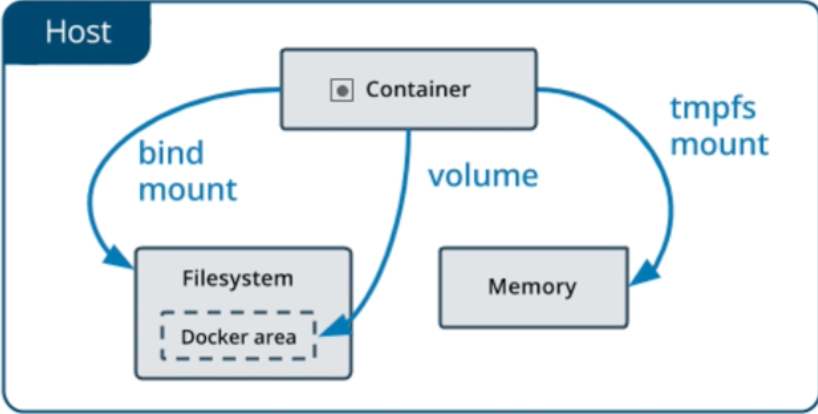

# Storage

Containers are **ephemeral** - the writable layer is destroyed when the container is removed. For data that needs to outlive a container, Docker provides three persistence mechanisms.



## Comparison

| | Bind Mount | Named Volume | tmpfs |
|---|---|---|---|
| **Managed by** | You | Docker | Kernel (in-memory) |
| **Location** | Any host path you specify | `/var/lib/docker/volumes/` | RAM only |
| **Persists after `docker rm`** | Yes | Yes | No |
| **Best for** | Dev source code, config files | Databases, app data | Secrets, temp data |

## Bind Mounts

Map a specific host path into the container. Changes on the host are immediately visible inside the container, and vice versa.

```bash
# --mount syntax (explicit, recommended)
docker run -d \
  --mount type=bind,src="$(pwd)/config",dst=/etc/myapp \
  myapp

# -v shorthand (same result)
docker run -d -v $(pwd)/config:/etc/myapp myapp

# Read-only (container cannot write to it)
docker run -d -v $(pwd)/config:/etc/myapp:ro myapp
```

**Typical uses:**
- Source code hot-reload in development
- Injecting config files without rebuilding the image
- Accessing host files (e.g., `/var/run/docker.sock` for Docker-in-Docker)

## Named Volumes

Docker manages the storage location. The volume is created automatically if it doesn't exist yet.

```bash
# --mount syntax
docker run -d \
  --mount type=volume,src=pgdata,dst=/var/lib/postgresql/data \
  postgres

# -v shorthand
docker run -d -v pgdata:/var/lib/postgresql/data postgres
```

```bash
docker volume create pgdata             # create explicitly (optional)
docker volume ls                        # list volumes
docker volume inspect pgdata            # location on host, metadata
docker volume rm pgdata                 # remove (fails if in use)
docker volume prune                     # remove all unused volumes
```

!!! tip
    Use named volumes for databases and any data that must survive container restarts or replacements. The data lives at `/var/lib/docker/volumes/<name>/_data` on the host.

## tmpfs

Stored in memory only - never written to disk. Destroyed when the container stops.

```bash
docker run -it \
  --mount type=tmpfs,dst=/run/secrets \
  ubuntu bash

# Inside: write to /run/secrets/
# After container exits: data is gone
```

**Typical uses:**
- Access tokens and passwords needed only while the container is running
- Temporary files that must not be persisted or logged

## Dockerfile `VOLUME` Instruction

Declaring a volume in a Dockerfile marks a directory as a mount point:

```dockerfile
FROM postgres
VOLUME /var/lib/postgresql/data    # ensures data is not lost if no volume is mounted
```

Docker will create an anonymous named volume for this path if you don't provide one at `docker run`. Prefer explicit named volumes over relying on this behaviour.

## Sharing Volumes Between Containers

Multiple containers can mount the same volume simultaneously:

```bash
docker run -d -v shared_data:/data --name writer myapp
docker run -d -v shared_data:/data --name reader myapp
```

!!! warning
    Docker does not coordinate concurrent writes. If multiple containers write to the same volume, your application must handle locking.
