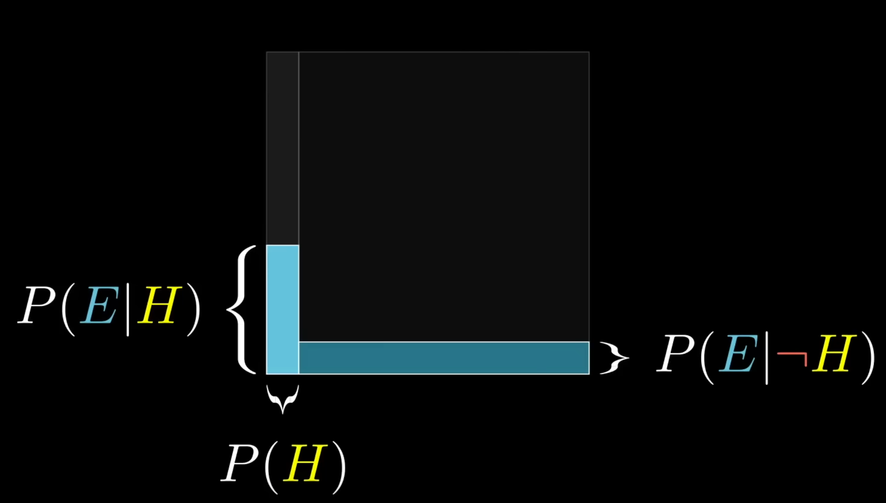

# Combinatorics & Probability

## Permutation & Combinations

- Permutation (`nPr`) : Number of ways to arrange `r` objects out of `n` distinct objects, order matters.

$$
nPr = \frac{n!}{(n-r)!}
$$

- Combination (nCr) : Number of ways to choose `r` objects out of `n` distinct objects, order doesn’t matter

$$
nCr = \frac{n!}{r!(n-r)!}
$$

## Pascal’s Triangle

- A triangular array where each number is sum of two directly above it
- The `nth` row corresponds to coefficient of $(a+b)^n$
- Properties
  - $\binom{n}{r} = \binom{n-1}{r-1} + \binom{n-1}{r}$
- Symmetry: $\binom{n}{r} = \binom{n}{n-r}$

## Binomial Theorem

- Expansion of $(a + b)^n$

$$
(a+b)^n = \Sigma^{n}_{r=0} \binom{n}{r} a^{n-r} b^r
$$

- Coefficient are binomial coefficient from Pascal’s Triangle

## Stars & Bars

- Technique to find the number of solution to : $x_1 + x_2 + ...+ x_k = n$, $x_i \ge 0$
- Number of solution is : $\binom{n+k-1}{k-1}$
- If $x_i > 0$, then number of solution is : $\binom{n-1}{k-1}$

## Inclusion - Exclusion Principle

- To find the size of the union of sets

## Derangements

- Permutation where no element appears in its original position
- Number of derangements of n objects, denote as $!n$

$$
!n = n!\Sigma^{n}_{k=0} \frac{(-1)^k}{k!}
$$

## Bell, Catalan, Stirling Numbers

- Bell Numbers : Number of ways to partition a set of n elements
- Catalan Number : Number of ways to correctly match parentheses, number of rooted binary trees, etc

$$
C_n = \frac{1}{n+1} \binom{2n}{n}
$$

- Stirling Numbers of the Second Kind: Number of ways to partition $n$ elements into $k$ non-empty subsets

$$
S(n, k)
$$

## Probabilities

### Conditional Probability

$$
P(A|B) = \frac{P(A\cap B)}{P(B)} \text{ if P(B) > 0}
$$

### Bayes’ Theorem

$$
P(H|E) = \frac{P(H)P(E|H)}{P(E)} = \frac{P(H)P(E|H)}{P(H)P(E|H) + P(\overline H)P(E|\overline H)}
$$

- Bayes theorem plays a central role in probability. It improves probability estimates based on evidence.
- Nice Video : [Link](https://www.youtube.com/watch?v=HZGCoVF3YvM)

|                                                              |
| ------------------------------------------------------------ |
|  |

### Expected Value

- For discrete random Variable $X$

$$
E[X] = \Sigma x_i P(X=x_i)
$$

### Linearity of Expectation

- For any random variables $X, Y$:

$$
E[X+Y] = E[X] + E[Y]
$$

- Holds even if $X, Y$ are dependent

## Radomized Techniques

Discussed in more detail in simulation section

* Monte Carlo Algorithms: Use randomness to get approximate solutions with some probability of error. 
* Las Vegas Algorithms: Always give correct solutions but runtime is random.

## Probabilistic DP & Sampling

- Use probability distributions to handle states in dynamic programming.
- Sampling methods (e.g., Markov Chain Monte Carlo) to estimate quantities when exact computation is hard.