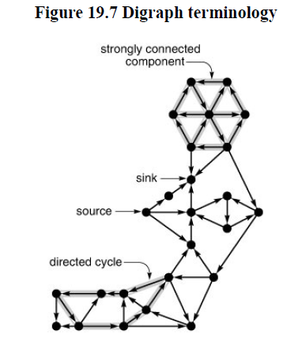
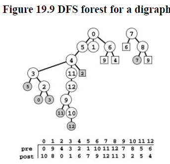
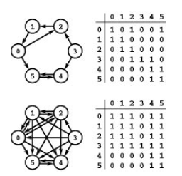
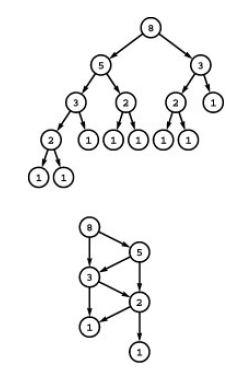
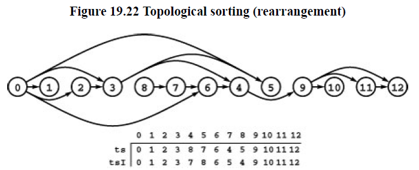

# Digraphs and DAGs

## Definitions

**Definition:** *A **digraph** is a set of **vertices** plus a set of **directed edges** that connect ordered pairs of vertices (with no duplicate edges). We say that an edge goes **from** its first vertex **to** its second vertex.*

**Definition:** *A **directed path** in a digraph is a list of vertices in which there is a directed edge connecting each vertex to its successor. We say that a vertex $t$ is reachable from a vertex $s$ if there is a directed path from $s$ to $t$.*

***sink*** has outdegree 0. ***source*** has indegree 0.

* NOTE: Indegree/outdegree and source/sink can be found in linear time and space.

**Definition:** *A **directed acyclic graph (DAG)** is a digraph with no directed cycles.*

**Definition:** *A digraph is **strongly connected** if every vertex is reachable from every other vertex.*



## DFS in Digraphs

In digraphs, there is a one-to-one correspondence between tree links and graph edges, and they fall into four distinct classes:

- Those representing a recursive call (tree edges)
- Those from a vertex to an ancestor in its DFS tree (back edges)
- Those from a vertex to a descendant in its DFS tree (down edges)
- Those from a vertex to another vertex that is neither an ancestor nor a descendant in its DFS tree (cross edges)



## Reachability and Transitive Closure

**Definition:** *The **transitive closure** of a digraph is a digraph with the same vertices but with an edge from s to t if and only if there is a directed path from s to t in the given digraph.*



Transitive closure can be computed using Warshall's Algorithm ($O(V^3)$):

```python
def transitive_closure(adj, n):
    # adj[i][j] = True if a direct edge i->j exists
    tc = [row[:] for row in adj]  # copy
    for k in range(n):
        for s in range(n):
            for t in range(n):
                if tc[s][k] and tc[k][t]:
                    tc[s][t] = True
    return tc
```

**Property:** With Warshall's algorithm, we can compute the transitive closure of a digraph in time proportional to $V^3$.

NOTE: The above is a special case of Floyd's algorithm, which finds shortest paths in a weighted graph.

## DAGs

* Generally used to solve scheduling problems.

**Definition:** *A **binary DAG** is a directed acyclic graph with two edges leaving each node, identified as the left edge and the right edge, either or both of which may be null.*



NOTE: The only difference between a binary DAG and a binary tree is that a node can have more than one parent.

## Topological Sorting

The goal of topological sorting is to process the vertices of a DAG such that every vertex is processed before all the vertices it points to.

**Topological Sort (relabel):** Given a DAG, relabel its vertices such that every directed edge points from a lower-numbered vertex to a higher-numbered one.

**Topological Sort (rearrange):** Given a DAG, rearrange its vertices on a horizontal line such that all directed edges point from left to right.



NOTE: The vertex order produced by a topological sort is not unique.

### DFS Topological Sort

**Property:** *Postorder numbering in DFS yields a reverse topological sort for any DAG.*

```python
def topological_sort_dfs(adj, n):
    visited = [False] * n
    order = []

    def dfs(v):
        visited[v] = True
        for neighbor in adj[v]:
            if not visited[neighbor]:
                dfs(neighbor)
        order.append(v)  # post-order: add after visiting all neighbors

    for i in range(n):
        if not visited[i]:
            dfs(i)

    return order[::-1]  # reverse for topological order
```

### Kahn's Topological Sort

* Create an indegree vector while building the graph.
* Push all sources (indegree 0) onto the queue.
* Run BFS, decrementing indegrees as edges are processed.

```python
from collections import deque
from typing import List, Iterable, Tuple

def topo_sort_kahn(n: int, edges: Iterable[Tuple[int, int]]) -> List[int]:
    """
    Returns a topological ordering of a directed graph with n vertices.
    Returns an empty list if a cycle exists.
    """
    graph = [[] for _ in range(n)]
    indegree = [0] * n

    for u, v in edges:
        graph[u].append(v)
        indegree[v] += 1

    q = deque(i for i in range(n) if indegree[i] == 0)
    order = []

    while q:
        u = q.popleft()
        order.append(u)
        for v in graph[u]:
            indegree[v] -= 1
            if indegree[v] == 0:
                q.append(v)

    return order if len(order) == n else []
```

## Problems

### Example Problems with Links

| **Problem** | **Concept** | **Approach** |
|-------------|-------------|--------------|
| [Topological Sort](https://practice.geeksforgeeks.org/problems/topological-sort/1) | Standard Topological Sorting | Use DFS with a stack or Kahn's Algorithm. |
| [Detect Cycle in a Directed Graph](https://practice.geeksforgeeks.org/problems/detect-cycle-in-a-directed-graph/1) | Cycle Detection in a Directed Graph | Use recursion stack in DFS or Kahn's Algorithm to detect cycles. |
| [Course Schedule](https://leetcode.com/problems/course-schedule/) | Check if courses can be completed | Use Topological Sort to detect cycles. |
| [Course Schedule II](https://leetcode.com/problems/course-schedule-ii/) | Find course completion order | Use Topological Sort to get a valid order. |
| [Find Eventual Safe States](https://leetcode.com/problems/find-eventual-safe-states/) | Identify nodes not leading to a cycle | Reverse the graph, apply Topological Sort on reversed edges, and find nodes with 0 indegree. |
| [Alien Dictionary](https://leetcode.com/problems/alien-dictionary/) | Determine character order from word precedence | Construct a graph from word order, apply Topological Sort to find the order. Handle cycles or ambiguity cases. |

### Alien Dictionary

**Problem Statement:** Determine the order of characters in an alien language given a sorted list of words from its dictionary.

```
Example:
Input: words = ["baa", "abcd", "abca", "cab", "cad"]
Output: "b d a c"
```

Model the problem as a directed graph:
- Characters → Nodes
- Ordering constraints → Directed Edges

Construct the graph by comparing **only consecutive words** — the input being sorted means transitivity is implied ($a < b$ and $b < c$ implies $a < c$). Then return the topological sort.

```python
from collections import defaultdict, deque

def alienOrder(words):
    graph = defaultdict(set)
    indegree = {}

    # initialize all characters
    for word in words:
        for c in word:
            indegree[c] = 0

    # build graph using adjacent word pairs only
    for i in range(len(words) - 1):
        w1, w2 = words[i], words[i + 1]
        min_len = min(len(w1), len(w2))

        # invalid: longer word is a prefix of shorter (e.g. ["abc", "ab"])
        if len(w1) > len(w2) and w1[:min_len] == w2[:min_len]:
            return ""

        for j in range(min_len):
            if w1[j] != w2[j]:
                if w2[j] not in graph[w1[j]]:
                    graph[w1[j]].add(w2[j])
                    indegree[w2[j]] += 1
                break

    # topological sort via Kahn's
    q = deque([c for c in indegree if indegree[c] == 0])
    res = []

    while q:
        c = q.popleft()
        res.append(c)
        for nei in graph[c]:
            indegree[nei] -= 1
            if indegree[nei] == 0:
                q.append(nei)

    return "".join(res) if len(res) == len(indegree) else ""
```
