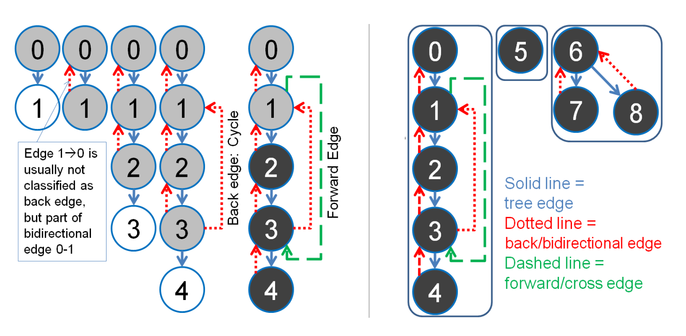
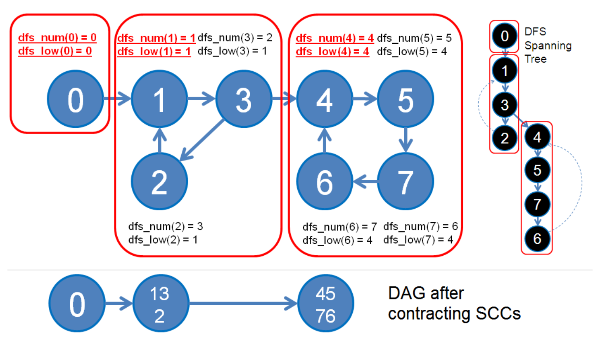

# Other Algorithms

### Graph Edge Property Check via DFS Spanning Tree

Running DFS on a connected graph generates a DFS spanning tree (or spanning forest if the graph is disconnected). With three vertex states — UNVISITED, EXPLORED (visited but not yet completed), and VISITED (completed) — we can classify graph edges into three types:

* **Tree edge:** An edge from an EXPLORED vertex to an UNVISITED vertex (the edge DFS traversed).
* **Back edge:** An edge from an EXPLORED vertex to another EXPLORED vertex. Indicates a cycle. (For undirected graphs, exclude the parent edge.)
* **Forward/Cross edge:** An edge from an EXPLORED vertex to a VISITED vertex.



```python
UNVISITED, EXPLORED, VISITED = 0, 1, 2

def graph_check(adj, n):
    state = [UNVISITED] * n
    parent = [-1] * n
    num_comp = 0

    def dfs(u):
        state[u] = EXPLORED
        for v in adj[u]:
            if state[v] == UNVISITED:
                parent[v] = u
                dfs(v)
            elif state[v] == EXPLORED:
                if v == parent[u]:
                    print(f"Two ways ({u}, {v}) - ({v}, {u})")
                else:
                    print(f"Back Edge ({u}, {v}) (Cycle)")
            else:  # VISITED
                print(f"Forward/Cross Edge ({u}, {v})")
        state[u] = VISITED

    for i in range(n):
        if state[i] == UNVISITED:
            num_comp += 1
            print(f"Component {num_comp}:")
            dfs(i)
```

### Bridges

Use Cases:

* **Network Analysis:** Detecting critical connections in a communication or transport network.
* **Graph Reliability:** Determining edges whose removal disconnects parts of the graph.

Properties:

* **Definition:** Edges whose removal increases the number of connected components.
* Found in **undirected graphs**.
* Calculated by comparing discovery time and low-link values during DFS.
* **Time:** $O(V + E)$

```python
def find_bridges(adj, n):
    disc = [-1] * n
    low = [-1] * n
    bridges = []
    timer = [0]

    def dfs(u, parent):
        disc[u] = low[u] = timer[0]
        timer[0] += 1
        for v in adj[u]:
            if disc[v] == -1:
                dfs(v, u)
                low[u] = min(low[u], low[v])
                if low[v] > disc[u]:
                    bridges.append((u, v))
            elif v != parent:  # back edge
                low[u] = min(low[u], disc[v])

    for i in range(n):
        if disc[i] == -1:
            dfs(i, -1)

    return bridges
```

### Articulation Points

Use Cases:

* **Network Design:** Identifying critical routers or servers in a network.
* **Graph Reliability:** Understanding the impact of removing key nodes.

Properties:

* **Definition:** Nodes whose removal increases the number of connected components.
* Found in **undirected graphs**.
* Depends on DFS traversal and comparing discovery and low-link values.
* **Time:** $O(V + E)$

```python
def find_articulation_points(adj, n):
    disc = [-1] * n
    low = [-1] * n
    is_ap = [False] * n
    timer = [0]

    def dfs(u, parent):
        disc[u] = low[u] = timer[0]
        timer[0] += 1
        children = 0
        for v in adj[u]:
            if disc[v] == -1:
                children += 1
                dfs(v, u)
                low[u] = min(low[u], low[v])
                if parent == -1 and children > 1:
                    is_ap[u] = True
                if parent != -1 and low[v] >= disc[u]:
                    is_ap[u] = True
            elif v != parent:
                low[u] = min(low[u], disc[v])

    for i in range(n):
        if disc[i] == -1:
            dfs(i, -1)

    return [i for i in range(n) if is_ap[i]]
```

## Strongly Connected Components

An SCC is a maximal set of vertices such that for any pair u, v in the SCC, there exists a path from u to v and from v to u.



### Tarjan's Algorithm

Use Cases:

* **SCCs:** Find SCCs in directed graphs.
* **Optimization:** Used in solving 2-SAT problems in linear time.

Properties:

* Uses DFS to compute discovery and low-link values.
* Maintains a stack to track nodes in the current SCC.
* Operates on **directed graphs**.
* **Time:** $O(V + E)$

```python
def tarjans_scc(adj, n):
    disc = [-1] * n
    low = [-1] * n
    in_stack = [False] * n
    stack = []
    sccs = []
    timer = [0]

    def dfs(u):
        disc[u] = low[u] = timer[0]
        timer[0] += 1
        stack.append(u)
        in_stack[u] = True

        for v in adj[u]:
            if disc[v] == -1:
                dfs(v)
                low[u] = min(low[u], low[v])
            elif in_stack[v]:
                low[u] = min(low[u], disc[v])

        if low[u] == disc[u]:  # root of an SCC
            scc = []
            while True:
                v = stack.pop()
                in_stack[v] = False
                scc.append(v)
                if v == u:
                    break
            sccs.append(scc)

    for i in range(n):
        if disc[i] == -1:
            dfs(i)

    return sccs
```

### Kosaraju's Algorithm

Use Cases:

* **SCCs:** Identifying clusters in directed graphs.
* **Dependency Analysis:** Resolving dependencies in package management systems.

Properties:

* **Steps:** Two-pass DFS:
    * First pass: Record finish order of nodes (postorder).
    * Second pass: Perform DFS on the **reversed graph** in decreasing finish order.
* Operates on **directed graphs**.
* **Time:** $O(V + E)$

```python
def kosarajus_scc(adj, n):
    visited = [False] * n
    order = []

    def dfs1(u):
        visited[u] = True
        for v in adj[u]:
            if not visited[v]:
                dfs1(v)
        order.append(u)

    for i in range(n):
        if not visited[i]:
            dfs1(i)

    rev_adj = [[] for _ in range(n)]
    for u in range(n):
        for v in adj[u]:
            rev_adj[v].append(u)

    visited = [False] * n
    sccs = []

    def dfs2(u, scc):
        visited[u] = True
        scc.append(u)
        for v in rev_adj[u]:
            if not visited[v]:
                dfs2(v, scc)

    for u in reversed(order):
        if not visited[u]:
            scc = []
            dfs2(u, scc)
            sccs.append(scc)

    return sccs
```

| **Algorithm**           | **Use Case**                        | **Graph Type** | **Property**                             | **Time Complexity** |
| ----------------------- | ----------------------------------- | -------------- | ---------------------------------------- | ------------------- |
| **Articulation Points** | Critical nodes in undirected graphs | Undirected     | Nodes whose removal increases components | O(V + E)            |
| **Bridges**             | Critical edges in undirected graphs | Undirected     | Edges whose removal increases components | O(V + E)            |
| **Kosaraju's**          | SCCs in directed graphs             | Directed       | Two-pass DFS with graph reversal         | O(V + E)            |
| **Tarjan's**            | SCCs in directed graphs             | Directed       | Single DFS with stack-based SCCs         | O(V + E)            |
