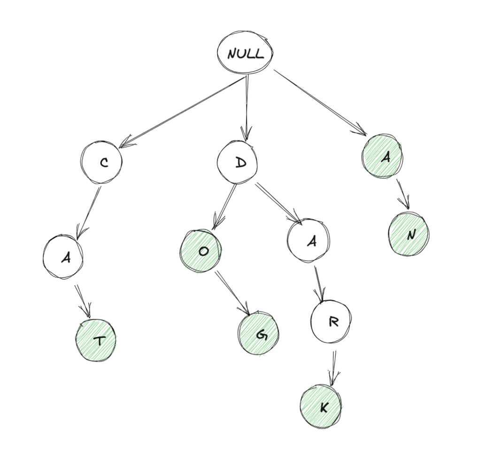

# Trie

A **Trie** (pronounced “try”) is a tree-like data structure used to store a dynamic set of strings. Each node in the Trie represents a single character, and strings are represented as paths from the root to a leaf node. It is mainly used for:

* Word search (exact match)

* Prefix search (words starting with a prefix)

Its common use-cases are

* Auto-Complete
* Spell Checker
* Longest Prefix Matching



````c++
class Trie {
public:
    Trie() { root = new TrieNode(); }

    // Insert a word into the Trie
    void insert(const string& word) {
        TrieNode* tmp = root;
        for (char c : word) {
            int i = c - 'a';
            if (tmp->next[i] == nullptr)
                tmp->next[i] = new TrieNode();
            tmp = tmp->next[i];
        }
        tmp->end = true;
    }

    // Check if a word exists in the Trie
    bool search(const string& word) {
        TrieNode* tmp = root;
        for (char c : word) {
            int i = c - 'a';
            if (tmp->next[i] == nullptr) return false;
            tmp = tmp->next[i];
        }
        return tmp->end;
    }

    // Check if any word starts with the given prefix
    bool startsWith(const string& prefix) {
        TrieNode* tmp = root;
        for (char c : prefix) {
            int i = c - 'a';
            if (tmp->next[i] == nullptr) return false;
            tmp = tmp->next[i];
        }
        return true;
    }

private:
    struct TrieNode {
        vector<TrieNode*> next;
        bool end;
        TrieNode() : next(26, nullptr), end(false) {}
    };

    TrieNode* root;
};
````

Similar Implementation but in Python

```python

class Trie:
    def __init__(self):
        self.root = {}

    def insert(self, word: str) -> None:
        node = self.root
        for ch in word:
            node = node.setdefault(ch, {})
        node["$"] = True   # end-of-word marker

    def search(self, word: str) -> bool:
        node = self.root
        for ch in word:
            if ch not in node:
                return False
            node = node[ch]
        return "$" in node

    def startsWith(self, prefix: str) -> bool:
        node = self.root
        for ch in prefix:
            if ch not in node:
                return False
            node = node[ch]
        return True

```

## Problems

### Number of Distinct Substrings in a String Using Trie

**Problem Description:** Implement a program that takes a string 'S' as input and returns the number of distinct substrings of the given string, including the empty substring. Use a trie data structure to accomplish this.

Example:

```
s = 'aba'
output = 6 : ['a', 'ab', 'ba', 'b', 'aba', '']
total = 8
```

One straightforward solution is to generate all the substrings : $O(n^2)$ which would be slow, but trie based solution is also $O(n^2)$

We repeatedly try to push each substring into the trie hoping if we encounter same substring it would not insert again in the trie,

```python

class TrieNode:
    def __init__(self):
        self.children = {}

def countDistinctSubstrings(s: str) -> int:
    root = TrieNode()
    count = 0

    for i in range(len(s)):
        node = root
        for j in range(i, len(s)):
            if s[j] not in node.children:
                node.children[s[j]] = TrieNode()
                count += 1
            node = node.children[s[j]]

    return count

```

### Longest String with All Prefixes

Given a string array nums of length n. A string is called a complete string if every prefix of this string is also present in the array nums. Find the longest complete string in the array nums.

Example

```

Input: nums = ["n", "ni", "nin", "ninj" , "ninja" , "nil" ]
Output: "ninja"
Explanation: The word "ninja" is the longest word which has all its prefixes present in the array.

```

Python Solution: 

Hint : Build the trie out of each strings in nums, and try to find the longest path in the Trie.


```python

def longestWord(self, words: list[str]) -> str:
    trie = Trie()
    for w in words:
        trie.insert(w)

    best = ""

    def dfs(node, path):
        nonlocal best

        # update answer, check length and lexicographic value
        if len(path) > len(best) or (len(path) == len(best) and path < best):
            best = path

        for ch in sorted(node.keys()):
            if ch == "$":
                continue
            # only continue if prefix is a word
            if "$" in node[ch]:
                dfs(node[ch], path + ch)

    # start DFS only from valid single-letter words
    for ch in sorted(trie.root.keys()):
        if "$" in trie.root[ch]:
            dfs(trie.root[ch], ch)

    return best

```

## Bit Operations in Trie

An important application of bitwise operations in tries is XOR (exclusive OR). XOR is commonly used in tries to efficiently perform operations like bitwise toggling or finding the XOR of elements. This operation is particularly useful in scenarios where we need to compare or manipulate binary representations of data.

For Example : 9 ~ 1001

But in Trie we represent entire 32 bit range with leading zeroes in Trie.

### Maximum XOR of Two Numbers in an Array

Given an integer array `nums`, return _the maximum result of_ `nums[i] XOR nums[j]`, where `0 <= i <= j < n`.

A naive approach would be to try all 2 pairs with $O(n^2)$ complexity.

To maximize XOR of two numbers we want the opposite bits at the highest possible position. Example

```

1 ^ 0 = 1 (good)
1 ^ 1 = 0 (bad)

To maximize let's say 9 : 1001
we want to check whether there is a : 0110 present

```

In bit representation of Trie there would be either `0` child or `1` child at each node.

```python

def findMaximumXOR(self, nums: list[int]) -> int:
    trie = {}
    L = max(nums).bit_length()

    # insert number into trie
    def insert(num):
        node = trie
        for i in range(L - 1, -1, -1):
            bit = (num >> i) & 1
            node = node.setdefault(bit, {})

    # query best XOR partner
    def query(num):
        node = trie
        xor_val = 0
        for i in range(L - 1, -1, -1):
            bit = (num >> i) & 1
            toggled = 1 - bit
            if toggled in node:
                xor_val |= (1 << i)
                node = node[toggled]
            else:
                node = node[bit]
        return xor_val

    # build + query
    for num in nums:
        insert(num)

    ans = 0
    for num in nums:
        ans = max(ans, query(num))

    return ans

```

### Maximum XOR with an Element From Array

You are given an array `nums` consisting of non-negative integers. You are also given a `queries` array, where `queries[i] = [xi, mi]`.

The answer to the `ith` query is the maximum bitwise `XOR` value of `xi` and any element of `nums` that does not exceed `mi`. In other words, the answer is `max(nums[j] XOR xi)` for all `j` such that `nums[j] <= mi`. If all elements in `nums` are larger than `mi`, then the answer is `-1`.

Return _an integer array_ `answer` _where_ `answer.length == queries.length` _and_ `answer[i]` _is the answer to the_ `ith` _query._


```python

def maximizeXor(self, nums, queries):
    nums.sort()
    queries = [(xi, mi, i) for i, (xi, mi) in enumerate(queries)]
    queries.sort(key=lambda x: x[1])

    trie = {}
    ans = [-1] * len(queries)
    idx = 0
    L = max(nums).bit_length() if nums else 1

    def insert(num):
        node = trie
        for i in range(L - 1, -1, -1):
            bit = (num >> i) & 1
            node = node.setdefault(bit, {})

    def query(num):
        node = trie
        res = 0
        for i in range(L - 1, -1, -1):
            bit = (num >> i) & 1
            want = 1 - bit
            if want in node:
                res |= (1 << i)
                node = node[want]
            else:
                node = node[bit]
        return res

    for xi, mi, qi in queries:
        while idx < len(nums) and nums[idx] <= mi:
            insert(nums[idx])
            idx += 1

        if trie:
            ans[qi] = query(xi)
        else:
            ans[qi] = -1

    return ans

```

### Design Add Word and Search Data Structure

Design a data structure that supports adding new words and searching for existing words.

Implement the `WordDictionary` class:

- `void addWord(word)` Adds `word` to the data structure.
- `bool search(word)` Returns `true` if there is any string in the data structure that matches `word` or `false` otherwise. `word` may contain dots `'.'` where dots can be matched with any letter.

```python
class WordDictionary:

    def __init__(self):
        self.root = {}
        
    def addWord(self, word: str) -> None:
        node = self.root
        for ch in word:
            node = node.setdefault(ch, {})
        node["$"] = True 

    def search(self, word: str) -> bool:

        n = len(word)
        
        def find(node, i):
            if i == n:
                return "$" in node

            ch = word[i]            
            if ch != ".":
                if ch not in node:
                    return False
                return find(node[word[i]], i+1)
            else:
                for nxt in node:
                    if nxt == "$":
                        continue
                    if find(node[nxt], i + 1):
                        return True
                return False

        return find(self.root, 0)
```

### Word Search II

Given a 2-D grid of characters `board` and a list of strings `words`, return all words that are present in the grid.

For a word to be present it must be possible to form the word with a path in the board with horizontally or vertically neighboring cells. The same cell may not be used more than once in a word.

```
Input:
board = [
  ["a","b","c","d"],
  ["s","a","a","t"],
  ["a","c","k","e"],
  ["a","c","d","n"]
],
words = ["bat","cat","back","backend","stack"]

Output: ["cat","back","backend"]
```


|  |
| ----------------------------------------------- |

In above problem, if only single word was given, then we could have tried backtracking at every cell `(i, j)`, but since while tracking we can match any of the words from the list of the words given Trie is more optimal choice here for prefix matching.

We will keep visited array here to avoid traversing already visited cells.

```python

class TrieNode:
    def __init__(self):
        self.root = {}
    
    def addWord(self, word):
        node = self.root
        for ch in word:
            node = node.setdefault(ch, {})
        node["$"] = True

class Solution:
    def findWords(self, board: List[List[str]], words: List[str]) -> List[str]:
        trie = TrieNode()
        for w in words:
            trie.addWord(w)

        n, m = len(board), len(board[0])
        res, vis = set(), set()

        dirs = [(0, 1), (1, 0), (-1, 0), (0, -1)]

        def dfs(i, j, node, word):
            if (i, j) in vis:
                return
            vis.add((i, j))

            node = node[board[i][j]]
            word += board[i][j]
            if "$" in node:
                res.add(word)

            for dx, dy in dirs:
                x = dx + i 
                y = dy + j

                if x < 0 or y < 0 or x >= n or y >= m:
                    continue
                
                if board[x][y] not in node:
                    continue

                
                dfs(x, y, node, word)
            
            vis.remove((i, j))
        
        for r in range(n):
            for c in range(m):
                if board[r][c] in trie.root:
                    dfs(r, c, trie.root, "")
        
        return list(res)
```

Further improvement can be done in above problem by running DFS in guided manner using Trie


