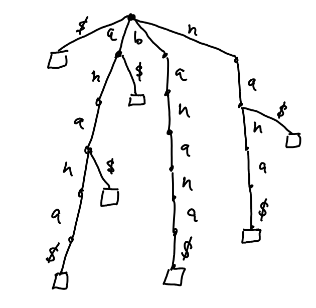
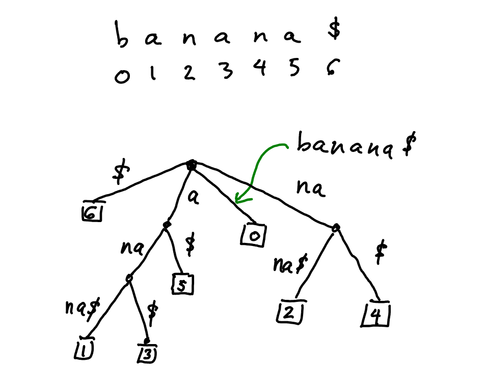

# Suffix Tree

* A suffix tree is a compressed trie containing all the suffixes of the given text as their keys and positions in the text as their values.
* Allows particularly fast implementations of many important string operations
* The Suffix tree for a text `X` of size `n` from an alphabet of size `d` 
  * stores all the `n(n-1)/2` suffixes of `X` in `O(n)` space.
  * can be constructed in `O(dn)` time
  * supports arbitrary pattern matching and prefix matching queries in `O(dm)` time, where `m` is length of the pattern

Example - Given a string `banana$` create its suffix tree. NOTE: `$` : represents string termination.

Generating the suffixes by hand would give us following : `banana$, anana$, nana$, ana$, na$, a$ , $`

Construct a trie for the data, which is a space-intensive method to represent it as a tree. Instead, create a suffix tree from the data.

|  |
| ------------------------------------------------------------ |
| Above representation is not efficient in terms of space, we can represent a suffix as shown below. |
|  |
| The number in the leaf refers to the index into `s` where the suffix represented by the leaf begins. |

* Actual algorithm work in following way, To add a new suffix to tree, we walk down the current tree, until we come to a place where the path leads off of the current tree.
* This could happen at anywhere in tree, middle of the edge, or at an already existing node,
  * In first cast we split the edge in two and add a new node with branching factor of 2 in the middle
  * second case simply add a new edge from an already existing node.
* Thus number of node in the tree is O(n) (NOTE: Naive construction above is still $O(N^2)$ which can be optimized)
* NOTE: Ukkonen’n Algorithm (linear time) for creating suffix tree. [Link](https://en.wikipedia.org/wiki/Ukkonen's_algorithm)

# Suffix Array

* **in practice**, people rarely implement full **suffix trees**, especially not Ukkonen’s algorithm
* In a practical scenario : Suffix Array + LCP Array = Practical Suffix Tree Substitute
* A suffix array is simply a sorted list of all suffixes of the string. Taking previous example.

````c++
Suffixes:         Sorted Order:
0: banana$        6: $
1: anana$         5: a$
2: nana$          3: ana$
3: ana$           1: anana$
4: na$            0: banana$
5: a$             4: na$
6: $              2: nana$
````

* Suffix Array would be : `[6, 5, 3, 1, 0, 4, 2]`
* LCP Array is Longest Common Prefix : It tells the length of the common prefix between consecutive suffixes in the sorted suffix array. Here LCP = `[0, 1, 3, 0, 0, 2, 0]`

| **Feature**                | **Suffix Tree**          | **Suffix Array + LCP**                        |
| -------------------------- | ------------------------ | --------------------------------------------- |
| **Construction Time**      | O(n) with Ukkonen’s algo | O(n log n) or O(n) with tricks                |
| **Space Usage**            | High (nodes, pointers)   | Low (arrays only)                             |
| **Ease of Implementation** | Very hard                | Easy to moderate                              |
| **Pattern Matching**       | O(m)                     | O(m log n)                                    |
| **Use in Practice**        | Rarely used directly     | Common (bioinformatics, search engines, etc.) |

## Suffix Array Implementation

* Build Suffix Array in $O(n \log n)$
* Build LCP Array using Kasai’s algorithm in $O(n)$
* Supports
  * Pattern Matching
  * Longest Repeated Substring
  * Count of distinct substring

````c++
#include <bits/stdc++.h>
using namespace std;

class SuffixStructure {
private:
    string s;
    int n;
    vector<int> sa, rank, lcp;

    void buildSA() {
        sa.resize(n);
        vector<int> tmp(n), cnt(max(256, n));
        iota(sa.begin(), sa.end(), 0);
        rank.resize(n);
        for (int i = 0; i < n; ++i) rank[i] = s[i];

        for (int k = 1; k < n; k <<= 1) {
            auto cmp = [&](int i, int j) {
                if (rank[i] != rank[j]) return rank[i] < rank[j];
                int ri = (i + k < n) ? rank[i + k] : -1;
                int rj = (j + k < n) ? rank[j + k] : -1;
                return ri < rj;
            };
            sort(sa.begin(), sa.end(), cmp);

            tmp[sa[0]] = 0;
            for (int i = 1; i < n; ++i)
                tmp[sa[i]] = tmp[sa[i - 1]] + cmp(sa[i - 1], sa[i]);
            rank = tmp;
        }
    }

    void buildLCP() {
        lcp.resize(n);
        vector<int> inv(n);
        for (int i = 0; i < n; ++i) inv[sa[i]] = i;

        int k = 0;
        for (int i = 0; i < n; ++i) {
            if (inv[i] == 0) continue;
            int j = sa[inv[i] - 1];
            while (i + k < n && j + k < n && s[i + k] == s[j + k]) k++;
            lcp[inv[i]] = k;
            if (k) k--;
        }
    }

public:
    SuffixStructure(const string &str) : s(str + "$"), n(str.size() + 1) {
        buildSA();
        buildLCP();
    }

    // Find if pattern exists in O(m log n)
    bool contains(const string &pattern) {
        int l = 0, r = n - 1;
        while (l <= r) {
            int m = (l + r) / 2;
            string suffix = s.substr(sa[m], pattern.size());
            if (suffix == pattern) return true;
            else if (suffix < pattern) l = m + 1;
            else r = m - 1;
        }
        return false;
    }

    // Longest repeated substring
    string longestRepeatedSubstring() {
        int len = 0, pos = 0;
        for (int i = 1; i < n; ++i) {
            if (lcp[i] > len) {
                len = lcp[i];
                pos = sa[i];
            }
        }
        return s.substr(pos, len);
    }

    // Number of distinct substrings
    long long countDistinctSubstrings() {
        long long total = 1LL * n * (n - 1) / 2; // sum of lengths of all suffixes
        long long repeated = accumulate(lcp.begin(), lcp.end(), 0LL);
        return total - repeated;
    }

    // Getters
    vector<int> getSA() { return sa; }
    vector<int> getLCP() { return lcp; }
};
````

## Problems

| **Problem**                                                  | **Problem Type**       | **Optimal with**        | **Notes**                                                    |
| ------------------------------------------------------------ | ---------------------- | ----------------------- | ------------------------------------------------------------ |
| [#336. Palindrome Pairs](https://leetcode.com/problems/palindrome-pairs/) | Substring checks       | Trie / Suffix tree idea | Though typically solved with tries, suffix structures help in understanding efficient string lookups. |
| [#472. Concatenated Words](https://leetcode.com/problems/concatenated-words/) | Substring parsing      | Trie / DP               | Suffix tree logic helps if asked to optimize DP further.     |
| [#920. Number of Music Playlists](https://leetcode.com/problems/number-of-music-playlists/) | Rare use case          | DP + Combinatorics      | Suffix trees aren’t a fit here, but LCP might be used to optimize substring checks. |
| [#1044. Longest Duplicate Substring](https://leetcode.com/problems/longest-duplicate-substring/) | **Direct application** | **Suffix Array + LCP**  | This is the **clearest modern Suffix Tree replacement problem** on LeetCode. |
| [#1153. String Compression II](https://leetcode.com/problems/string-compression-ii/) | Optimization           | DP + Preprocessing      | Advanced string structure can help, but not common in brute-force. |
| [#1326. Minimum Number of Taps to Open to Water a Garden](https://leetcode.com/problems/minimum-number-of-taps-to-open-to-water-a-garden/) | Interval covering      | Segment Tree            | Not suffix-related, but string segment problems sometimes align with this. |
| [#1178. Number of Valid Words for Each Puzzle](https://leetcode.com/problems/number-of-valid-words-for-each-puzzle/) | Bitmask / Trie         | Trie / hashing          | Again, tries are more practical here.                        |

### Summary

* Most of technical interviews will not ask for Suffix Tree/Suffix Array unless you are going for competitive coding, in that case Suffix Array + LCP would be enough to answer most of the questions