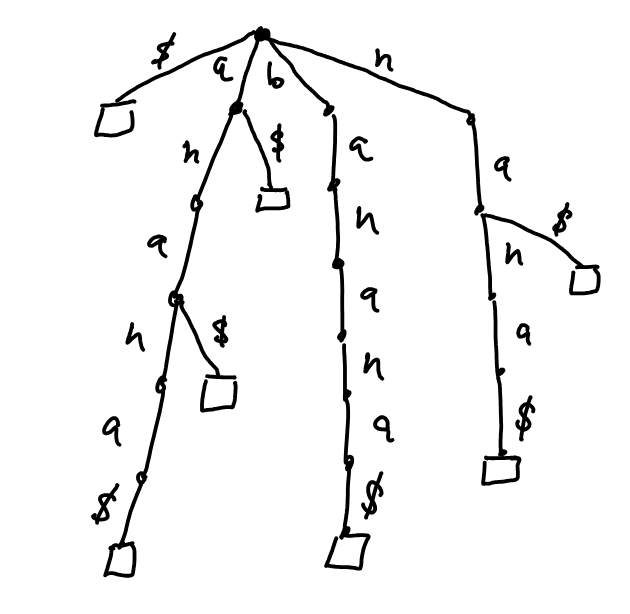
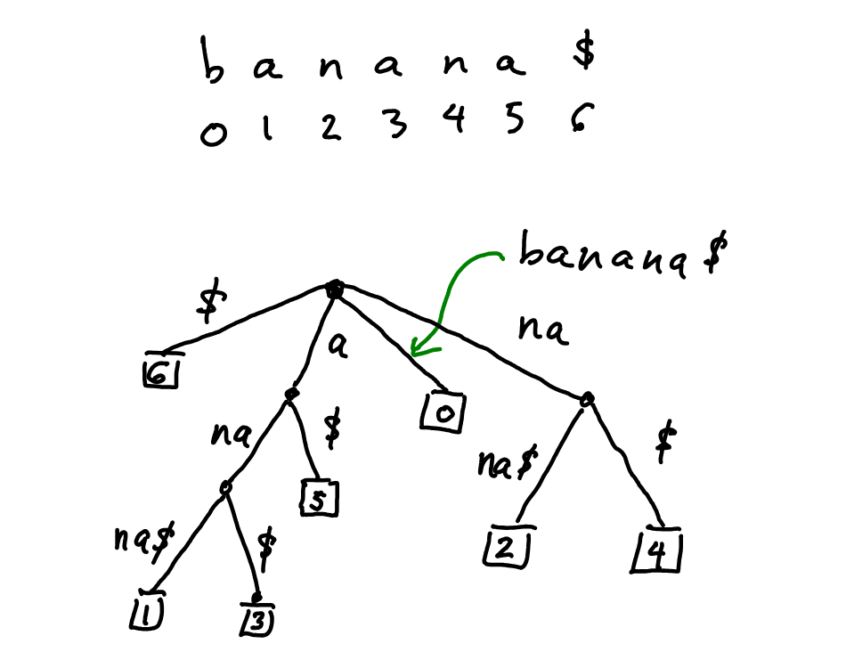

# Suffix Tree

* A suffix tree is a compressed trie containing all the suffixes of the given text as their keys and positions in the text as their values.
* Allows particularly fast implementations of many important string operations
* The Suffix tree for a text `X` of size `n` from an alphabet of size `d` 
    * stores all the `n(n-1)/2` suffixes of `X` in `O(n)` space.
    * can be constructed in `O(dn)` time
    * supports arbitrary pattern matching and prefix matching queries in `O(dm)` time, where `m` is length of the pattern

Example - Given a string `banana$` create its suffix tree. NOTE: `$` : represents string termination.

Generating the suffixes by hand would give us following : `banana$, anana$, nana$, ana$, na$, a$ , $`

Construct a trie for the data, which is a space-intensive method to represent it as a tree. Instead, create a suffix tree from the data.

|  |
| ------------------------------------------------------------ |
| Above representation is not efficient in terms of space, we can represent a suffix as shown below. |
|  |
| The number in the leaf refers to the index into `s` where the suffix represented by the leaf begins. |

* Actual algorithm work in following way, To add a new suffix to tree, we walk down the current tree, until we come to a place where the path leads off of the current tree.
* This could happen at anywhere in tree, middle of the edge, or at an already existing node,
    * In the first case we split the edge in two and add a new node with branching factor of 2 in the middle
    * second case simply add a new edge from an already existing node.
* Thus number of node in the tree is O(n) (NOTE: Naive construction above is still $O(N^2)$ which can be optimized)
* NOTE: Ukkonen’n Algorithm (linear time) for creating suffix tree. [Link](https://en.wikipedia.org/wiki/Ukkonen's_algorithm)

# Suffix Array

* **in practice**, people rarely implement full **suffix trees**, especially not Ukkonen’s algorithm
* In a practical scenario : Suffix Array + LCP Array = Practical Suffix Tree Substitute
* A suffix array is simply a sorted list of all suffixes of the string. Taking previous example.

```
Suffixes:         Sorted Order:
0: banana$        6: $
1: anana$         5: a$
2: nana$          3: ana$
3: ana$           1: anana$
4: na$            0: banana$
5: a$             4: na$
6: $              2: nana$
```

* Suffix Array would be : `[6, 5, 3, 1, 0, 4, 2]`
* LCP Array is Longest Common Prefix : It tells the length of the common prefix between consecutive suffixes in the sorted suffix array. Here LCP = `[0, 1, 3, 0, 0, 2, 0]`

| **Feature**                | **Suffix Tree**          | **Suffix Array + LCP**                        |
| -------------------------- | ------------------------ | --------------------------------------------- |
| **Construction Time**      | O(n) with Ukkonen’s algo | O(n log n) or O(n) with tricks                |
| **Space Usage**            | High (nodes, pointers)   | Low (arrays only)                             |
| **Ease of Implementation** | Very hard                | Easy to moderate                              |
| **Pattern Matching**       | O(m)                     | O(m log n)                                    |
| **Use in Practice**        | Rarely used directly     | Common (bioinformatics, search engines, etc.) |

## Suffix Array Implementation

* Build Suffix Array in $O(n \log n)$ - Python’s `sorted` with a suffix slice key is concise and correct.
* Build LCP Array using Kasai’s algorithm in $O(n)$.
* Supports:
    * Pattern Matching in $O(m \log n)$
    * Longest Repeated Substring
    * Count of distinct substrings

Python’s string comparison is lexicographic out of the box, making the implementation straightforward.

```python

class SuffixArray:
    def __init__(self, s: str):
        self.s = s
        self.n = len(s)
        self.sa = sorted(range(self.n), key=lambda i: s[i:])
        self.lcp = self._build_lcp()

    def _build_lcp(self):
        n, s, sa = self.n, self.s, self.sa
        rank = [0] * n
        for i, idx in enumerate(sa):
            rank[idx] = i

        lcp = [0] * n
        k = 0
        for i in range(n):
            if rank[i] == 0:
                continue
            j = sa[rank[i] - 1]
            while i + k < n and j + k < n and s[i + k] == s[j + k]:
                k += 1
            lcp[rank[i]] = k
            if k:
                k -= 1
        return lcp

    def contains(self, pattern: str) -> bool:
        l, r = 0, self.n - 1
        m = len(pattern)
        while l <= r:
            mid = (l + r) // 2
            substr = self.s[self.sa[mid]:self.sa[mid] + m]
            if substr == pattern:
                return True
            elif substr < pattern:
                l = mid + 1
            else:
                r = mid - 1
        return False

    def longest_repeated_substring(self) -> str:
        max_len = 0
        pos = 0
        for i in range(1, self.n):
            if self.lcp[i] > max_len:
                max_len = self.lcp[i]
                pos = self.sa[i]
        return self.s[pos:pos + max_len]

    def count_distinct_substrings(self) -> int:
        return self.n * (self.n + 1) // 2 - sum(self.lcp)

```

## Problems

| **Problem**                                                                                                                                | **Problem Type**       | **Optimal with**        | **Notes**                                                                                             |
| ------------------------------------------------------------------------------------------------------------------------------------------ | ---------------------- | ----------------------- | ----------------------------------------------------------------------------------------------------- |
| [#336. Palindrome Pairs](https://leetcode.com/problems/palindrome-pairs/)                                                                  | Substring checks       | Trie / Suffix tree idea | Though typically solved with tries, suffix structures help in understanding efficient string lookups. |
| [#472. Concatenated Words](https://leetcode.com/problems/concatenated-words/)                                                              | Substring parsing      | Trie / DP               | Suffix tree logic helps if asked to optimize DP further.                                              |
| [#920. Number of Music Playlists](https://leetcode.com/problems/number-of-music-playlists/)                                                | Rare use case          | DP + Combinatorics      | Suffix trees aren’t a fit here, but LCP might be used to optimize substring checks.                   |
| [#1044. Longest Duplicate Substring](https://leetcode.com/problems/longest-duplicate-substring/)                                           | **Direct application** | **Suffix Array + LCP**  | This is the **clearest modern Suffix Tree replacement problem** on LeetCode.                          |
| [#1153. String Compression II](https://leetcode.com/problems/string-compression-ii/)                                                       | Optimization           | DP + Preprocessing      | Advanced string structure can help, but not common in brute-force.                                    |
| [#1326. Minimum Number of Taps to Open to Water a Garden](https://leetcode.com/problems/minimum-number-of-taps-to-open-to-water-a-garden/) | Interval covering      | Segment Tree            | Not suffix-related, but string segment problems sometimes align with this.                            |
| [#1178. Number of Valid Words for Each Puzzle](https://leetcode.com/problems/number-of-valid-words-for-each-puzzle/)                       | Bitmask / Trie         | Trie / hashing          | Again, tries are more practical here.                                                                 |

### Summary

* Most of technical interviews will not ask for Suffix Tree/Suffix Array unless you are going for competitive coding, in that case Suffix Array + LCP would be enough to answer most of the questions