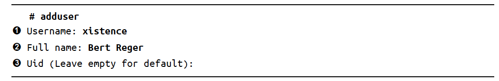
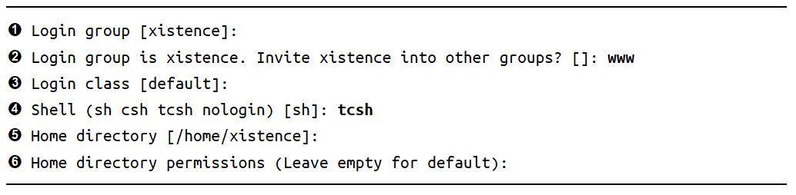
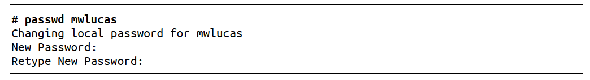
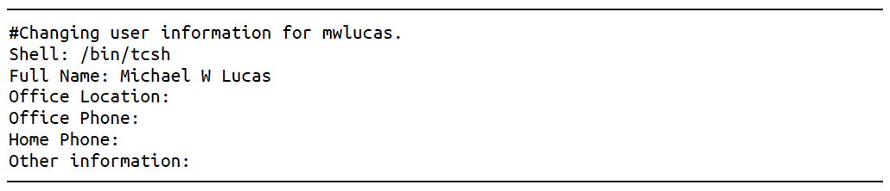

## 9. Securing your System

Securing your system means ensuring that your computer’s resources are used only by authorized people for authorized purposes. Even if you have no important data on system, you still have valuable CPU time, memory, and bandwidth.

Many folks who think their systems were too unimportant for anyone to bother breaking into found themselves an unwitting relay for an attack that disabled a major corporation. See Botnets.

Generally, OS are not broken into; the program running on OS are. Even the most paranoiac, secure-by-default OS in the world can’t protect badly written programs from themselves. Occasionally, one of those program can interact with OS in a way as to actually compromise OS. The most well-know of these are *buffer overflows*, where an intruder’s program is dumped straight into CPU’s execution space and the OS runs it. FreeBSD has undergone extensive auditing to eliminate buffer overflows as wells as myraid other well-understood security issues, but that’s no guarantee that they have been eradicated.

FreeBSD provides many tools to help secure your system against attacker, both internal and external. While no one of these tools are sufficient, all are desirable. Treat everything you learn about system security as a tool in a kit, not as the answer to all your problems.

### Who is the Enemy ?

#### Script Kiddies

Script Kiddies are not sysadmins and they are not skilled. They download attack points and work on a point-and-click basis and go look for vulnerability. To defend against : just keep your software up-to-date and follow good computing practices.

#### Disaffected Users

A organization’s employees are people most likely to know where the security gaps are, to feel that the rules don’t apply to them, and to have the time to spend breaking your security. You might have all patched and downright misanthropic firewall installed, but if anyone who knows the password is *Current93* can dial the back rook modem, you’re in trouble.

To stop people like these is simply not to be sloppy. Don’t leave projects insecurely half-finished or half-documented. When someone leaves the company, disable his account, change all administrative passwords, inform all employees of that person’s departure, and remind them not to share confidential information with that person. 

#### Botnets

Botnets are more numerous than either of the above. They are machines compromised by malware and controlled from a central point. Botnets can include millions of machines. The malware authors control the botnets and use them for anything from searching for more vulnerable hosts to sending spam or breaking into secure sites. Most botnets are composed of Windows and Linux Machines, But there is no reason why FreeBSD OS can’t be assimilated into botnets.

Fortunately, botnet defense is much like script kiddie defense; keeping your software patched and following good computing practices goes a long way.

#### Motivated Skilled Attackers

The most dangerous group - skilled attackers are competent system admins, security researchers, penetration specialists, and criminals who want access to your specific resources. Computer penetration is a lucrative criminal field these days, especially if the victim has resources that can be used for DDOS attacks or mass spam transmission. If one of these people *really* wants to break into your network, he’ll probably get there.

If you can make the intruder’s break-in plan resemble a Hollywood script no matter how much he knows about your network, your security is probably pretty good.

### FreeBSD Security Announcements

The FreeBSD Project includes volunteers who specialize in auditing source code and watching for security issues with both the base operating system and add-on software. These developers maintain a very low-volume mailing list, FreeBSD-security-notifications@FreeBSD.org, and subscribing is a good idea. While you can monitor other mailing lists for general announcements, the security notifications list is a single source forFreeBSD-specific information. To subscribe to the security notifications mailing list, see the instructions on http://lists.freebsd.org/. The FreeBSD security team releases advisories on that mailing list as soon as they’re available.

### User Security

FreeBSD has a variety of ways to allow users to do their work without giving them free rein on the system.

#### Creating User Accounts

FreeBSD uses standard UNIX user management programs such as `passwd(1)`, `pw(8)`, and `vipw(8)`. FreeBSD also includes a friendly interactive user-adding program, `adduser(8)`. Only *root* may add users, of course.



The username is the name of account. FreeBSD lets you choose a numerical user ID (UID). FreeBSD starts numbering UIDs at 1,000; while you can change this, all UIDs below 1000 are reserved for system use. Just press enter to take next available UID.



The user’s default group is important. The FreeBSD default of having each user in their own group is usually the sensible way for most setups. Any of big thick books on system administration offers several grouping schemes.

A login class specifies what level of resource the user has access to.

The *shell* is command line environment. While system default is /bin/sh, I prefer tcsh.

The home directory is where the user’s files reside on disk. The user and the user’s primary group own this directory. You can set custom permissions on the directory if you want, probably so that other users can’t view this user’s directory.

#### Configuring Adduser : /etc/adduser.conf

Creating new users on some Unix systems requires you to manually edit `/etc/passwd`, rebuild the password database, edit `/etc/group`, create a home directory, set permission on that directory, install dotfiles, and so on.

`/etc/adduser.conf` lets you set requirements as defaults while retaining the high degree of automation. To create `adduser.conf`, run `adduser -c` and answer the questions.

#### Editing Users

FreeBSd includes several tools for editing accounts, the simplest are `passwd(1)`, `chpass(1)`, `vipw(8)`, and `pw(8)`. These work on tightly interrelated files `/etc/master.passwd`, `/etc/passwd`, `/etc/spwd.db` and `/etc/pwd.db`.

`/etc/master.passwd` is authoritative source of user account information and includes user passwords in encrypted form.

Any time any standard user management program changes the account information in `/etc/master.passwd`, FreeBSD runs `pwd_mkdb(8)` to update other three files.

**Changing a Password**

Use `passwd(1)` to change passwords.



**Changing Accoutns with chpass(1)**

if you use `chpass`, you will get an editro with following text : 



If you use `chpass <username>` as root you will get even more options to modify.

**The Big Hammer : vipw(8)**

`vpiw` helps edit multiple user at a time. A FreeBSD system considers `/etc/master.passwd` in case of conflicts with other password files.

Each line in `/etc/master.passwd` is a single account record containing 10 colon-sepearated fields. These fields are the following : 

Username;Encrypted Password, UserID, Group ID, User’s Class, Password Expiration; Account Expiration; Personal Data; User’ Home Directory; User’s Shell.

**Removing a User**

The `rmuser(8)` program deletes user accounts.

**Scripting with `pw(8)`**

Very useful command to lock users and while account is locked, account is active, nobody can log in to it.

`pw lock xistence`

`pw unlock xistence`

### Shells and /etc/shells

The *shell* is the program that provides the user’s command prompt. The file `/etc/shells` contains a list of all legitimate user shells. If you compile your own shell without using a FreeBSD port, you must list the shsell by its complete path in `/etc/shells`.

The FTP daemon won’t allow a user to login via FTP if his shell isn’t listed in `/etc/shells`

### root, Groups, an Management

#### The root Password

Certain actions require absolute control of the system, including manipulating core system files such as the kernel, device drivers, and authentication systems. Such activities are designed to be performed by root.

To use the root password, you can either login as root at console login prompt or, if you’re a member of group wheel, log in as yourself and use the switch user command `su(1)`. It logs who uses it and can be used on a remote system.

One of the simplest ways to reduce the need for root access is the proper use of the groups.

#### Groups of Users

- A *group* is a way to classify users with similar administrative functions.
- A *sysadmin* can define a group *webmasters*, and add accounts of people with privilages to edit web-related files or create a group *email* and add email administrators to that group.
- To check your group type `id` on a console.

**/etc/group**

- The file `/etc/group` contains all group information except for the user’s primary group (which is defined with user account in `/etc/master.passwd`).

- Each line is four colon-delimited fields : the group name, group password, the group ID number, and a list of members.

  Example entry : `wheel:*:0:root,mwlucas,xistence`

- Second field group password, turned out to be a big nightmare. Modern Unix-like systems don’t do anything with group password, but field remains because old program expect to find something in this space. Asterisk is just a placeholder.

**Changing group Memberships**

- Just simply add user’s name into the list of member in `/etc/group` of respective group you want to add user to.

**Creating Group**

- For creating you only need a name for the group and a group ID. Technically, you don’t need a member for the group; some programs run as members of a group, and FreeBSD uses group permissions to control those programs similar to users.
- GIDs are generally assigned as next number in list but can be arbitrary number between 0 and 65535.

#### Using Groups to Avoid Root

#### System Accounts

- FreeBSD reserves some user account names for integrated programs. e.g. nameserver runs under the user account bind and group bind. If an intruter compromises the nameserver, she can access the system only with privileges of the user bind.
- Don’t have user log in as these users. They are not setup as interactive accounts by design.
- Create a separate user and group to own program files. That way, our hypothetical intruder can’t even edit the files used by DNS server, minimizing potential damage.
- Similarly database should not be allowed to edit its own config files.

#### Administrative Group Creation

Simplest way to create a group that owns files is to employ `adduser` to make a user that owns them and then to utilize that user’s primary group as the group for the files. Because we already have a user called `bind`, we will create an administrative user `dns`. Username isn’t important, but you can choose a name that everyone will recognise.

Give you administrative user a shell of `nologin`, which sets a shell of `/sbin/nologin`. This prevents anyone from actually loggin in as the administrative user.

Do not add this administrative user to any other groups. Under no circumstances add this user to a privileged group, such as wheel !

Every user needs a home directory. For an administrative user, a home directory of `/nonexistent` works well. This user’s files are elsewhere in the system, after all.

Lastly, let `adduser(8)` disable the account. While the shell prevents logins, an extra layer of defense won’t hurt.

To change the file’s owner and group, use `chown(1)`

`chown dns:dns rndc.key`

#### Interesting Default Groups

````
audit  : Users who can access audit(8) information
authpf : Users who can authenticate to the PF packet filter
bin 	 : Group owner of general system programs
bind   : Group for the BIND DNS server software
daemon : Used by various system services, such as the printing system
_dhcp  : DHCP client operations
dialer : Users who can access serial ports; useful for modems and tip(1)
games  : Owner of game files
guest  : System guests (almost never used)
hast   : Files used by hastd(8)
kmem   : Programs that can access kernel memory, such as fstat(1), netstat(1), and so on
mail   : Owner of the mail system
mailnull:Default group for sendmail(8) or other mail server
man    : Owner of uncompressed man pages
network: Owner of network programs like ppp(8)
news   :Owner of the Usenet News software (probably not installed)
nobody : Primary group for unprivileged user nobody, intended for use by NFS
nogroup: Group with no privileges, intended for use by NFS
operator:Users that can access drives, generally for backup purposes
_pflogd: Group for PF logging
proxy  : Group for FTP proxy in PF packet filter
smmsp  : Group for Sendmail submissions
sshd   : Owner of the SSH server (see Chapter 20)
staff  : System administrators (from BSD’s college roots, when users were
staff, faculty, or students)
sys    : Another system group
tty    : Programs that can write to terminals, like wall(1)
unbound: Files and programs related to the unbound(8) DNS server
uucp   : Group for programs related to the Unix-to-Unix Copy Protocol
video  : Group that can access DRM and DRI video devices
wheel  : Users who may use the root password
www Web: server programs (not files)
_ypldap: Files needed by the LDAP-backed YP server ypldap(8)
````

### Tweaking User Security

#### Restricting Login Ability

FreeBSD checks `/etc/login.access` for rules that forbid logins from users. This file has no rules by default, meaning everyone who provides valid password and username has no restrictions.

The `/etc/login.access` has three colon-delimited fields.

- (+) grants or (-) denies the right to login
- list of users or groups
- list of connection sources

Usage of `ALL` or `ALL EXCEPT` is allowed to make simple but expressive rules.

For example, to allow only members of wheel group to login from system console.

```
+:wheel:console
```

NOTE : There is a problem with this rule, although it allows wheel users to login from console, but if there is a user named Bert who is no wheel, but if he tries to login, no rule denies him access.

Correct Rule should be.

````
+:wheel:console
-:ALL :consoles
````

or similar rule using `ALL EXCEPT`

```
-:ALL EXCEPT wheel: console
```

Change the default from “allow access” to “deny access” by adding a final rule.

```
-:ALL:ALL
```

**Hostnames**

```
-:ALL EXCEPT WHEEL:fileserver.mycompany.com
```

Users in the wheel group can login from the fileserver, but nobody else can.

**Host Addresses and Networks**

Host addresses work like hostnames except they are immune to DNS failures or spoofing.

```
-:ALL EXCEPT wheel : 203.0.11.345
```

A network number is truncated IP Address, like this : 

```
-:ALL EXCEPT wheel : 203.0.113.
```

**LOCAL**

Anyone who owns a block of IP addresses can give their addresses any desired reverse DNS. The `LOCAL` restriction is best avoided.

**ALL and ALL EXCEPT**

```
-:ALL EXCEPT wheel: ALL EXCEPT 203.0.113.128 203.0.113.44
```

**Tie It All Together**

The point of these rules is to build a login policy that matches your real-world policies. If you provide generic services but only allow your sysadmin to log on remotely, a one-line `login.access` prevents any other users from loggin in.

Generally this configuration is quite used at several ISPs

````
-:ALL EXCEPT wheel: console
-:ALL EXCEPT wheel dns webmasters: ALL
````

This allows sysadmins to login via console and allow web teams and DNS teams to login remotely.

#### Restricting System Usage

You can provide more specific controls with login classes `/etc/login.conf`.

**Class Definitions**

The default `login.conf` starts with the default class, the class used by accounts without any class and gives unlimited access to system resources.

Each class definition consists 