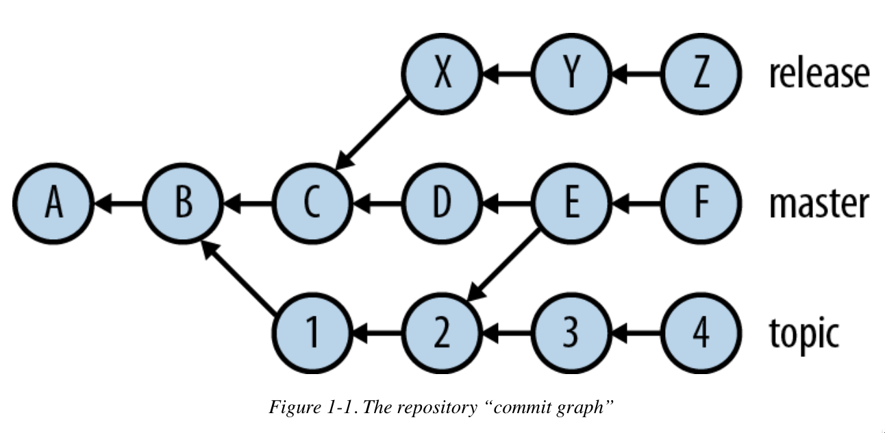

# Git Internals

Understanding Git's data model makes everything else click. Git is a content-addressable storage system built on four object types and a directed acyclic graph (DAG).

## The Four Object Types

### Blob

A blob is raw file content with no filename or metadata attached.

- Every version of every file is stored as a complete, standalone blob
- Two files with identical content share one blob (deduplication is automatic)
- Blobs use sophisticated compression internally
- Corruption of one blob affects only that version of that file, not the file's full history

### Tree

A tree represents one directory level.

- Contains a list of entries: each entry has a name, file type, and a pointer to either a blob (file) or another tree (subdirectory)
- A tree is a snapshot of a directory at one point in time, including all subdirectories recursively

### Commit

A commit is the fundamental unit of change.

- Points to a tree (the complete state of the repo at that moment)
- Records **Author** (who wrote the content) and **Committer** (who applied the change to the repo) separately
- Holds timestamps for both
- Lists zero or more **parent commits** (root commits have no parents; merge commits have two or more)
- Because commits form a DAG, cyclic references are impossible

### Tag

A tag is a permanent, human-readable label for a specific commit. Annotated tags also store a message and can be signed.

```bash
git tag v1.0                     # lightweight tag
git tag -a v1.0 -m "Release"     # annotated tag
git push origin v1.0             # tags are not pushed automatically
git push origin --tags           # push all tags
```

## Author vs Committer

Author and Committer start out identical, but diverge when history is rewritten:

| Operation | Author | Committer |
|-----------|--------|-----------|
| `git commit` | you | you |
| `git cherry-pick` | original author | you |
| `git rebase` | original author | you |
| `git am` (apply patch) | patch author | you |

## Object IDs and SHA-1

Every object is identified by a **cryptographic hash** of its type, size, and content. Git has historically used **SHA-1**, producing a 40-character hex string:

```
a1b2c3d4e5f6a1b2c3d4e5f6a1b2c3d4e5f6a1b2
```

This makes Git a **content-addressable store**: the same content always produces the same ID, and any change to content produces a completely different ID.

Practical consequences:

- You can abbreviate any OID to its shortest unique prefix (usually 7-12 chars): `git show a1b2c3d`
- Changing a commit message, parent, or tree produces a new OID, which is why rebasing "rewrites" history
- If an object is tampered with, its OID no longer matches its content and Git refuses to use it

### SHA-256

SHA-1 has known theoretical weaknesses. Git 2.29+ supports SHA-256 (`git init --object-format=sha256`), producing 64-character OIDs. Most repos still use SHA-1 as of 2025; tooling support for SHA-256 is still maturing.

## The Commit Graph (DAG)

Commits form a directed acyclic graph. Each commit points to its parent(s), creating a chain back to the root.



Reading the graph:

- Each node is a commit; arrows point toward parents (older commits)
- A **root commit** has no parent
- A **merge commit** has two or more parents
- A **branch** is just a named pointer to the tip of a line of commits
- **HEAD** is a pointer to the currently active branch (or directly to a commit in detached HEAD state)

Because the graph only flows backward, you can always reconstruct the full history from any commit, but you cannot navigate forward without extra tooling.

## Refs

Refs are human-readable names for object IDs, stored as files under `.git/refs/`.

| Ref type | Example | Points to |
|----------|---------|-----------|
| Branch | `refs/heads/main` | Latest commit on `main` |
| Remote-tracking | `refs/remotes/origin/main` | Last known state of `origin/main` |
| Tag | `refs/tags/v1.0` | A tag object or commit |
| HEAD | `.git/HEAD` | Current branch or commit |

```bash
git show-ref                     # list all refs and their OIDs
git rev-parse HEAD               # resolve HEAD to its OID
git rev-parse main               # resolve a branch to its OID
```

## The Index (Staging Area)

The index (`.git/index`) sits between your working tree and the object store. It holds a snapshot of what the next commit will look like.

```
Working tree  ->  Index  ->  Object store
              git add    git commit
```

```bash
git ls-files --stage             # inspect the raw index
```

## Signed Commits

Commits can be signed with GPG or SSH (Git 2.34+) to prove authorship.

```bash
# GPG signing
git commit --gpg-sign            # sign this commit
git config --global commit.gpgsign true  # always sign

# SSH signing (simpler, no GPG required)
git config --global gpg.format ssh
git config --global user.signingkey ~/.ssh/id_ed25519.pub
git config --global commit.gpgsign true

git log --show-signature         # verify signatures in the log
```
