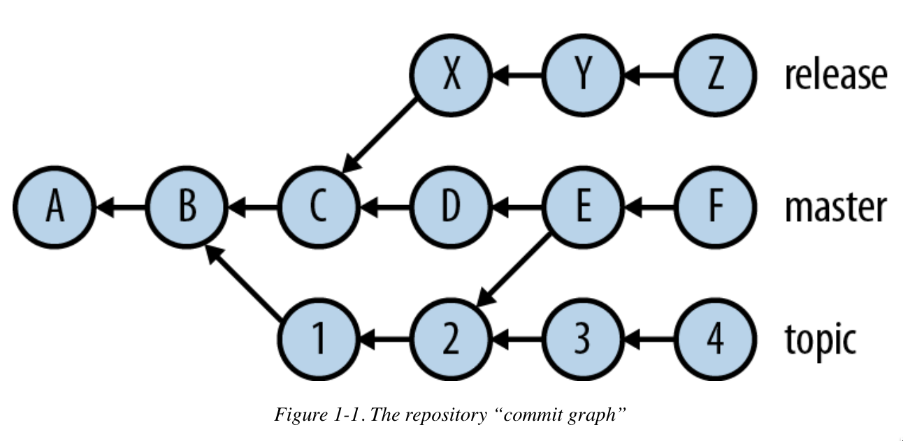

## Understanding Git

A Git Project is represented by “repository”, which is collection of complete history in form of commits.

Commits are like snapshots of project content

Contents of Commit

- A project content snapshot : Tree
- Author
- Committer
- Commit Message
- A list of zero or more “parent commits”

Commit graph of some Repository

- Letters and numbers represents commits
- Arrowhead : Commit to its parent commit
- A root is the commit with no parent commit
- Some commits have multiple parents which represents “merge:commits”
    - indicates commit reconciliation from different branches of commit graph
- usually arrowheads are omitted since flow is usually represented left-right and down-top

**Branches**

- “release”, “master” and “topic” denotes branches
- Z, F and 4 tips of these branches
    - release = {A, B, C, X, Y , Z}
    - master = {A, B, C, D, E, F, 1, 2}
    - topic = {A, B, 1, 2, 3, 4}

#### Sharing Work

There are two contexts : Public and Private Repository

- commit “early and often” to try out various ideas and make changes freely
- you can reorganize your commits later before publishing

With Git, sharing work happens via operations called “push” and “pull” changes from and to the remote repository

- first we clone the existing repository over a network via protocols like HTTP and SSH
- this clone is full copy of the original, including all project history
- this cloned repository maintains reference to original one using a “remote”
- remote maintains state of branches using “remote tracking” branches indicated by name “origin/develop” or “origin/master”

NOTE:

- when we ask to checkout some *topic* branch, git sees that there isn’t a local branch with that name (initially master/main is fetched) but since remote already has ‘origin/topic’.
- it automatically creates a branch named topic and sets ‘origin/topic’ as its “upstream” branch
- this process causes push/pull mechanism to maintain changes in sync

- when we pull git updates remote-tracking branches with the current state of origin repository
- when we push, it updates the remote with any changes you’ve made corresponding to local branches.
    - sometimes git will complain to merge conflicting changes before actually pushing

### The Object Store

- Blob : *opaque chunk of data*, a string of bytes with no further internal structure
    - content of file under VCS is represented as blob using sophisticated compression and transmission techniques
    - NOTE: every version of a file in Git is represented as a whole, with its own blob containing the file’s complete contents,
        - its different from many systems where changes are stored incrementally
        - Comes with its own benefits and drawbacks like “storage-saving” v/s reconstructing file back from history using diffs :)
        - blob design provides redundancy : corruption of one blob just affects some specific version rather than entire history of file
- Tree : represents a single level of directory structure in repository content
    - it contains a list of each items with each containing
        - a filename and file type
        - a pointer to another object. If object is blob then this item represents file, if its a tree, a directory
    - git tree, represents a portion of the repository content at one point in time : a snapshot of a particular directory’s content, including all directories recursively beneath it
- Commit : A VCS manaages content changes, commit is fundamental unit of change in Git
    - Commit consists of
        - A pointer to tree containing the complete state of repository content at one point in time
        - Ancillary information about this change: who was responsible for content(Author), who introduced the change into the repository(committer); and time/date for both changes
        - A list of zero or more other commit objects, called the “parents” of this commit
    - There is always atleast a root commit (infinite loops etc are not allowed so a DAG)
    - there can be several root commits using `git checkout --orphan`

- Author vs Committer

    - These are initially same, but become distinct by use of certain git commands. For example `git chery-pick` replicates changes from existing commit by reapplying the changes introduced by that commit in another context.

    - other operation that may result in this are `git filter-branch` or `git rebase`

- Cryptographic Signature : A commit may also be signed using GnuPG with `git commit --gpg-sign[=keyid]`
    - A cryptographic signature binds the commit to a particular real-world personal identity attached to the key used for signing.
- Tag : tag serves to distinguish a particular commit by giving it a human-readable name in a namespace reserved for this purpose

### Object IDs and SHA-1

