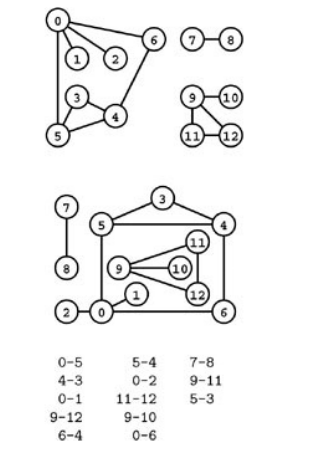
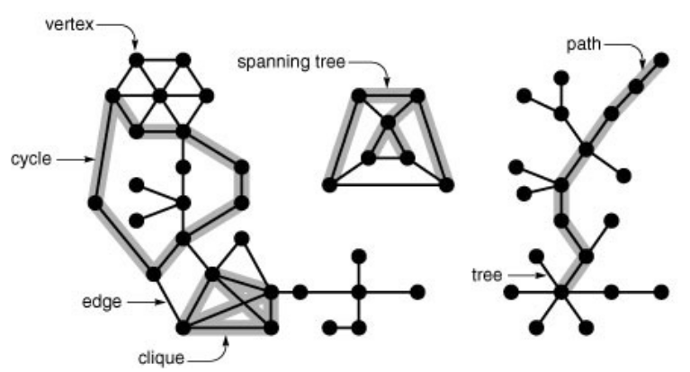
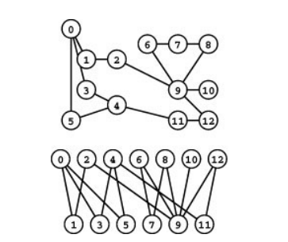
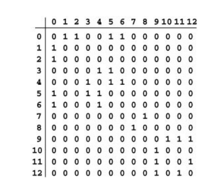
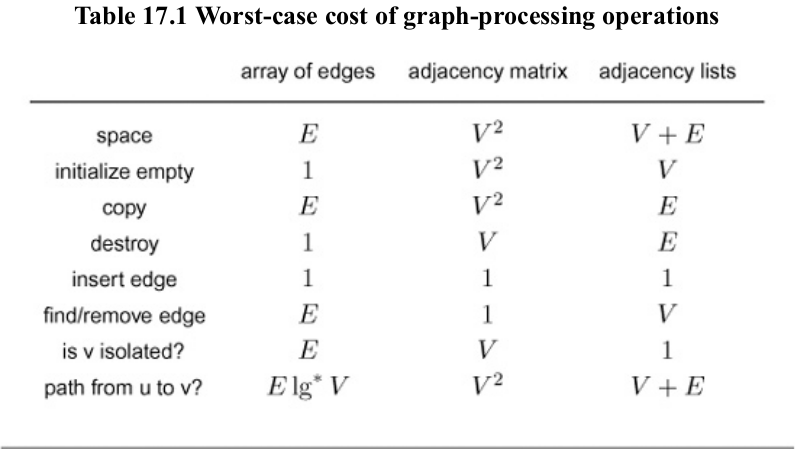

# Graph Properties and Types

Major Application of Graph includes *Maps, Hypertext, Circuits, Schedules, Transactions, Matching, Networks, Program Structure(Compiler).*

## Glossary

***Definition** :* A **graph** is a set of **vertices** and a set of **edges** that connect pairs of distinct vertices ( with at most one edge connecting any pair of vertices ).

$V$: # of vertices/nodes, $E$: number of edges/links

Above definition puts two restrictions on graphs

1. Disallow duplicate edges (*Parallel edges, and a graph that contains them multigraph*)
2. Disallows edges that connect to itself (*Self-Loops*)

***Property 1:*** *A graph with $V$ vertices has at most $V(V-1)/2$ edges.*

When there is a edge connecting two vertices, we say that the vertices are *adjacent* to one another and edges *incident* on it. 

Degree of Vertex: Number of edges incident on it. $v-w$ represents edge from $v$ to $w$ and $w-v$ represents edge from $w$ to $v$.

A *subgraph* is a subset of graph's edges (and associated vertices) that constitutes a graph.

**Same graph represented 3-ways**



A graph is defined by its vertices and its edges, not the way that we choose to draw it.

A *planar graph* is one that can be drawn in the plane without any edges crossing. Figuring out whether a graph is planar or not is a fascinating problem itself. For some graphs drawing can carry information like vertices corresponding points on plane and distance represented by edges are called as *Euclidean graphs.*

Two graphs are *isomorphic* if we can change the vertex labels on one to make its set of edges identical to the other. (Difficult Computation Problem since there are $V!$ possibilities).

**Definition 2: ** *A **path** in a graph is a sequence of vertices in which each successive vertex(after the first) is adjacent to its predecessor in the path.* In a **simple path**, the vertices and edges are distinct. A *cycle* is a path that is simple except that the first and final vertices are the same.

Sometimes we refer *cyclic paths* to refer to a path whose first and last vertices are same; and we use term *tour* to refer to a cyclic path that includes every vertex.

Two simple paths are *disjoint* if they have non vertices in common other than, possibly, their endpoints.



**Definition 3:** A graph is ***connected graph*** if there is a path from every vertex to every other vertex in the graph. A graph that is not connected consists of a set of ***connected components***, which are maximal connected subgraphs.

**Definition 4 :** A acyclic connected graph is called a **tree**. A set of trees is called a **forest**. A **spanning tree** of a connected graph is a subgraph that contains all of that graph's vertices and is a single tree.

A **spanning forest** of a graph is a subgraph that contains all of that graph's vertices and is a forest.

A graph $G$ with $V$ vertices is a tree if and only if it satisfies any of the following four conditions.

- $G$ has $V-1$ edges and no cycles.
- $G$ has $V-1$ edges and is connected
- Exactly one simple path connects each pair of vertices in $G$
- $G$ is connected, but removing any edge disconnects it

Graphs with all edges present are called *complete graphs.*

*Complement of a graph $G$ has same set of vertices as complete graph but removing the edges of $G$*.

Total number of graphs with $V$ vertices is $2^{V(V-1)/2}$. A complete subgraph is called a *clique*.

*density* of graph is average vertex degree or $\frac{2E}{V}$. A *dense graph* is a graph whose density is proportional to $V$. A *sparse graph* is a graph whose complement is dense.

A graphs is dense if $E \propto V^2$ and sparse otherwise. Density of graphs helps us choose a efficient algorithm for processing the graph.

When analysing graph algorithms, we assume $\frac V E$  is bounded above by a small constant, so we can abbreviate expression such as $V(V+E)\approx VE$.

A *bipartite graph* is a graph whose vertices we can divide into two sets such that all edges connect a vertex in one set with a vertex in the other set. Its quite useful in matching problem. Any subgraph of bipartite graph is bipartite.



Graphs defined above are all *undirected graphs*. In *directed graphs*, also know as *digraphs*, edges are one-way. pair of vertices are in form of ordered pairs.

First vertex in digraph is called as *source* and final vertex is called as *destination*.

We speak of *indegree and outdegree* of a vertex ( the #edges where it is destination and #edges where it is source respectively)

A *directed cycle* in a digraph is a cycle in which all adjacent vertex pairs appear in the order indicated by (directed) graph edges

A *directed acyclic graph (DAG)* is digraph that has no directed cycles.

In *weighted graphs we associate numbers (weights) with each edge, denoting cost or distance.*

## Graph Representation

### Edge List

An **edge-list representation** of a graph is a way of representing the edges of a graph as a list of pairs (or tuples) of vertices. Each pair corresponds to an edge in the graph, indicating a connection between two vertices.

* For a **directed graph**, each pair (u, v) in the list represents a directed edge from vertex u to vertex v.

* For an **undirected graph**, each pair (u, v) in the list represents an undirected edge between vertices u and v. (Note: Duplicate or reverse entries, such as (u, v) and (v, u), are often avoided since they represent the same edge.)

This representation is well-suited for **sparse graphs** where the number of edges is much smaller compared to the number of possible edges.

### Adjacency Matrix

An *adjacency-matrix* representation of a graph is matrix of Boolean values, with entry in row and column defined to be 1 if there is an edge connecting vertex and vertex in the graph, and to be 0 otherwise.

This representation is well suited for dense graphs.

NOTE: this matrix will be symmetric for undirected graphs.



````c++
vector<vector<int>> build_adj_matrix(vector<vector<int>> edges, int n) {
    // Assume input: edges = [(u1, v1), (u2, v2), ...], n vertices/nodes
    vector<vector<int>> adj(n, vector<int>(n, 0)); // Create an n x n matrix initialized to 0

    for (auto &[u, v] : edges) {
        adj[u][v] = 1; // From u to v
        adj[v][u] = 1; // From v to u (for undirected graph)
    }

    return adj; // Return the adjacency matrix
}
````

### Adjacency List

Preferred when graphs are not dense, where we keep track of all vertices connected to each vertex on a linked list that is associated with that  vertex. We maintain a vector of lists so that, given a vertex, we can  immediately access its list; we use linked lists so that we can add new  edges in constant time.

Primary advantage is space-efficient structure while disadvantage is time proportional to  for removing a specific edges.

````c++
vector<vector<int>> build_adj_list(vector<vector<int>> edges, int n) {
    // Assume input: edges = [(u1, v1), (u2, v2), ...], n vertices/nodes
    vector<vector<int>> adj(n); // Create an adjacency list with n empty lists

    for (auto &[u, v] : edges) {
        adj[u].push_back(v); // Add v to the adjacency list of u
        adj[v].push_back(u); // Add u to the adjacency list of v (for undirected graph)
    }

    return adj; // Return the adjacency list
}
````

Cost Comparison of these representations



## Simple, Euler and Hamilton Paths

**Simple Path :** Given two vertices, is there a simple path in the graph that connects them ?

* Property: We can find a path connecting two given vertices in a graph in linear time.

**Hamilton Path :** Given two vertices, is there a simple path connecting them that visits every vertex in the graph exactly once ? If the path is from a vertex back to itself, this problem is known as the Hamilton Tour.

* Property: *A recursive search for a Hamilton tour could take exponential time.*

**Euler Path :** Is there a path connecting two given vertices that uses each edge in the graph exactly once ? The path need not be simple - vertices may be visited multiple times. If the path is from a vertex back to itself, we have a Euler tour problem. or Is there a cyclic path that uses each edge in the graph exactly once ?

* *Property :* A graph has an Euler tour if and only if it is connected and all its vertices are of even degree.
* *Corollary :* A graph has an Euler path if an only if it is connected and exactly two of its vertices are of odd degree.
* Property: We can find an Euler tour in a graph, if one exists, in linear time.

## Suggested Reading

[Graph Processing Problems](https://algo.minetest.in/5-Graph_Algorithms/17-Graph-Properties_and_Types/8_Graph-Processing_Problems/)
