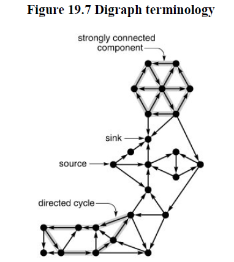
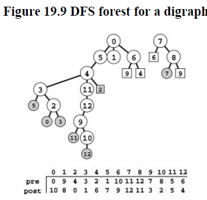
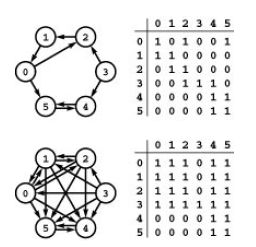
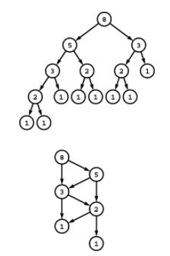
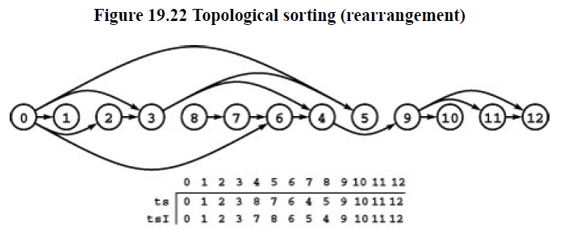

# Digraphs and DAGs

## Definitions

**Definition:** *A **digraph** is a set of **vertices** plus a set of **directed edges** that connect ordered pairs of vertices (with no duplicate edges). We say that an edge goes **from** its vertex **to** its second vertex*

**Definition:** *A **directed path** in a digraph is a list of vertices in which there is a (directed) digraph edge connecting each vertex in the list to its successor in the list. We say that a vertex $t$ is reachable from a vertex $s$ if there is a directed path from $s$ to $t$*.

***sink*** has outdegree 0. and **source** has indegree of 0.

* NOTE: We can easily calculate indegree/outdegree, and find source/sink in linear time and space.

**Definition:** *A **directed acyclic graph (DAG)** is digraph with no directed cycles.*

**Definition:** *A digraph is **strongly connected** if every vertex is reachable from every vertex.*



## DFS in Digraphs

In digraphs, there is a one-to-one correspondence between tree links and graph edges, and they fall into four distinct classes :

- Those representing a recursive call (tree edges)
- Those from a vertex to an ancestor in its DFS tree (back edges)
- Those from a vertex to a descendent in its DFS tree (down edges)
- Those from a vertex to another vertex that is neither an ancestor nor a descendent in its DFS tree (cross edges)



## Reachability and Transitive Closure

**Definition:** *The **transitive closure** of a digraph is a digraph with same vertices but with an edge from s to t in the transitive closure if and only if there is a directed path  from s to t in the given digraph.*



Transitive Closure can be calculated by using $C = A *A^2$ where $A$ is adjacency matrix representation.

We can build transitive closure as

````c++
for(i = 0; i< V; i++)
    for( s = 0 ; s < V; s++)
        for( t = 0; t <V; t++)
            if(A[s][i] && A[i][t]) A[s][t] = 1;
````

**Property:** With Warshall’s algorithm, we can compute the transitive closure of a digraph in time proportional to $V^3$.

A better improvement would be to move `A[s][i]` outside of for loop in a if condition.

There are two important problem which imply us to find better solution to this method.

* (all-pair shortest path)for each pair of vertices, a directed path with minimal number of edges
* solving transitive-closure problem efficiently solves boolean matrix multiplication problem.

NOTE: above problem is just special case of *Floyd’s* Algorithm which finds shortest path in a weighted graph.

## DAGs

* generally used to solve scheduling problem.

**Definition:** *A **binary DAG** is a directed acyclic graph with two edges leaving each node, identified  as the left edge and the right edge, either or both of which may be  null.*



NOTE: only difference between a binary DAGs and Binary tree is that a node can have more than 1 parent.

## Topological Sorting

Goal of topological sorting is to process the vertices of DAG s.t. every vertex is processed before all the vertices to which it points.

**Topological Sort (relabel)** Given a DAG, relabel its vertices such that every directed edge points from a lower-numbered vertex to a higher-number one.

**Topological Sort (rearrange)** Given a DAG, rearrange its vertices on a horizontal line such that all the directed edges points from left to right.



`for(i = 0; i < V; i++) tsI[ts[i]] = i;` defines a relabeling in the vertex-indexed vector.

NOTE: The vertex order produced by a topological sort is not unique.

### DFS Topological Sort

**Property:** *Postorder numbering in DFS yields a reverse topological sort for any DAG.*

````c++
void dfs(int v, vector<vector<int>>& adj, vector<bool>& visited, vector<int>& order) {
    visited[v] = true;
    for (int neighbor : adj[v]) {
        if (!visited[neighbor]) {
            dfs(neighbor, adj, visited, order);
        }
    }
    order.push_back(v); // Add to order after visiting all neighbors (Post-order)
}

vector<int> topologicalSort(int V, vector<vector<int>>& adj) {
    vector<bool> visited(V, false);
    vector<int> order;
    // Perform DFS for each unvisited node
    for (int i = 0; i < V; i++)
        if (!visited[i])
            dfs(i, adj, visited, order)

    // Reverse to get topological sort order
    reverse(order.begin(), order.end());
    return order;
}
````

### Kahn’s Topological Sort

* create a indegree vector while creating graph
* put all the sources onto the queue
* then run BFS from those sources and keep decrementing the indegree as you explore the graph.

````c++
vector<int> kahnTopologicalSort(int numVertices, vector<vector<int>>& edges) {
    // Create adjacency list and indegree vector
    vector<vector<int>> graph(numVertices);
    vector<int> inDegree(numVertices, 0);

    // Populate the graph and indegree vector
    for (auto& edge : edges) {
        graph[edge[0]].push_back(edge[1]); // Directed edge from edge[0] to edge[1]
        inDegree[edge[1]]++;
    }

    // Initialize the queue with nodes having indegree 0
    queue<int> q;
    for (int i = 0; i < numVertices; i++)
        if (inDegree[i] == 0)
            q.push(i);

    vector<int> result; // To store the topological order

    // Process nodes in the queue
    while (!q.empty()) {
        int curr = q.front();
        q.pop();
        result.push_back(curr);

        // Reduce indegree of neighbors by 1
        for (int neighbor : graph[curr]) {
            inDegree[neighbor]--;
            if (inDegree[neighbor] == 0) {
                q.push(neighbor);
            }
        }
    }

    // If all nodes are processed, return the topological order
    if ((int)result.size() == numVertices) {
        return result;
    }

    // If there is a cycle, return an empty vector
    return {};
}
````

## Problems

### Example Problems with Links

| **Problem** | **Concept** | **Approach** |
|-------------|-------------|--------------|
| [Topological Sort](https://practice.geeksforgeeks.org/problems/topological-sort/1) | Standard Topological Sorting. | Use DFS with a stack or Kahn’s Algorithm. |
| [Detect Cycle in a Directed Graph](https://practice.geeksforgeeks.org/problems/detect-cycle-in-a-directed-graph/1) | Cycle Detection in a Directed Graph. | Use recursion stack in DFS or Kahn’s Algorithm to detect cycles. |
| [Course Schedule](https://leetcode.com/problems/course-schedule/) | Check if courses can be completed. | Use Topological Sort to detect cycles. |
| [Course Schedule II](https://leetcode.com/problems/course-schedule-ii/) | Find course completion order. | Use Topological Sort to get a valid order. |
| [Find Eventual Safe States](https://leetcode.com/problems/find-eventual-safe-states/) | Identify nodes not leading to a cycle. | Reverse the graph, apply Topological Sort on reversed edges, and find nodes with 0 indegree. |
| [Alien Dictionary](https://leetcode.com/problems/alien-dictionary/) | Determine character order from word precedence. | Construct a graph from word order, apply Topological Sort to find the order. Handle cycles or ambiguity cases. |

### Alien Dictionary

We can represent the problem as directed graph. Now if there is a cycle or self loops then its invalid.

Vertices will be unique characters from the words. After the construction of graph we have to return topological sort of the graph!

Now should we make graph explicitly. Yes indeed because topological sort requires the neighbors but we can't have neighbors through given structure of input and will cost $O(n^2)$ to every letter.

We used the unordered_set just to quickly check whether there is a edge already there.

````c++
class Solution {
public:
  string alienOrder(vector<string>& words) {
      // construct the graph
      // nodes - letters
      // a->b iff a < b
      // Adjacency list.
      unordered_map<char, unordered_set<char>> graph;
      int n = words.size();
      string res = "";
      unordered_map<char, int> indegree;
      // preprocessing step for intializing to empty value
      // if there is some vertex that doesn't get processed 
      // while graph construction i.e. stand alone vertices
      for(int i = 0; i < n; i++){
          for(int k = 0; k < words[i].size(); k++) {
              if(graph.find(words[i][k]) == graph.end()) {
                  graph[words[i][k]] = {};
                  indegree[words[i][k]] = 0;
              }
          }
      }
      // Graph Construction.
      for(int i = 0; i < n; i++){
          for(int j = i+1; j < n; j++){
              // equal words...
              if(words[i] == words[j])
                  continue;

        int k = 0, l = 0;
              while(k < words[i].size() && l < words[j].size()
                   && words[i][k] == words[j][l]){
                  k++;l++;
              }
              // words[j] is a prefix of words[i].
              if(l == words[j].size())
                  return "";

              if(k == words[i].size())
                  continue;

              if(graph[words[i][k]].find(words[j][l]) == 
                                         graph[words[i][k]].end()) {
                  // undirected graph!
                   graph[words[i][k]].insert(words[j][l]);
                  indegree[words[j][l]]++;
              }

          }
      }
      // Topological sort
      queue<char> q;

      // Initialize the queue
      for(const auto& entry:indegree){
          if(entry.second == 0)
              q.push(entry.first);
      }
      while(!q.empty()){
          char ch = q.front();
          q.pop();
          res += ch;
          for(const auto& nbrs: graph[ch]){
              indegree[nbrs]--;
              if(indegree[nbrs] == 0)
                  q.push(nbrs);
          }
      }
      return res.size() == graph.size() ? res : "";
  }
};
````

Improvements : We need to check only consecutive words to create graph.

Because graph captures transitive relation by the fact input is sorted in alien dictionary implying word $ a, b, c$ in order mean $a < b$ and $ b < c$ but that directly implies $ a < c $.