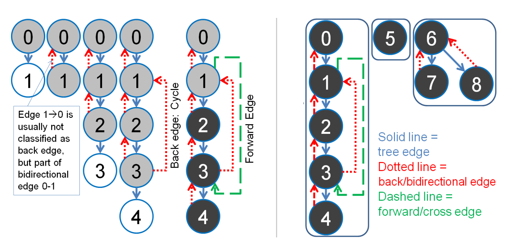
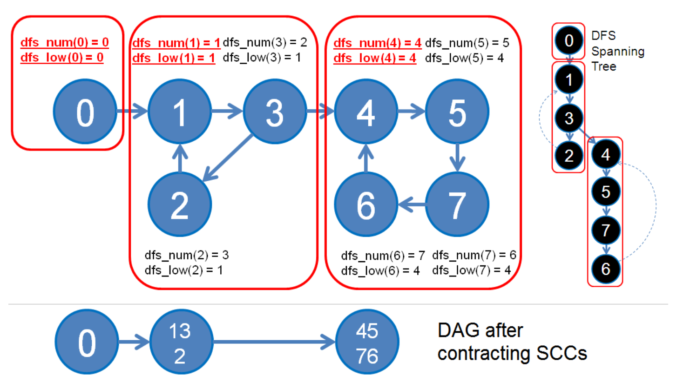

## Other Algorithms

### Graph Edges Property Check via DFS Spanning Tree

* Running DFS on a connected graph generates a DFS spanning tree (or spanning forest if the graph is disconnected). With the help of one more vertex state: EXPLORED = 2 (visited but not yet completed) on top of VISITED (visited and completed), 

* we can classify graph edges into three types:
  * Tree edge: The edge traversed by DFS, i.e. an edge from a vertex currently with state: EXPLORED to a vertex with state: UNVISITED.

  * Back edge: Edge that is part of a cycle, i.e. an edge from a vertex currently with state: EXPLORED to a vertex with state: EXPLORED too. This is an important application of this algorithm. Note that we usually do not count bi-directional edges as having a ‘cycle’ (We need to remember dfs_parent to distinguish this, see the code below).

  * Forward/Cross edges from vertex with state: EXPLORED to vertex with state: VISITED.




````c++
void graphCheck(int u) { 
    // DFS for checking graph edge properties
    dfs_num[u] = EXPLORED;  // Color u as EXPLORED instead of VISITED

    for (int j = 0; j < (int)AdjList[u].size(); j++) {
        ii v = AdjList[u][j]; 
        if (dfs_num[v.first] == UNVISITED) {  // Tree Edge, EXPLORED -> UNVISITED
            dfs_parent[v.first] = u;          // Parent of this child is me
            graphCheck(v.first);
        }
        else if (dfs_num[v.first] == EXPLORED) {  // EXPLORED -> EXPLORED
            if (v.first == dfs_parent[u]) {
                // To differentiate between these two cases
                printf("Two ways (%d, %d) - (%d, %d)\n", u, v.first, v.first, u);
            } else {
                // The most frequent application: check if the graph is cyclic
                printf("Back Edge (%d, %d) (Cycle)\n", u, v.first);
            }
        }
        else if (dfs_num[v.first] == VISITED) {
            printf("Forward/Cross Edge (%d, %d)\n", u, v.first); // EXPLORED -> VISITED
        }
    }
    dfs_num[u] = VISITED;  // After recursion, color u as VISITED (DONE)
}

// Inside int main()
dfs_num.assign(V, UNVISITED);
dfs_parent.assign(V, 0);  // New vector
for (int i = 0; i < V; i++)
    if (dfs_num[i] == UNVISITED)
        printf("Component %d:\n", ++numComp), graphCheck(i); // 2 lines in 1!
````


### Bridges

Use Cases:

* **Network Analysis:** Detecting critical connections in a communication or transport network.
* **Graph Reliability:** Determining edges whose removal disconnects parts of the graph.
* **Geography:** Identifying vulnerable bridges in road networks.

Properties:

* **Definition:** Edges whose removal increases the number of connected components.
* Found in **undirected graphs**.
* Calculated by comparing discovery and low-link values during DFS.
* **O(V + E):** Same DFS-based approach as articulation points.

````c++
void findBridges(int u, int parent, vector<int>& disc, vector<int>& low, vector<vector<int>>& adj,
                 int& time, vector<pair<int, int>>& bridges) {
    disc[u] = low[u] = ++time;

    for (int v : adj[u]) {
        if (disc[v] == -1) { // v is not visited
            findBridges(v, u, disc, low, adj, time, bridges);

            low[u] = min(low[u], low[v]);

            if (low[v] > disc[u]) {
                bridges.push_back({u, v});
            }
        } else if (v != parent) { // Back edge
            low[u] = min(low[u], disc[v]);
        }
    }
}

void bridges(int n, vector<vector<int>>& adj) {
    vector<int> disc(n, -1), low(n, -1);
    vector<pair<int, int>> bridges;
    int time = 0;

    for (int i = 0; i < n; i++) {
        if (disc[i] == -1) {
            findBridges(i, -1, disc, low, adj, time, bridges);
        }
    }

    for (auto& bridge : bridges) {
        cout << bridge.first << " - " << bridge.second << endl;
    }
}
````

### Articulation Point

Use Cases:

* Network Design: Identifying critical routers or servers in a network.
* Graph Reliability: Understanding the impact of removing key nodes.
* Ecosystems: Determining species critical to the stability of ecological networks.

Properties:

* **Definition:** Nodes whose removal increases the number of connected components in a graph.
* Found in **undirected graphs**.
* Depends on **DFS traversal** and comparing discovery and low-link values.
* **O(V + E)**: Each vertex and edge is visited once during the DFS.

````c++
void findArticulationPoints(int u, int parent, vector<int>& disc, vector<int>& low,
                            vector<bool>& isArticulation, vector<vector<int>>& adj, int& time) {
    disc[u] = low[u] = ++time;
    int children = 0;

    for (int v : adj[u]) {
        if (disc[v] == -1) { // v is not visited
            children++;
            findArticulationPoints(v, u, disc, low, isArticulation, adj, time);

            low[u] = min(low[u], low[v]);

            // Check articulation point condition
            if (parent == -1 && children > 1) isArticulation[u] = true;
            if (parent != -1 && low[v] >= disc[u]) isArticulation[u] = true;
        } else if (v != parent) { // Back edge
            low[u] = min(low[u], disc[v]);
        }
    }
}

void articulationPoints(int n, vector<vector<int>>& adj) {
    vector<int> disc(n, -1), low(n, -1);
    vector<bool> isArticulation(n, false);
    int time = 0;

    for (int i = 0; i < n; i++) {
        if (disc[i] == -1) {
            findArticulationPoints(i, -1, disc, low, isArticulation, adj, time);
        }
    }

    for (int i = 0; i < n; i++) {
        if (isArticulation[i]) cout << i << " ";
    }
}
````

## Strongly Connected Components

An SCC is defined as such: If we pick any pair of vertices u and v in the SCC, we can find a path from u to v and vice versa.



### Tarjan’s Algorithm

* **SCCs:** Find SCCs in directed graphs.
* **Circuit Analysis:** Identify strongly connected sub-circuits.
* **Optimization:** Used in solving 2-SAT problems in linear time.

Properties:

* Uses **DFS** to compute discovery and low-link values.
* Maintains a stack to identify the nodes in the current SCC.
* Operates on **directed graphs**.
* **O(V + E):** Each node and edge is processed once during DFS.

````c++
void tarjanDFS(int u, int& time, vector<vector<int>>& adj, vector<int>& disc, vector<int>& low,
               stack<int>& st, vector<bool>& inStack) {
    disc[u] = low[u] = ++time;
    st.push(u);
    inStack[u] = true;

    for (int v : adj[u]) {
        if (disc[v] == -1) { // v is not visited
            tarjanDFS(v, time, adj, disc, low, st, inStack);
            low[u] = min(low[u], low[v]);
        } else if (inStack[v]) { // Back edge
            low[u] = min(low[u], disc[v]);
        }
    }

    if (low[u] == disc[u]) { // Root of SCC
        while (true) {
            int v = st.top();
            st.pop();
            inStack[v] = false;
            cout << v << " ";
            if (v == u) break;
        }
        cout << endl;
    }
}

void tarjansSCC(int n, vector<vector<int>>& adj) {
    vector<int> disc(n, -1), low(n, -1);
    vector<bool> inStack(n, false);
    stack<int> st;
    int time = 0;

    for (int i = 0; i < n; i++) {
        if (disc[i] == -1) {
            tarjanDFS(i, time, adj, disc, low, st, inStack);
        }
    }
}
````

### Kosaraju Algorithm

Use Cases:

* **Strongly Connected Components (SCCs):** Identifying clusters in directed graphs.
* **Dependency Analysis:** Resolving dependencies in package management systems.
* **Circuits:** Finding self-contained sub-circuits in electrical networks.

Properties:

* **Steps:** Two-pass DFS:
  * First pass: Record finishing times of nodes.
  * Second pass: Perform DFS on the reversed graph in decreasing order of finishing times.
* Operates on **directed graphs**.
* **O(V + E):** First DFS, graph reversal, and second DFS each take linear time.

````c++
void dfs(int u, vector<vector<int>>& adj, vector<bool>& visited, stack<int>& st) {
    visited[u] = true;
    for (int v : adj[u]) {
        if (!visited[v]) {
            dfs(v, adj, visited, st);
        }
    }
    st.push(u);
}

void reverseDFS(int u, vector<vector<int>>& revAdj, vector<bool>& visited) {
    visited[u] = true;
    cout << u << " "; // Print SCC
    for (int v : revAdj[u]) {
        if (!visited[v]) {
            reverseDFS(v, revAdj, visited);
        }
    }
}

void kosaraju(int n, vector<vector<int>>& adj) {
    stack<int> st;
    vector<bool> visited(n, false);

    // Step 1: Fill the stack with finish times
    for (int i = 0; i < n; i++) {
        if (!visited[i]) {
            dfs(i, adj, visited, st);
        }
    }

    // Step 2: Reverse the graph
    vector<vector<int>> revAdj(n);
    for (int u = 0; u < n; u++) {
        for (int v : adj[u]) {
            revAdj[v].push_back(u);
        }
    }

    // Step 3: Process vertices in order of decreasing finish time
    fill(visited.begin(), visited.end(), false);
    while (!st.empty()) {
        int u = st.top();
        st.pop();
        if (!visited[u]) {
            reverseDFS(u, revAdj, visited);
            cout << endl;
        }
    }
}
````


| **Algorithm**           | **Use Case**                        | **Graph Type** | **Property**                             | **Time Complexity** |
| ----------------------- | ----------------------------------- | -------------- | ---------------------------------------- | ------------------- |
| **Articulation Points** | Critical nodes in undirected graphs | Undirected     | Nodes whose removal increases components | O(V + E)            |
| **Bridges**             | Critical edges in undirected graphs | Undirected     | Edges whose removal increases components | O(V + E)            |
| **Kosaraju's**          | SCCs in directed graphs             | Directed       | Two-pass DFS with graph reversal         | O(V + E)            |
| **Tarjan's**            | SCCs in directed graphs             | Directed       | Single DFS with stack-based SCCs         | O(V + E)            |