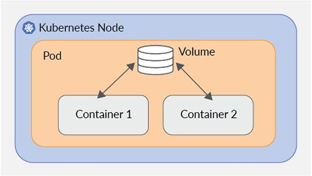
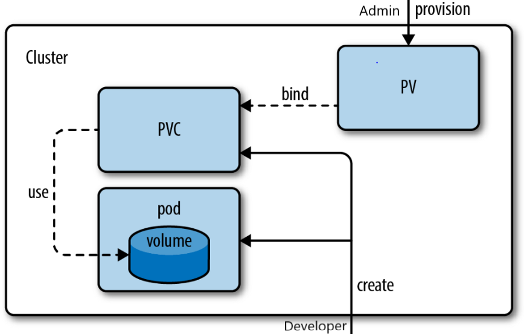

# Introduction to Kubernetes


## Volumes

- Sometimes useful to share data between containers in a Pod
- Lifetime of container file systems is limited to container’s lifetime
- can lead to unexpected consequences if container restarts

### Pod Storage in Kubernetes

- Two high-level storage options: Volume and Persistent Volumes
- Used by mounting a directory in one or more containers in a Pod
- Pods can use multiple Volumes and Persistent Volumes
- Difference between Volumes and Persistent Volumes is how their lifetime is managed

### Volume

- volume are tied to a pod and their lifecycle
- share data between containers and tolerate container restarts
- use for non-durable storage that is deleted with pod
- default volume type is emptyDir
- data is lost if pod is rescheduled on a different pod

|                            Volume                            |
| :----------------------------------------------------------: |
|  |

### Persistent Volumes

- independent of pod’s lifetime
- pods claim persistent volumes to use throughout their lifetime (PVC)
- can be mounted by multiple pods on different Nodes if underlying storage supports it
- can be provisioned statically in advance or dynamicaly on-demand

### Persistent Volume Claims (PVC)

- describe a pod’s request for persistent volume storage
- includes how much storage, type of storage and access mode.
- access mode can be read-write once, read-only many, or read-write many
- pvc stays pending if no PV can satisfy it and dynamic provisioning is not enabled
- connects to a pod through a volume of type PVC

| PV and PVC                                                   |
| ------------------------------------------------------------ |
|  |

### Storage Volume Types

- wide variety of volume types to choose from
- use persistent volumes for more durable storage types
- supported durable storage types include GCE Persistent Disks, Azure Disks, Amazon EBS, NFS, and iSCSI

````bash
kubectl get pods -n deployments
kubectl -n deployments logs support-tier-<hash> poller --tail=1
# outputed counter keeps on increasing


# destroy the pod then check the counter
# go into pod
kubectl exec -n deployments data-tier-<hash> -it -- /bin/bash
# execute : kill 1

kubectl create -f 9.1-namespace.yaml
diff -y 7.2-data_tier.yaml 9.2-pv_data_tier.yaml


output >
								>       apiVersion: v1
								>       kind: PersistentVolume
								>       metadata:
								>         name: data-tier-volume
								>       spec:
								>         capacity:
								>           storage: 1Gi # 1 gibibyte
								>         accessModes:
								>           - ReadWriteOnce	# single node at a time
								>         awsElasticBlockStore:
								>           volumeID: INSERT_VOLUME_ID # replace with actual ID
								>       ---
								>       apiVersion: v1
								>       kind: PersistentVolumeClaim
								>       metadata:
								>         name: data-tier-volume-claim
								>       spec:
								>         accessModes:
								>           - ReadWriteOnce
								>         resources:
								>           requests:
								>             storage: 128Mi # 128 mebibytes

--------- skip ---------------
								>               volumeMounts:
								>                 - mountPath: /data
								>                   name: data-tier-volume
								>             volumes:
								>             - name: data-tier-volume
								>               persistentVolumeClaim:
								>                 claimName: data-tier-volume-claim
								

````


## ConfigMaps and Secrets

- Until now all container configuration has been in Pod spec
- This makes it less portable than it could be
- If sensitive information such as API keys and passwords is involved it presents a security issue

### ConfigMaps & Secrets

- separate config from pod spec
- results in easier to manage and more portable manifests
- both are similar but secrets are specifically for sensitive data
- there are specialized types of secrets for storing Docker registry credentials and TLS certs

- stores data in Key-value pairs
- pods must reference configmaps and secrets to use their data
- references can be made by mounting Volumes or setting environment variables that can be replaced

#### Config Maps

````yaml
apiVersion: v1
kind: ConfigMap
metadata:
  name: redis-config
data:
  config: | # YAML for multi-line string
    # Redis config file
    tcp-keepalive 240
    maxmemory 1mb
````

````bash
diff -y 7.2-data_tier.yaml 10.3-data_tier.yaml
output >
								>               command:
								>                 - redis-server
								>                 - /etc/redis/redis.conf
								>               volumeMounts:
								>                 - mountPath: /etc/redis
								>                   name: config
								>             volumes:
								>               - name: config
								>                 configMap:
								>                   name: redis-config
								>                   items:
								>                   - key: config
								>                     path: redis.conf
end_of_output

# TASK: exec inside pod and check if redis.conf is updated or not :)
# inside pod : redis-cli CONFIG GET tcp-keepalive
````

#### Secrets

````yaml
apiVersion: v1
kind: Secret
metadata:
  name: app-tier-secret
stringData: # unencoded data
  api-key: LRcAmM1904ywzK3esX
  decoded: hello
data: #for base-64 encoded data
  encoded: aGVsbG8= # hello in base-64

# api-key secret (only) is equivalent to
# kubectl create secret generic app-tier-secret --from-literal=api-key=LRcAmM1904ywzK3esX
````

````bash
diff -y 9.3-app_tier.yaml 10.5-app_tier.yaml

output >

          - name: DEBUG							          - name: DEBUG
            value: express:*						            value: express:*
                                        >                 - name: API_KEY
                                        >                   valueFrom:
                                        >                     secretKeyRef:
                                        >                       name: app-tier-secret
                                        >                       key: api-key
````


## Kubernetes Ecosystem

- Vibrant Ecosystem Around the Core of Kuberenetes

### Helm

- kubernetes package manager
- packages are called charts and are installed on your cluster using Helm CLI
- helm charts make it easy to share complete application
- Search helm hub for public charts : hub.helm.sh
- We could have taken redis helm chart for our redis server : `helm install stable/redis-ha`
- You could create a chart for the entire application

### Kustomise.io

- Customize YAML manifests in Kubernetes
- Helps you manage the complexity of your application
- declares kustomization.yaml file that declares customisation rules
- original manifests are untouched and remain usable
- generating configMaps and secrets from files
- configure common fields across multiple resources
- apply patches to any field in a manifest
- use overlays to customize base groups of resource
- directly integrated kubectl : `kubectl create -k kustomize.yml`

### Prometheus

- open-source monitoring and alerting system
- A server for pulling in time series metric data and storing it
- inspired by an internal monitoring tool at Google called borgmon
- De facto standard solution for monitoring kubernetes
- commonly paired with Grafan for visualizations
- define alert rules and send notification

### Kubeflow

- makes deployment of machine learning workflows on Kubernetes simple, scalable, and portable
- a comple machine learning stack
- leverage kubernetes to deploy anywhere, autoscale,etc

### Knative

- platform for building, deploying and managing serverless workloads on Kubernetes
- can be deployed anywhere with Kubernetes, avoiding vendor lock-in
- supported by Google, IBM, and SAP


