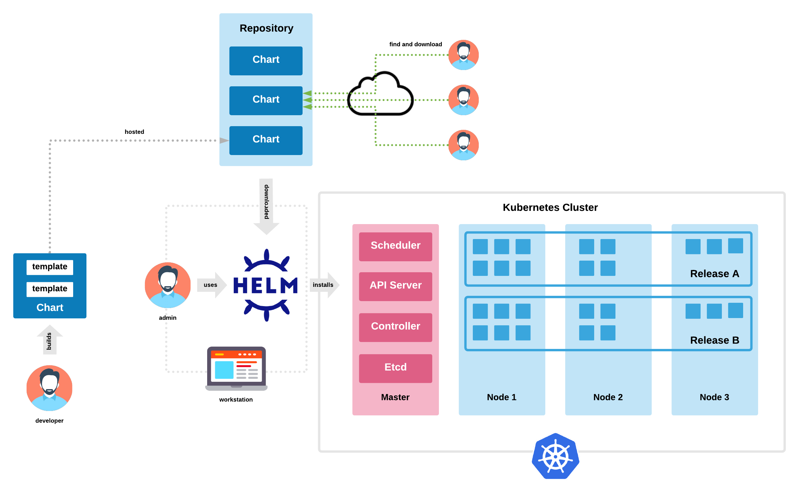
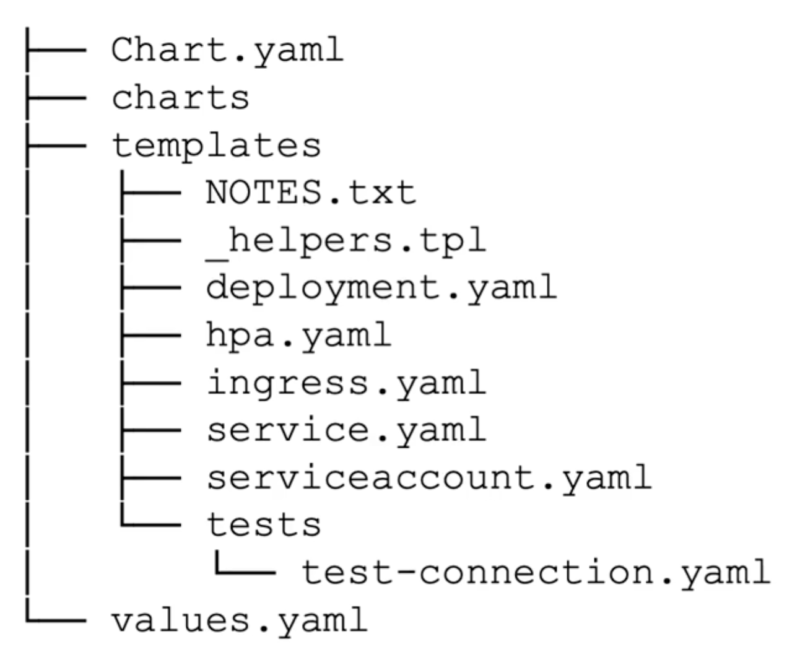

# Helm

## What is Helm?

Helm is the package manager for Kubernetes. A **chart** is a Helm package containing all the resource definitions needed to run an application in a cluster.



**Problems Helm solves:**

- Deploying a real application requires 5-15+ YAML files applied in the right order
- Config values are spread across many files
- No built-in way to upgrade or rollback all resources together
- Hard to share a full application setup with others

**Helm 3 vs Helm 2:** Helm 3 removed the server-side Tiller component. It communicates directly with the Kubernetes API using your `kubeconfig` credentials. No special cluster-side setup is needed.

## Installation

```bash
# macOS
brew install helm

# Linux
curl https://raw.githubusercontent.com/helm/helm/main/scripts/get-helm-3 | bash

# Shell completion
source <(helm completion bash)
echo 'source <(helm completion bash)' >> ~/.bashrc

source <(helm completion zsh)
echo 'source <(helm completion zsh)' >> ~/.zshrc
```

## Core Concepts

| Term | Meaning |
|------|---------|
| Chart | Package of K8s resource templates |
| Repository | HTTP server hosting an index of charts |
| Release | A deployed instance of a chart in a cluster |
| Values | Variables that customize a chart's templates |

## Key Commands

```bash
# Search
helm search hub <keyword>          # search Artifact Hub (public)
helm search repo <keyword>         # search added repos

# Repository management
helm repo add bitnami https://charts.bitnami.com/bitnami
helm repo list
helm repo update
helm repo remove bitnami

# Install
helm install <release-name> <chart>
helm install my-redis bitnami/redis
helm install my-redis bitnami/redis --set replica.replicaCount=3
helm install my-redis bitnami/redis -f custom-values.yaml

# Dry run (preview rendered manifests without installing)
helm install my-redis bitnami/redis --dry-run

# Upgrade and rollback
helm upgrade my-redis bitnami/redis --set image.tag=7.2
helm rollback my-redis 1              # roll back to revision 1

# Uninstall
helm uninstall my-redis

# Status and history
helm list
helm status my-redis
helm history my-redis
helm get manifest my-redis           # see rendered YAML deployed
helm get values my-redis             # see values used
```

## Chart Structure



```
mychart/
  Chart.yaml        # chart metadata (name, version, description)
  values.yaml       # default values
  charts/           # chart dependencies
  templates/        # Kubernetes manifest templates
    deployment.yaml
    service.yaml
    _helpers.tpl    # reusable template snippets
    tests/
```

### Chart.yaml

```yaml
apiVersion: v2
name: myapp
description: A Helm chart for myapp
type: application              # application | library
version: 0.2.1                 # chart version (semver)
appVersion: "2.1.0"            # version of the application being packaged
```

### values.yaml

```yaml
replicaCount: 2

image:
  repository: nginx
  tag: "1.25"
  pullPolicy: IfNotPresent

service:
  type: ClusterIP
  port: 80

resources:
  requests:
    cpu: "100m"
    memory: "64Mi"
```

## Templates

Templates are standard Kubernetes YAML with Go template directives.

```yaml
# templates/deployment.yaml
apiVersion: apps/v1
kind: Deployment
metadata:
  name: {{ include "myapp.fullname" . }}
  labels:
    {{- include "myapp.labels" . | nindent 4 }}
spec:
  replicas: {{ .Values.replicaCount }}
  selector:
    matchLabels:
      {{- include "myapp.selectorLabels" . | nindent 6 }}
  template:
    metadata:
      labels:
        {{- include "myapp.selectorLabels" . | nindent 8 }}
    spec:
      containers:
        - name: {{ .Chart.Name }}
          image: "{{ .Values.image.repository }}:{{ .Values.image.tag }}"
          imagePullPolicy: {{ .Values.image.pullPolicy }}
          ports:
            - containerPort: 80
```

### Template Syntax

| Syntax | Meaning |
|--------|---------|
| `{{ .Values.key }}` | Access a value from values.yaml |
| `{{ .Release.Name }}` | Name of this release |
| `{{ .Chart.Version }}` | Chart version |
| `{{- ... -}}` | Strip whitespace before/after |
| `\| nindent 4` | Add a newline then indent 4 spaces |
| `\| quote` | Wrap in quotes |
| `include "name" .` | Include a named template partial |

### _helpers.tpl (Partials)

```
{{- define "myapp.fullname" -}}
{{- printf "%s-%s" .Release.Name .Chart.Name | trunc 63 | trimSuffix "-" }}
{{- end }}

{{- define "myapp.labels" -}}
helm.sh/chart: {{ .Chart.Name }}-{{ .Chart.Version }}
app.kubernetes.io/name: {{ .Chart.Name }}
app.kubernetes.io/instance: {{ .Release.Name }}
{{- end }}
```

## Creating a Chart

```bash
helm create myapp           # scaffold a new chart
helm lint myapp             # validate chart syntax
helm template myapp ./myapp # render templates locally (no install)
helm package myapp          # create myapp-0.1.0.tgz

# Test in a cluster
helm install my-release ./myapp --dry-run
helm install my-release ./myapp
```

## Overriding Values

```bash
# Command line overrides
helm install my-release ./myapp \
  --set replicaCount=3 \
  --set image.tag=1.26

# Custom values file
helm install my-release ./myapp -f prod-values.yaml

# Multiple values files (later files override earlier ones)
helm install my-release ./myapp -f base.yaml -f prod.yaml
```

## Demo: Install WordPress

```bash
minikube start

helm repo add bitnami https://charts.bitnami.com/bitnami
helm repo update

helm install wordpress bitnami/wordpress \
  --set wordpressUsername=admin \
  --set wordpressPassword=password \
  --set mariadb.auth.rootPassword=secretpassword

helm list
kubectl get all
helm status wordpress
minikube tunnel     # then visit http://localhost/wp-admin

helm uninstall wordpress
```
