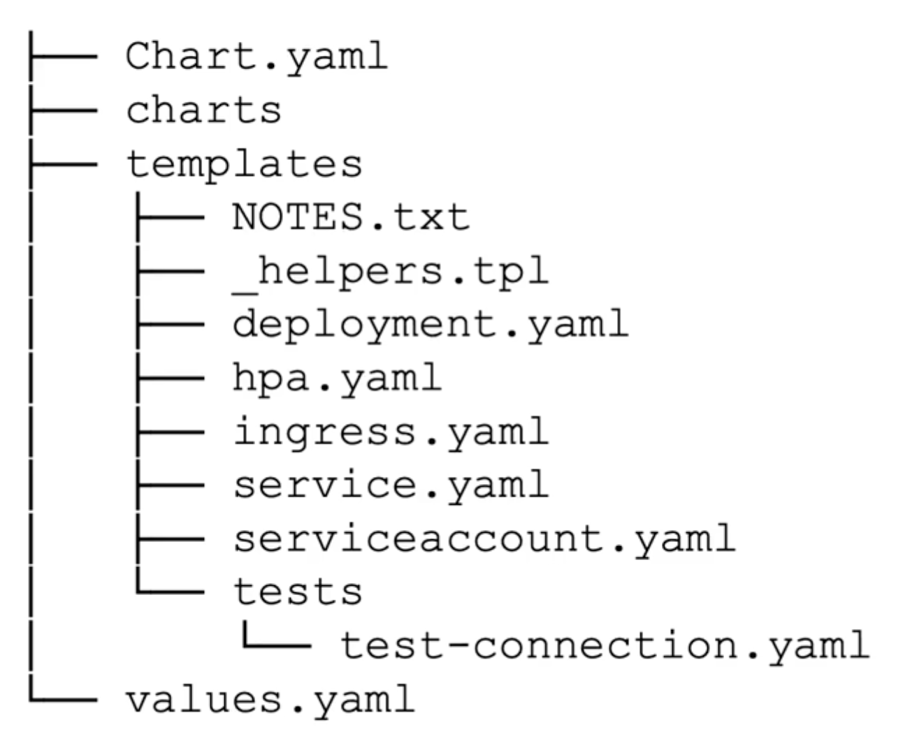

# Helm

## Helm Introduction

- Application Manger for Kubernetes
- Simplifies Large Kubernetes Deployments
- Consider frontend, application and database resources deployments and are configured via kubernetes resource files.
- We will have to apply kubeclt multiple times for multiple files and order of applying matters
- How to parameterise ? 
- How to Add in Application Lifecycle Hooks ?
- How to manage version of related resources ?

- Helm uses a concept of chart similar to package and can deploy entire chart with just on command in a sequenced manner.

| Helm                                               |
| -------------------------------------------------- |
|  |

## Benefits

- Manages Complexity
  - `helm install ca-demo1 ca-repo/voteapp`
- Helm allows upgrades, Rollback and Deletion
  - `helm upgrade`, `helm rollback`, `helm uninstall`
- Helm makes its chart distribution to easily export your infra to other users
  - `helm repo add ca-repo https://ca-repo.io/repo`
  - `helm install ca-repo/cloudacademy-app`
- Custom Chart Scaffolding
  - `helm create [chart_name]`

## Terminology

- Chart : Package Format for Helm, which includes specific files called as template when rendered make up the resource for cluster
- Repository: HTTP Web-server hosting index.yml of charts similar to DockerHub
- Templates : Files used in Chart Package. By taking a typical Kubernetes manifest files and abstracting in template and parameterize and while chart installing can alter the values of resources.
- Releases: when a chart is deployed in cluster, helm tags a release and used by helm to track the chart/cluster history

## Architecture

- Helm2 Architecture
  - server architecture
  - depended on cluster hosted component tiller
- Helm3 Architecture (more simple and secure)
  - follows client only architecture
  - communicates directly with k8s API with RBAC enabled using `.kube/config` file credentials
  - chart rendering is done on client side by helm before deploying
  - deploying a chart creates a release

## Installation

- `brew install helm`
- Setup autocompletion :
  - `source <(helm completion bash)`
  - `echo ‘source <(helm completion bash)’ >> ~/.bash_profile`

## Commands

````bash
helm search [cmd]

# hub/repo search
helm search hub [keyword]
helm search repo [keyword]
helm pull [chart]

# installation
helm install [name] [chart]

# upgrades/rollback/uninstall
helm upgrade [release] [chart]
helm rollback [release] [chart]
helm uninstall [release]

# helm repo managements
helm repo add [name] [url]
helm repo list
helm repo remove [name]
helm repo update
helm repo index [dir]

# helm release management
helm status [release]
helm list
helm history [release]
helm get manifest [release]

# helm chart management
helm create [name]
helm template [name] [chart]
helm package [chart]
helm lint [chart]
````

## Charts

- We will use `helm create [chartname]`

| chart directory structure                                    |
| ------------------------------------------------------------ |
|  |

````txt
    foo/
    ├── .helmignore   # Contains patterns to ignore when packaging Helm charts.
    ├── Chart.yaml    # Information about your chart
    ├── values.yaml   # The default values for your templates
    ├── charts/       # Charts that this chart depends on
    └── templates/    # The template files
        └── tests/    # The test files
````

Chart.yaml file

````txt
apiVersion: v2
name: cloudacademy-webapp
description: A Helm chart for Kubernetes

# A chart can be either an 'application' or a 'library' chart.
# Application charts are a collection of templates that can be packaged into versioned archives to be deployed.
# Library charts provide useful utilities or functions for the chart developer. They're included as a dependency of application charts to inject those utilities and functions into the rendering pipeline. Library charts do not define any templates and therefore cannot be deployed.
type: application

# This is the chart version. This version number should be incremented each time you make changes to the chart and its templates, including the app version.
# Versions are expected to follow Semantic Versioning (https://semver.org/)
version: 0.1.0

# This is the version number of the application being deployed. This version number should be incremented each time you make changes to the application. Versions are not expected to follow Semantic Versioning. They should reflect the version the application is using.
appVersion: 1.16.0
````

values.yml

````txt
replicaCount: 2

image:
  repository: nginx
  pullPolicy: IfNotPresent
  tag: ""

service:
  type: ClusterIP
  port: 80

autoscaling:
  enabled: false

nginx:
  conf:
    message: "CloudAcademy DevOps 2020 v1"
````

Now these can be referenced using simply : `{{ .Values.service.port }}` in templates

`values.yml` file can override by cmd line args.

Template syntax are based on Go Templates

`_helpers.tpl` : template partials are repeated in other files and can be referenced as resusable partials. `{{ include smk-app.serviceAccountName }}` is used to import partials where this partial is defined in _helpers.tpl files.

`helm package [chart_name]` produces a chart in `.tgz` form.

`helm install ca-demo1 cloudacademyapp-0.1.3.tgz --dry-run` : dry run the manifests files

`helm repo index .` : hosts chart in a repo

## Templates

- A helm chart at its core consists of templates

- Clone following repo & inspect templates : `https://github.com/jeremycook123/helm-demo`
- Template Directives : `{{ }}` or `{{- -}}`
- Builtin Objects : `Values` and `Release`
- Template Partials
- Pipe Symbol `|` (nindent)
- Template functions - (indent, nindent, sha256sum)