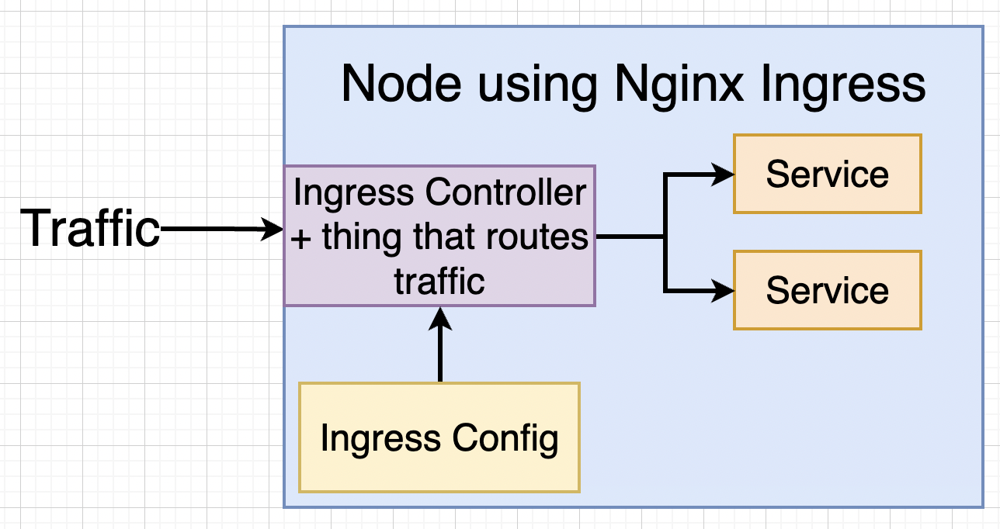

# Ingress

## What is Ingress?

An Ingress resource defines HTTP/HTTPS routing rules for external traffic into the cluster. It is more powerful than a bare LoadBalancer Service because:

- One load balancer for many services (cost-effective)
- Path-based and host-based routing
- TLS termination
- Rewrites and redirects

```
Internet --> [Ingress Controller] --> /api     --> server-service:5000
                                  --> /        --> client-service:3000
```

> Ingress only defines rules. You also need an **Ingress Controller** (nginx-ingress, Traefik, AWS ALB, etc.) running in the cluster to act on them.

## Ingress Controllers

Kubernetes does not include an ingress controller. You must install one.

| Controller | Notes |
|-----------|-------|
| ingress-nginx | Community-maintained; most widely used; simple to set up |
| AWS Load Balancer Controller | Provisions AWS ALB/NLB natively |
| Traefik | Good for dynamic environments; built-in dashboard |
| HAProxy Ingress | High-performance; feature-rich |
| GKE Ingress | Built into GKE; uses Google Cloud LB |

### Install ingress-nginx

```bash
# On minikube
minikube addons enable ingress

# On a cluster via Helm
helm repo add ingress-nginx https://kubernetes.github.io/ingress-nginx
helm repo update
helm install ingress-nginx ingress-nginx/ingress-nginx \
  --namespace ingress-nginx \
  --create-namespace

# Verify
kubectl get pods -n ingress-nginx
kubectl get svc -n ingress-nginx
```



## Ingress Manifest

```yaml
apiVersion: networking.k8s.io/v1
kind: Ingress
metadata:
  name: my-ingress
  annotations:
    nginx.ingress.kubernetes.io/rewrite-target: /$1
    nginx.ingress.kubernetes.io/use-regex: "true"
spec:
  ingressClassName: nginx      # replaces deprecated kubernetes.io/ingress.class annotation
  rules:
    - host: myapp.example.com  # omit to match all hosts
      http:
        paths:
          - path: /api/?(.*)
            pathType: Prefix
            backend:
              service:
                name: server-service
                port:
                  number: 5000
          - path: /?(.*)
            pathType: Prefix
            backend:
              service:
                name: client-service
                port:
                  number: 3000
```

### Path Types

| PathType | Behavior |
|----------|---------|
| `Prefix` | Matches any URL with the given prefix |
| `Exact` | Matches the exact URL only |
| `ImplementationSpecific` | Controller decides (avoid using this) |

## TLS with cert-manager

cert-manager automates TLS certificate issuance from Let's Encrypt and other CAs.

### Install cert-manager

```bash
helm repo add jetstack https://charts.jetstack.io
helm repo update

helm install cert-manager jetstack/cert-manager \
  --namespace cert-manager \
  --create-namespace \
  --version v1.14.5

# Install CRDs
kubectl apply -f https://github.com/cert-manager/cert-manager/releases/download/v1.14.5/cert-manager.crds.yaml

# Verify
kubectl get pods -n cert-manager
```

### ClusterIssuer (Let's Encrypt)

```yaml
apiVersion: cert-manager.io/v1
kind: ClusterIssuer
metadata:
  name: letsencrypt-prod
spec:
  acme:
    server: https://acme-v02.api.letsencrypt.org/directory
    email: you@example.com
    privateKeySecretRef:
      name: letsencrypt-prod
    solvers:
      - http01:
          ingress:
            ingressClassName: nginx
```

For testing, replace the server with the staging URL to avoid rate limits:
`https://acme-staging-v02.api.letsencrypt.org/directory`

### Certificate Resource

```yaml
apiVersion: cert-manager.io/v1
kind: Certificate
metadata:
  name: myapp-tls
  namespace: production
spec:
  secretName: myapp-tls-secret
  issuerRef:
    name: letsencrypt-prod
    kind: ClusterIssuer
  dnsNames:
    - myapp.example.com
    - www.myapp.example.com
```

### Ingress with TLS

```yaml
apiVersion: networking.k8s.io/v1
kind: Ingress
metadata:
  name: my-ingress
  annotations:
    cert-manager.io/cluster-issuer: letsencrypt-prod
    nginx.ingress.kubernetes.io/ssl-redirect: "true"
spec:
  ingressClassName: nginx
  tls:
    - hosts:
        - myapp.example.com
      secretName: myapp-tls-secret
  rules:
    - host: myapp.example.com
      http:
        paths:
          - path: /
            pathType: Prefix
            backend:
              service:
                name: client-service
                port:
                  number: 3000
```

cert-manager will automatically provision a certificate and store it in `myapp-tls-secret`.

## Useful Annotations (nginx-ingress)

```yaml
annotations:
  nginx.ingress.kubernetes.io/rewrite-target: /
  nginx.ingress.kubernetes.io/ssl-redirect: "true"
  nginx.ingress.kubernetes.io/proxy-body-size: "50m"
  nginx.ingress.kubernetes.io/rate-limit: "100"
  nginx.ingress.kubernetes.io/enable-cors: "true"
```

## Gateway API (Future Direction)

The [Gateway API](https://gateway-api.sigs.k8s.io/) is the successor to Ingress. It is more expressive and supports advanced routing. See [New Features](new_features.md) for details.

## Cleaning Up

```bash
# Remove everything deployed via kubectl apply
kubectl delete -f k8s/

# Remove ingress-nginx
helm uninstall ingress-nginx -n ingress-nginx
```
