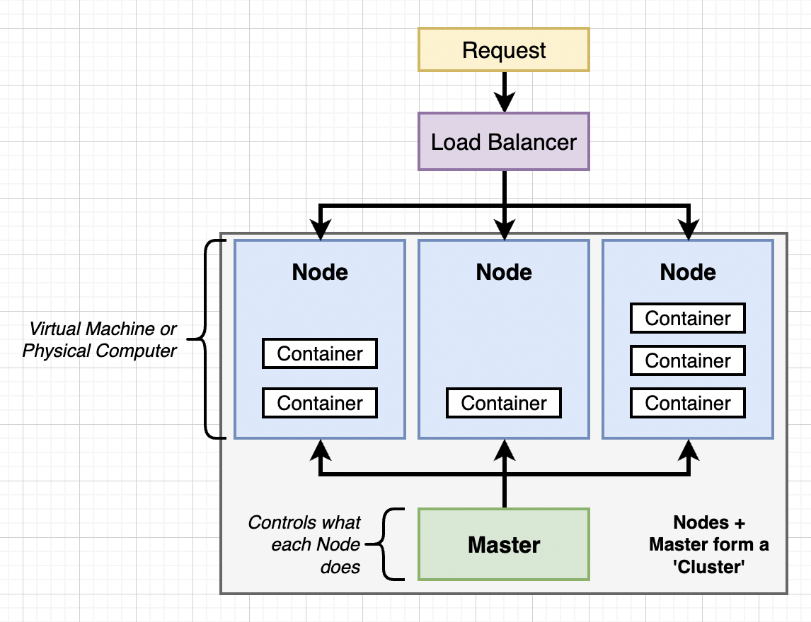

# Overview

## What is Kubernetes?

Kubernetes is an open-source container orchestration platform born out of Google's internal system (Borg). It automates deploying, scaling, and operating containerized applications across a cluster of machines.

**Core value:** Declarative configuration. You describe the desired state and Kubernetes continuously works to achieve and maintain it.

### Key Features

- Automated rollout and rollback
- Horizontal scaling (manual and automatic)
- Self-healing (restarts failed containers, reschedules on healthy nodes)
- Service discovery and load balancing
- Secret and configuration management
- Persistent volume management
- Batch job processing
- Role-based access control (RBAC)
- Linux and Windows container support

## Architecture



A Kubernetes **cluster** consists of:

- **Control Plane (Master)** - manages the cluster, makes scheduling decisions
- **Worker Nodes** - machines that run your containers

### Control Plane Components

| Component | Role |
|-----------|------|
| `kube-apiserver` | Front door for the cluster; all kubectl commands hit this |
| `etcd` | Key-value store holding all cluster state |
| `kube-scheduler` | Assigns pods to nodes based on resource availability |
| `kube-controller-manager` | Runs controllers (deployment, replicaset, node, etc.) |
| `cloud-controller-manager` | Integrates with cloud provider APIs (EKS, GKE, AKS) |

### Worker Node Components

| Component | Role |
|-----------|------|
| `kubelet` | Agent that ensures containers in a pod are running |
| `kube-proxy` | Maintains network rules for pod-to-pod and pod-to-service traffic |
| Container runtime | Runs containers (containerd, CRI-O; Docker is no longer directly supported) |

### Key Concepts

| Term | Meaning |
|------|---------|
| Pod | Smallest deployable unit; one or more containers sharing network and storage |
| Service | Stable endpoint for a set of pods |
| Deployment | Manages a desired number of identical pod replicas |
| Namespace | Virtual cluster for resource isolation |
| Node | Physical or virtual machine in the cluster |

## The Kubernetes API

Everything in Kubernetes is an API object. You interact by sending requests to the API server.

### Three ways to interact

1. **REST API** - direct HTTP calls (rarely used manually)
2. **Client libraries** - Go, Python, Java, JavaScript, .NET, etc.
3. **kubectl** - the CLI that translates commands into API calls

### API Groups and Versions

```yaml
# Core group (v1) - fundamental objects
apiVersion: v1        # Pod, Service, ConfigMap, Secret, PersistentVolume

# Apps group - higher-level workload objects
apiVersion: apps/v1   # Deployment, StatefulSet, DaemonSet, ReplicaSet

# Networking group
apiVersion: networking.k8s.io/v1  # Ingress, NetworkPolicy

# Autoscaling group
apiVersion: autoscaling/v2        # HorizontalPodAutoscaler
```

## kubectl Basics

```bash
# Get a list of resource types
kubectl api-resources

# Get resources
kubectl get pods
kubectl get pods -n kube-system
kubectl get all                        # pods, services, deployments
kubectl get pods -o wide               # includes node and IP
kubectl get pods -o yaml               # full YAML output

# Describe (detailed info + events)
kubectl describe pod <name>
kubectl describe node <name>

# Create / update
kubectl apply -f manifest.yaml         # preferred - declarative
kubectl create -f manifest.yaml        # imperative - fails if already exists

# Delete
kubectl delete pod <name>
kubectl delete -f manifest.yaml

# Logs
kubectl logs <pod-name>
kubectl logs <pod-name> -c <container> # multi-container pods
kubectl logs <pod-name> -f             # follow / tail

# Execute commands in a running container
kubectl exec -it <pod-name> -- /bin/bash
kubectl exec -it <pod-name> -c <container> -- sh

# Port forwarding (local development)
kubectl port-forward pod/<name> 8080:80
kubectl port-forward svc/<name> 8080:80

# Copy files
kubectl cp <pod-name>:/path/to/file ./local-file
```

### Useful Flags

```bash
# Output formats
-o yaml    # full YAML
-o json    # full JSON
-o wide    # extra columns
-o name    # just resource/name

# Filtering
-l app=web                     # label selector
--all-namespaces               # across all namespaces
--sort-by='{.metadata.creationTimestamp}'

# Dry run (preview without applying)
--dry-run=client -o yaml
```

### Shell Completion

```bash
source <(kubectl completion bash)
echo 'source <(kubectl completion bash)' >> ~/.bashrc

source <(kubectl completion zsh)
echo 'source <(kubectl completion zsh)' >> ~/.zshrc
```
