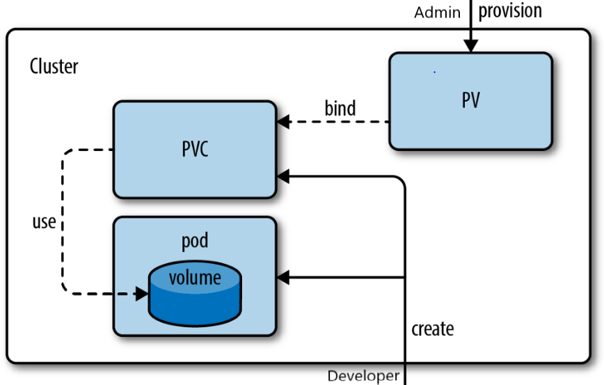
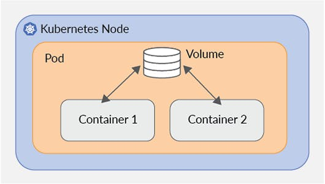

# Storage

## The Problem

Container file systems are ephemeral - data is lost when the container restarts. Even within a pod, containers do not share a file system by default.

Kubernetes solves this with three storage abstractions:

| Type | Lifetime | Use Case |
|------|---------|---------|
| Volume | Tied to the pod | Share data between containers in a pod; survives container restarts but not pod deletion |
| Persistent Volume (PV) | Independent of any pod | Durable storage for databases and stateful apps |
| Persistent Volume Claim (PVC) | Request for storage | How a pod asks for persistent storage |

## Volumes

A Volume is a directory accessible to containers in a pod. It is defined in the pod spec and mounted into containers.

### emptyDir

Temporary scratch space - exists as long as the pod runs. Good for sharing data between containers in the same pod.

```yaml
spec:
  containers:
    - name: app
      volumeMounts:
        - name: shared-data
          mountPath: /data
    - name: sidecar
      volumeMounts:
        - name: shared-data
          mountPath: /data
  volumes:
    - name: shared-data
      emptyDir: {}
```

### configMap and secret Volumes

Mount ConfigMaps or Secrets as files (see [Config and Secrets](config.md)):

```yaml
volumes:
  - name: config-vol
    configMap:
      name: my-config
      items:
        - key: redis.conf
          path: redis.conf
```

### hostPath

Mounts a directory from the node's file system. Avoid in production - creates node dependency and security concerns.

```yaml
volumes:
  - name: host-log
    hostPath:
      path: /var/log
      type: Directory
```

## Persistent Volumes



A PersistentVolume (PV) is a piece of storage provisioned by an administrator or dynamically by a StorageClass.

### Static Provisioning

An admin creates the PV manually:

```yaml
apiVersion: v1
kind: PersistentVolume
metadata:
  name: my-pv
spec:
  capacity:
    storage: 10Gi
  accessModes:
    - ReadWriteOnce
  persistentVolumeReclaimPolicy: Retain
  storageClassName: standard
  hostPath:              # local path; for production use a CSI driver
    path: /data/my-pv
```

### Access Modes

| Mode | Abbreviation | Meaning |
|------|-------------|---------|
| ReadWriteOnce | RWO | One node can mount read-write |
| ReadOnlyMany | ROX | Multiple nodes can mount read-only |
| ReadWriteMany | RWX | Multiple nodes can mount read-write |
| ReadWriteOncePod | RWOP | One pod can mount read-write (k8s 1.22+) |

Not all storage backends support all modes. Block storage (EBS, GCE PD) is typically RWO only.

## Persistent Volume Claims

A PVC is a request for storage. Kubernetes finds a matching PV (or dynamically provisions one) and binds it to the claim.

```yaml
apiVersion: v1
kind: PersistentVolumeClaim
metadata:
  name: db-storage
spec:
  accessModes:
    - ReadWriteOnce
  resources:
    requests:
      storage: 5Gi
  storageClassName: standard    # omit to use cluster default
```

### Using a PVC in a Pod

```yaml
spec:
  volumes:
    - name: db-data
      persistentVolumeClaim:
        claimName: db-storage
  containers:
    - name: postgres
      image: postgres:15
      volumeMounts:
        - name: db-data
          mountPath: /var/lib/postgresql/data
          subPath: postgres      # store data in a subfolder to avoid mount issues
```

```bash
kubectl get pvc
kubectl get pv
kubectl describe pvc db-storage
```

PVC lifecycle:

```
Pending  -->  Bound  -->  Released  -->  (Reclaim policy: Retain/Delete/Recycle)
```

## Storage Classes

StorageClasses enable **dynamic provisioning** - PVs are created automatically when a PVC is submitted.

```yaml
apiVersion: storage.k8s.io/v1
kind: StorageClass
metadata:
  name: fast
provisioner: ebs.csi.aws.com        # CSI driver
parameters:
  type: gp3
  encrypted: "true"
reclaimPolicy: Delete                # Delete | Retain
allowVolumeExpansion: true
volumeBindingMode: WaitForFirstConsumer   # don't provision until pod is scheduled
```

### Common Cloud Storage Classes

| Cloud | Provisioner | Storage Types |
|-------|------------|--------------|
| AWS | `ebs.csi.aws.com` | gp3, io2 (EBS) |
| AWS | `efs.csi.aws.com` | EFS (RWX) |
| GCP | `pd.csi.storage.gke.io` | pd-standard, pd-ssd |
| Azure | `disk.csi.azure.com` | Standard_LRS, Premium_LRS |
| Azure | `file.csi.azure.com` | Azure Files (RWX) |

```bash
kubectl get storageclasses
kubectl get sc                        # short form
```

## Important Notes

- **In-tree plugins** (`awsElasticBlockStore`, `gcePersistentDisk`, etc.) are deprecated. Use CSI drivers instead.
- Running multiple replicas of a database sharing one RWO volume is dangerous - each replica thinks it has exclusive access. Use StatefulSets with per-pod PVCs for clustered databases.
- To preserve data when deleting a PVC, set the StorageClass `reclaimPolicy: Retain`.


