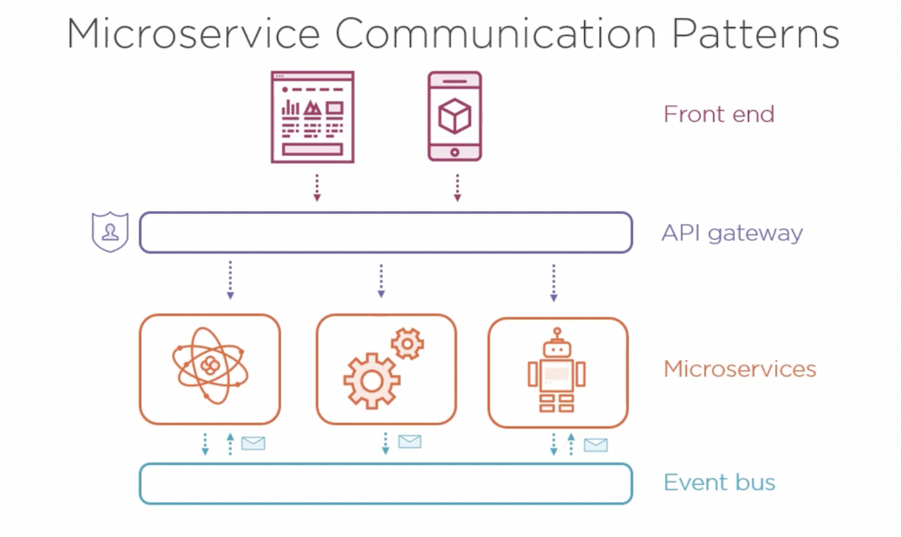

## Communicating Between Microservices

#### Microservice Communication Patterns

If microservices communicate directly with each other then there may be some tangled dependencies and casacading failures and poor performance (multiple hops for request).

If there is a hopping problem in your architecture then it might be possible that you may have a misplaced boundry in your architecture.

Better to allow Mircoservices to communicate via Event Bus allows synchronised communications. For frontend application we can use an API gateway to interact with microservices. We could separate and implement Authentication on API gateway and creates a single place for flow of external traffic into internal services.

We could also use BFF (Backend for Frontend Approach) to communicate to Microservices.

#### Synchronous Communication

Making a direct call to microservice and waiting for it to return response.

Performance is very important in synchronous communication !

HTTP is preferred : Industry standard, Easily used by any programming language, standard error codes, Caching and proxies. Payload for HTTP service is usually JSON or XML.

RESTful APIs : Represent information as “resources”, Use standard HTTP methods like

- GET to retrieve
- POST to create
- PUT to update

HTTP status codes and Media type headers (Content-Type).

#### Asynchronous Communication

Process of Placing an order can be a good example : Take payment, order additional stock, ship to customer. We can accept the order and let them track the order.

Asynchronous Communication via Messaging can be very useful design. If one microservice communicates with Even Bus and sends out a message to bus. It doesn’t require second microservice to present/online, messages can queue up in bus and when second service comes up online, it can pick up queued messages.

Another advantage is the scaling, say first Service send out a lots of messages then to process the messages effieciently we can scale up the second service and multiple instances can then take up the queued messages.

There are several types of messages, two important of them are 

- Commands : directed to a microservices
- Events : announce to all microservices and only concerned microservices respond.

Books Recommendation : Enterprise Integration Pattern by Gregor Hohpe & Bobby Woolf

#### Resilient Communication Patterns

In microservices

- Expect trasient errors!
- Beware of cascading failures
- Implement retries with back-off (e.g. using Polly in .NET)
- Circuit Breaker (sits in client and server) 
- *Caching can improve resilience* : Fallback mechanism
- Message Brokers are useful and they are resilient, they queue messages for microservices, It can catch up later. They can also manage re-deliveries and dead-letter after mulitple failure.
- NOTE : Messages maybe recieived out of order, or may be recieved multiple times (Have indempotent handlers!).

#### Service Discovery

To microservices requires an address to read the messages. We don’t want to hardcode ip addresses because microservices and vms can be taken ofline time to time for maintenance and update.

We use **Service Registry** to maintain the address of all the VMs, and you don’t need to create your own service registry, you could use a DNS if you have PaaS (Platform as a Service) or you use Container orchestration (Kubernetes have built in DNS which handles/load balancing handlers for managing internal traffic).