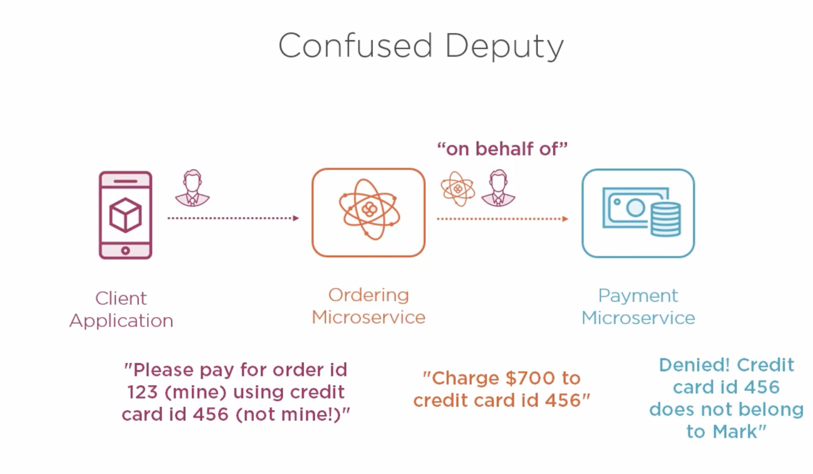
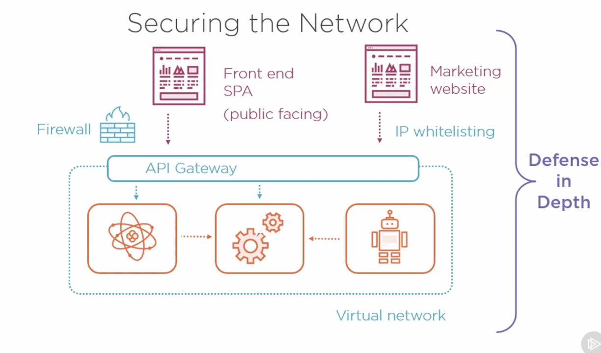

## Securing Microservices

Not all data is sensitive. For eg Catalog Service is not sensitive while Ordering Service is highly sensitive data and requires encryption.

#### Encrypting Data

Encryption should be present in transit. Use standard algorithms and never try to write your own encrytion schemes. For HTTP we use Transport Layer Security and SSL certificates. We usually need to manage Certificates, which could be done by Cloud Service provider or we can use LEGO tool for certificates.

 Also data needs to Encrypted at rest. Disk Encryption requires a proper key management and requires encrypted backups.

#### Authentication

*We need to know who is calling our service.*

with HTTP we have many options, auth header can have main option is 

- Basic Authentication (username & password) : Only issue is Requires all microservices requires password storage.
- API Key : key/client and requires client management
- Client certificate : public-key cryptography but require very complex management.

Better Approach is use an Identity Server and use industry standard protocols:  OAuth 2.0 & OpenID Connect.

Recommendation : Getting Started with OAuth2.0 (Scott Brady).

Once identity server verifies client auth info, it provides access token (Short lived) to client. Then every request from client to microservice will contain this token and makes life easy for microservices by not making them manage authentication.

#### Authorization

*If authenticated then limit what they can do, role based management.*

Authorization Frameworks : 

- Makes decisions based on “roles”
- consider carefully what callers should be allowed to do

Role based authentication systems helps fight the problem of confused deputy.

#### Securing the Network

Always put all microservices inside a virtual network and don’t allow others access them. Implement an API Gateway that accepts requests from public network and passes on incoming request to Microservices.

This allows us to have single point of entry and configured with Firewall and guarded with DDOS defense.

#### Defense in Depth

*Avoid relying on single layer of security.*

- Encryption in transit
- Access tokens
- Virtual Networks and whitelists for network security.

Apply multiple layers of protection to remove the possibility of breach.

Additional Defensive Measures : 

- Penetration testing : performed by infosec experts and get their advice.
- Automated security testing : prove APIs reject unauthorized callers
- Attack detection : port scanning, sql-injection detects and react quickly when you are under attack.
- Auditing : know exactly who did what and when.

