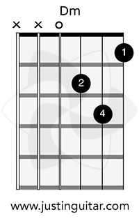

### Module 4

#### Beginner Finger Stretches

- difficulty varies according to anatomy
- not a speed exercise but do it slowly and strecthing
- keep your fingers parallel to one another and keep fingers roughly where they should be
- This Is A Finger Stretch Exercise, Not A Finger Pain Exercise
- bar chord : n, n+1, n+2, n+3 fret (probably called spider ig)

#### The Dm Chord

- 
- Many guitarist use 1-2-3 for the Dm, but for beginner 1-2-4 because 4 helps develop pinky finger
- practice : One Minute Change Exercise & Perfect Chord Exercise

#### [Metronome](https://www.justinguitar.com/guitar-lessons/meet-the-metronome-b1-403)

- enable to play in a steady, consistent rhythm - one of the vital skills for being a great guitarist.
- If you practice with a metronome regularly, you’ll develop your inner sense of rhythm!
- ability to play at a consistent tempo even when the click is off
- Rules :
  1. FIRST RULE : Practice different Tempo
  2. SECOND RULE : Accentuate the beat!
  3. THIRD RULE : Accuracy
- Try this metronome : https://geni.us/jgtr-time

#### [THE Strumming Pattern](https://www.justinguitar.com/guitar-lessons/the-strumming-pattern-b1-404)

- Step 1 : Start off with a simple pattern of four down-strums per bar. Then, while you strum, you should count aloud – 1, 2, 3, 4…

- Step 2 

- ```
  1 2+ 3+ 4
  
  D DU DU D
  ```

- Step 3

- ```
  1 2+ + 4
  
  D Du u D
  ```

- 80-100 BPM on metronome is a good idea

- 