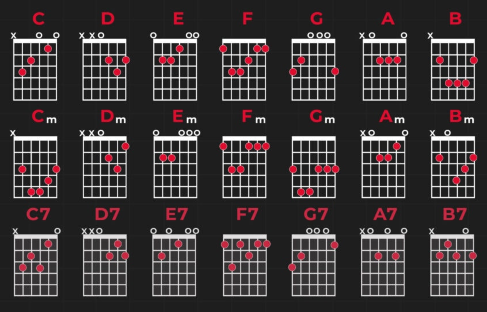
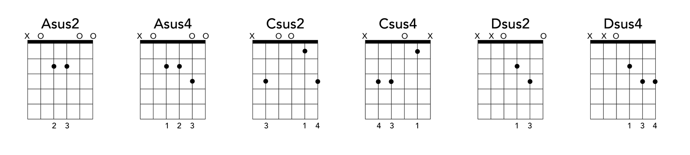
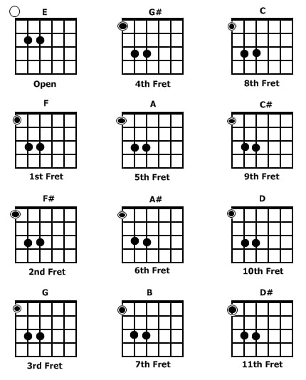
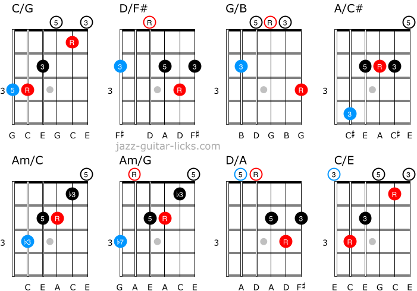
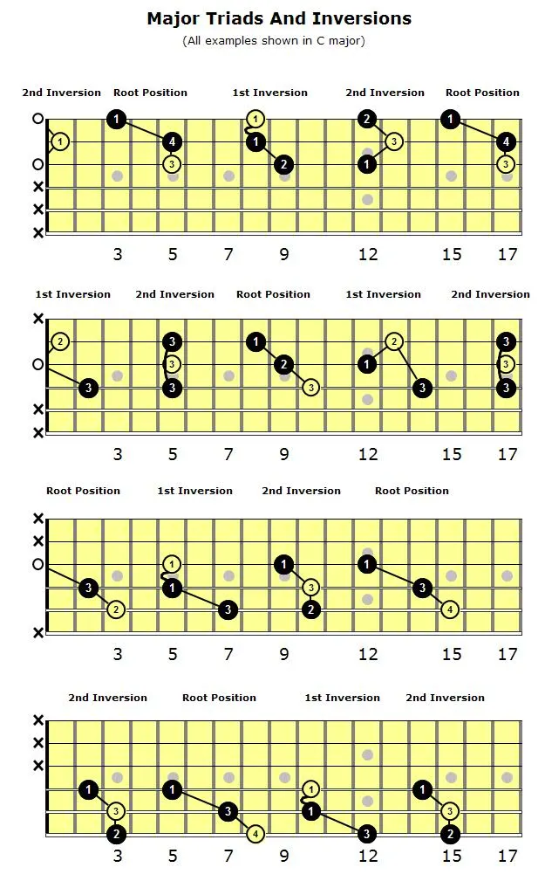
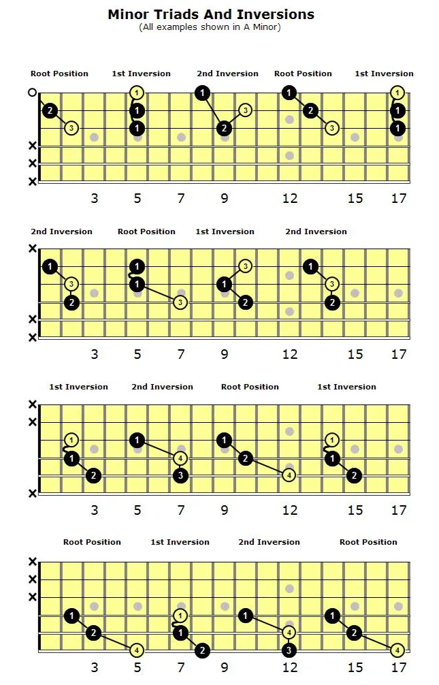

# Chords

## Reading Chord Diagrams

- Horizontal lines = frets; vertical lines = strings
- Dark top line = nut
- Numbers = fingers (1=index, 2=middle, 3=ring, 4=pinky)
- X = don't play; 0 = open string

## Basic Open Chords

The most common open chords are E, Em, A, Am, D, Dm, G, C, and F. These form the foundation of most songs.

## Sus Chords

Suspend chords omit the third note and replace it with either the 2nd (sus2) or 4th (sus4) note instead.

- **Sus2**: Root + 2nd + 5th (e.g., Asus2 = A B E)
- **Sus4**: Root + 4th + 5th (e.g., Asus4 = A D E)
- Common in pop and rock for an open, unresolved feel.

## Power Chords

1. **Structure**: Root + Fifth (e.g., E5 = E + B)
2. **Why Power Chords?**
   - Eliminate the third note, avoiding major/minor ambiguity.
   - Ideal for distortion-heavy genres like rock and metal.
3. **Shapes** (movable on the low E and A strings):
   - E5: Open string + 2nd fret on A string
   - A5: 5th fret E string + 7th fret A string

## Slash Chords

1. **Definition**: Chords with a specific bass note other than the root.
   - Example: **C/E** = C major chord with E in the bass.
2. **Usage**: Creates smooth transitions between chords (voice leading).
   - Example: **C → C/E → F**
3. **Tip**: Learn them as they appear in songs — they're intuitive in context.

## Extended Chords

1. **Definition**: Chords that add notes beyond the triad.
   - 7th: Cmaj7 = C E G B
   - 9th, 11th, 13th add further extensions.
2. **Usage**: Common in jazz, blues, and neo-soul. Adds complexity and richness.
3. **Tip**: Start with dominant 7th chords, then work outward.

## Diminished and Augmented Chords

- **Diminished**: Root + Minor Third + Diminished Fifth
  - Example: Cdim = C + Eb + Gb
  - Tension-building; resolves to major or minor chords.
- **Augmented**: Root + Major Third + Augmented Fifth
  - Example: Caug = C + E + G#
  - Creates a sense of lift or suspension.

## Borrowed Chords

1. **Definition**: Chords borrowed from the parallel key (e.g., from C minor when in C major).
2. **Common examples in C Major**:
   - **iv** (Fm), **bVII** (Bb), **bIII** (Eb)
3. **Usage**: Adds emotional depth or surprise to progressions.

## Triads

Triads are three-note chords built from a root, third, and fifth.

| Type        | Formula                             | Example  |
|-------------|-------------------------------------|----------|
| Major       | Root + Major 3rd + Perfect 5th      | C E G    |
| Minor       | Root + Minor 3rd + Perfect 5th      | C Eb G   |
| Diminished  | Root + Minor 3rd + Diminished 5th   | C Eb Gb  |
| Augmented   | Root + Major 3rd + Augmented 5th    | C E G#   |

---

## Not Yet Learned

- Chord inversions
- Jazz voicings
- Drop 2 and Drop 3 voicings
- Chord melody (playing melody and chords simultaneously)
- Shell voicings
- Quartal harmony
