# Scales

## Intervals

1. **Definition**: The distance between two notes (e.g., root to major third).
2. **Types**:
   - **Perfect Intervals**: Unison, Octave, Fourth, Fifth
   - **Major/Minor Intervals**: Second, Third, Sixth, Seventh
   - **Diminished/Augmented**: Flattened or sharpened versions of the above
3. **Application**:
   - Chord construction: Root + Major Third + Perfect Fifth = Major Chord
   - Melodic phrasing and soloing

## Major Scale

Formula: **W W H W W W H** (W = whole step, H = half step)

- C Major: C D E F G A B C
- The foundation for understanding keys, chords, and modes.

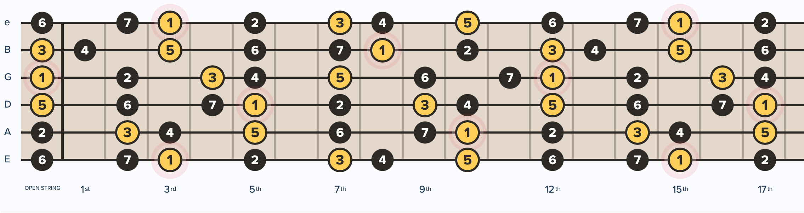

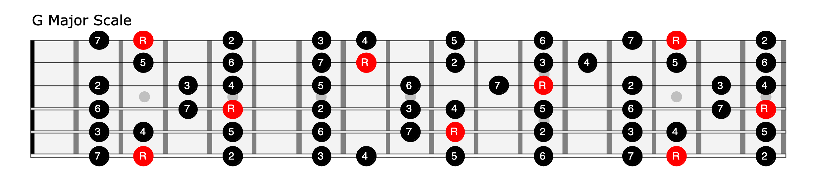

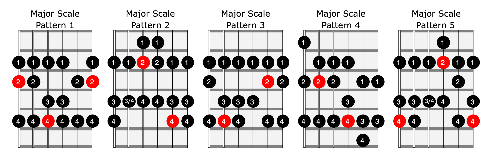

## Minor Scale

### Natural Minor (Aeolian)

Formula: **W H W W H W W**

- A Natural Minor: A B C D E F G A
- The 6th mode of the major scale — C Major and A Minor share the same notes.

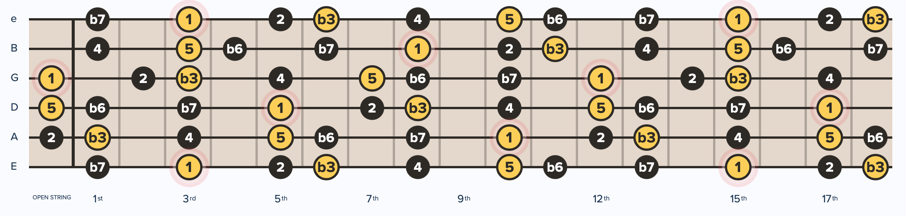

### Harmonic Minor

Raise the 7th degree of the natural minor by a half step. Creates a leading tone that resolves strongly to the root.

- A Harmonic Minor: A B C D E F G# A

### Melodic Minor

Raise both the 6th and 7th degrees ascending; revert to natural minor descending.

- A Melodic Minor (ascending): A B C D E F# G# A

## Pentatonic Scales

Five-note scales that work well over most chord progressions. The most practical scales for soloing.

### Major Pentatonic

Remove the 4th and 7th from the major scale.

- C Major Pentatonic: C D E G A

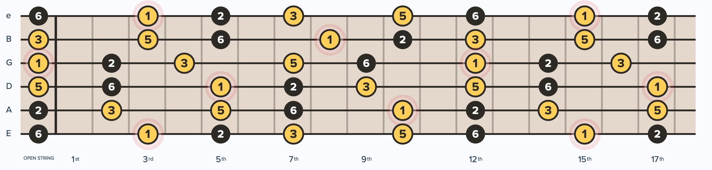

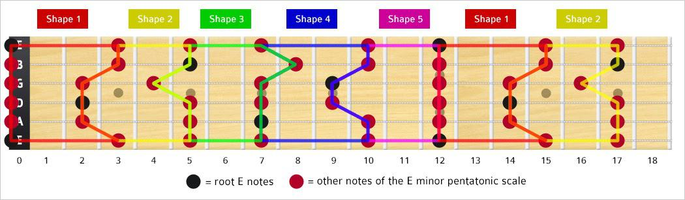

### Minor Pentatonic

Remove the 2nd and 6th from the natural minor scale.

- A Minor Pentatonic: A C D E G
- The bread-and-butter scale for rock, blues, and pop soloing.

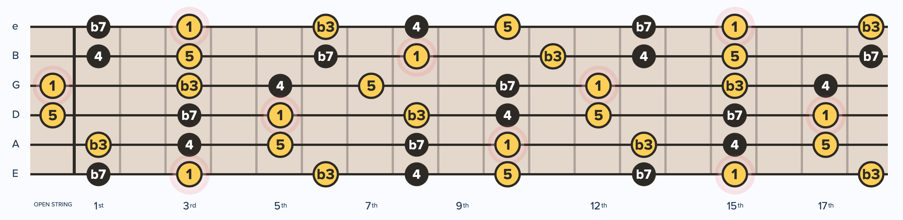

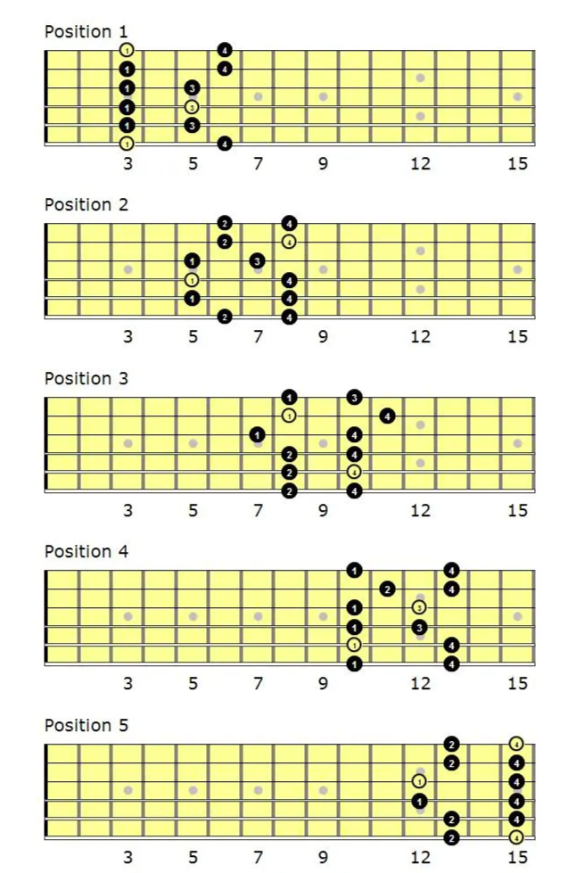

## Blues Scales

### Blues Major Scale

Major Pentatonic + flat 3rd (b3): C D Eb E G A

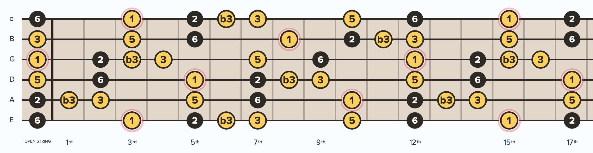

### Blues Minor Scale

Minor Pentatonic + flat 5th (b5, the "blue note"): A C D Eb E G

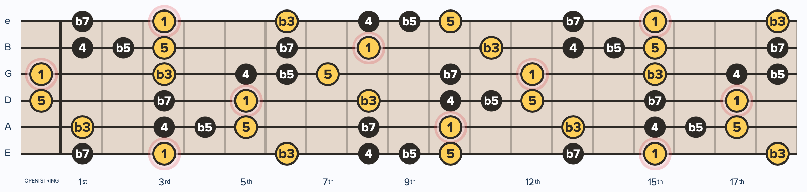

The flat 5th (tritone) is what gives blues its characteristic tension.

## Modes

Modes are the seven rotations of the major scale, each starting on a different degree.

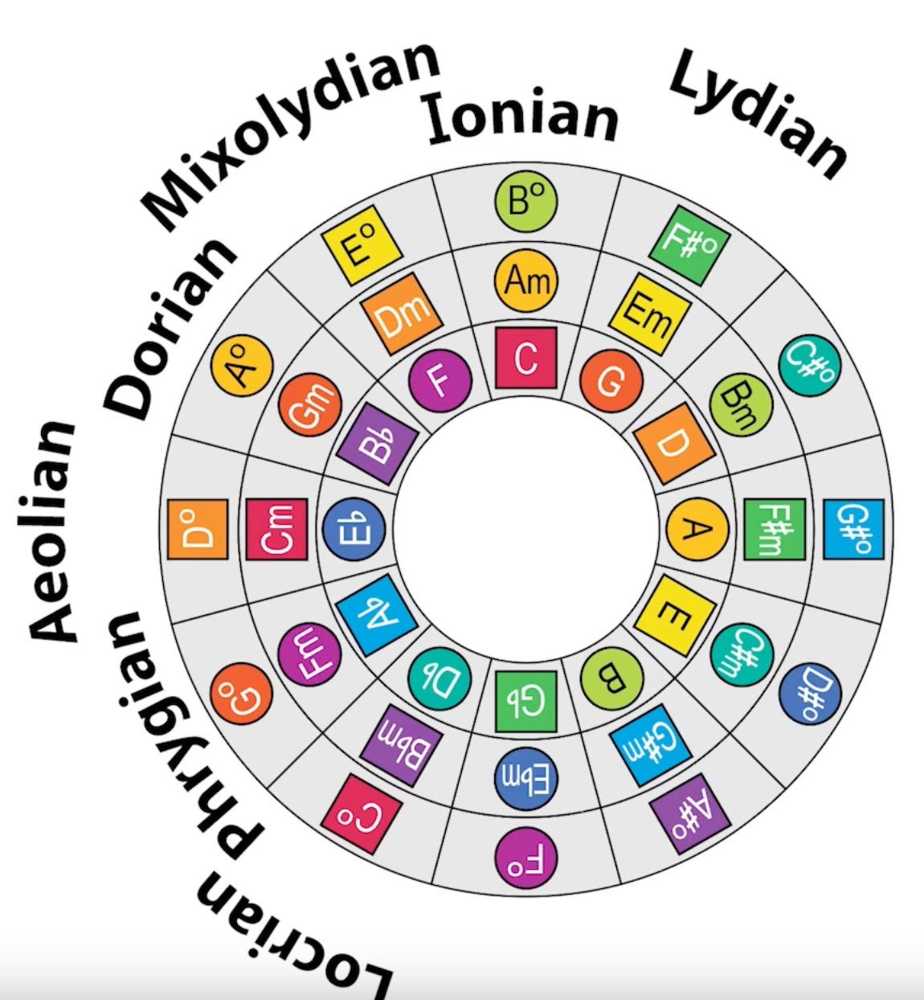

| Mode        | Degree | Character                   | Example (C Major basis) |
|-------------|--------|-----------------------------|--------------------------|
| Ionian      | 1st    | Bright, major               | C D E F G A B            |
| Dorian      | 2nd    | Minor but jazzy/funky       | D E F G A B C            |
| Phrygian    | 3rd    | Dark, Spanish/flamenco      | E F G A B C D            |
| Lydian      | 4th    | Dreamy, raised 4th          | F G A B C D E            |
| Mixolydian  | 5th    | Major with flat 7th, bluesy | G A B C D E F            |
| Aeolian     | 6th    | Natural minor               | A B C D E F G            |
| Locrian     | 7th    | Diminished, unstable        | B C D E F G A            |

---

## Guide to Practicing Scales

- **Practice slow — accuracy is more important than speed.**
- Once comfortable with the 5 pentatonic/major scale positions:
  - Practice all downstrokes first
  - Then alternate picking (down-up-down-up)
- Move to the minor scale — the patterns share the same shapes, just with different root note positions.
- Learn notes on the fretboard; track root, 3rd, 5th, and 7th.
- Once accuracy is solid, practice scales more melodically:
  - Mix finger combinations, aim for one finger per note
  - Add slides and delays for expressive effect
- Treat all 5 positions as one cohesive pattern across the neck.
- Blend between positions using slides from root notes, then from all 6 strings.
- Practice scales in **3rds**: play every other note in sequence. Thirds sound more melodic than straight up-and-down runs.

---

## Not Yet Learned

- Exotic scales (Gypsy, Hungarian, Japanese)
- Scale sequences and patterns
- Bebop scales
- Whole tone scale
- Diminished scale (octatonic)
- Scale-chord relationships (which scale over which chord)
- Three-notes-per-string scale patterns
