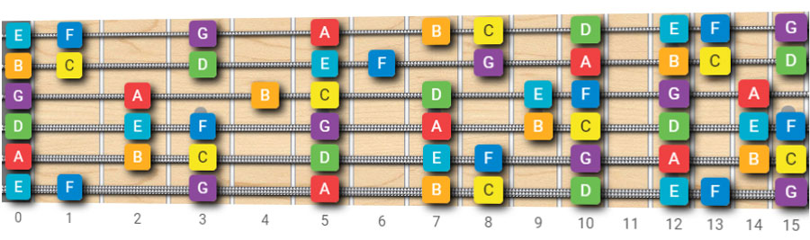
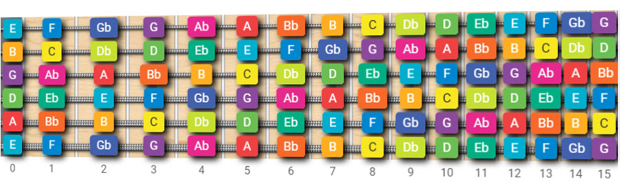
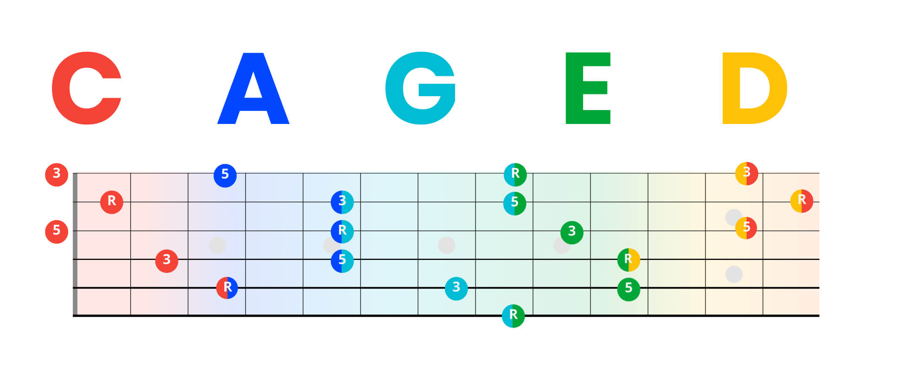
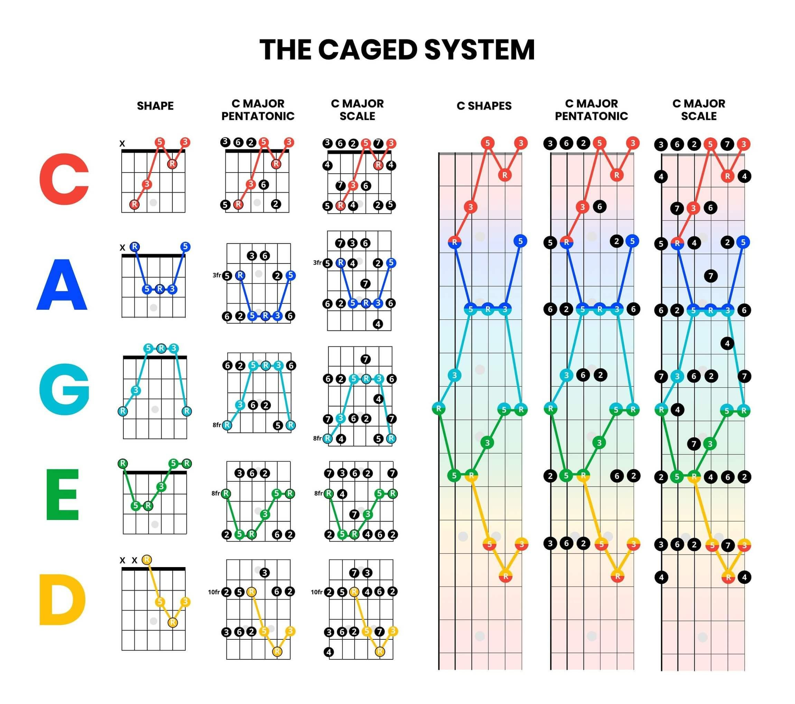
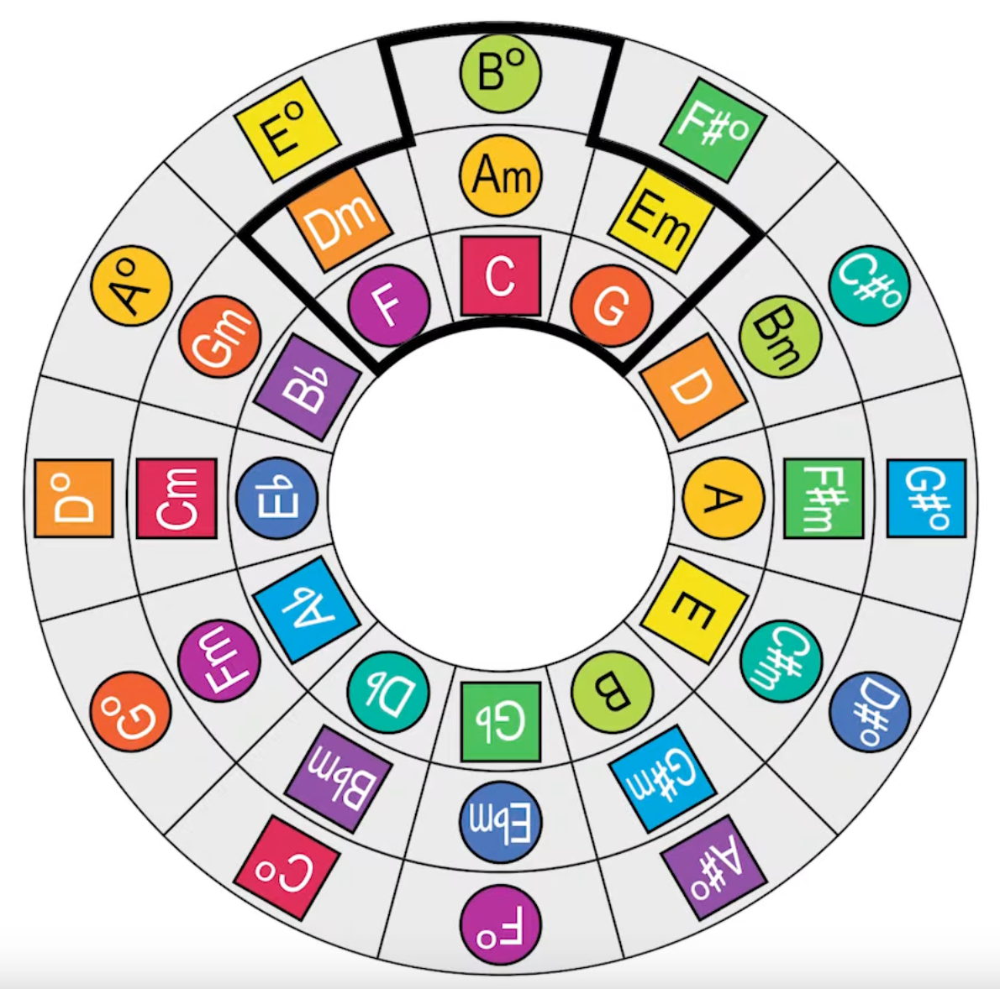
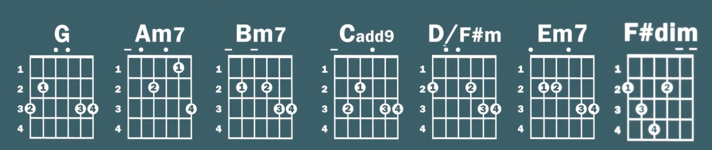
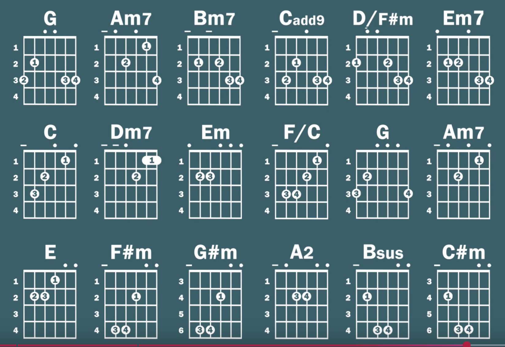
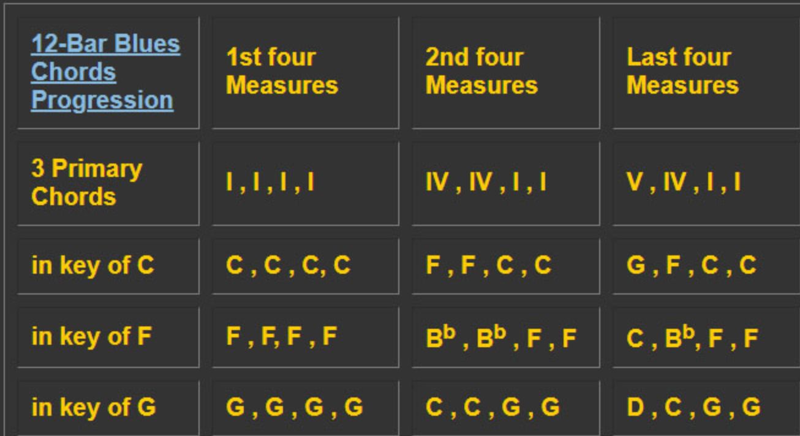

# Fretboard, CAGED & Progressions

## The Fretboard





- Learn to find the same note across different strings.
- Learn chromatic notes (4th/5th relationships) along and across strings.
- Video reference: [Fretboard Mastery](https://www.youtube.com/watch?v=OHa2DklOeTI)

---

## CAGED System





The CAGED system maps the five open chord shapes (C, A, G, E, D) across the entire fretboard. Each shape is movable — when you barre them, you can play any chord in any position.

Understanding CAGED lets you:
- Find any chord anywhere on the neck
- See how scale patterns connect to chord shapes
- Navigate the fretboard as a unified system rather than isolated positions

---

## Circle of Fifths



Moving clockwise adds a sharp; moving counter-clockwise adds a flat.

**Key of C**: C - Dm - Em - F - G - Am - B°

**Formula**: I - ii - iii - IV - V - vi - vii°

### Relative Major and Minor Keys

Every major key has a relative minor that shares the same notes and chord family. To find it: take the 6th degree of the major scale.

- C Major ↔ A Minor (both use C D E F G A B)

### Chord Families





| Key | I    | ii   | iii   | IV     | V      | vi    | vii°    |
|-----|------|------|-------|--------|--------|-------|---------|
| G   | G    | Am7  | Bm7   | Cadd9  | D/F#   | Em7   | F#dim   |
| A   | A    | Bm   | C#m   | D      | E      | F#m   | G#dim   |
| C   | C    | Dm7  | Em    | F/C    | G      | Am7   | Bdim    |
| D   | D    | Em   | F#m   | G      | A      | Bm    | C#dim   |
| E   | E    | F#m  | G#m   | A2     | Bsus   | C#m   | B dim   |

In practice, G, C, and E cover most songs. Diminished chords (vii°) can often be dropped.

Chord families can easily be transposed using a **capo**.

---

## Chord Progressions

| Type                  | Progression             | Key of C Example           | Famous Songs                              |
|-----------------------|-------------------------|----------------------------|-------------------------------------------|
| Classical I           | I-IV-V                  | C - F - G                  | La Bamba, Twist and Shout                 |
| Classical II          | I-V-IV-V                | C - G - F - G              | Louie Louie                               |
| Pop I                 | I-V-vi-IV               | C - G - Am - F             | With or Without You, Let It Be            |
| Pop II                | vi-IV-I-V               | Am - F - C - G             | Someone Like You, Don't Stop Believin'    |
| Sad/Melancholic I     | vi-ii-V-I               | Am - Dm - G - C            | Common jazz standards, ballads            |
| Sad/Melancholic II    | I-vi-IV-V               | C - Am - F - G             | Stand By Me, Earth Angel                  |
| Blues/Rock I          | I-IV-V-IV               | C - F - G - F              | Johnny B. Goode                           |
| Blues/Rock II         | I-vi-ii-V               | C - Am - Dm - G            | Fly Me to the Moon                        |
| Minor I               | i-VII-VI-VII            | Am - G - F - G             | Boulevard of Broken Dreams                |
| Minor II              | i-iv-v-i                | Am - Dm - Em - Am          | Many classical/traditional tunes          |
| Circle I              | I-IV-vii°-iii-vi-ii-V-I | C-F-Bdim-Em-Am-Dm-G-C     | Bach, Handel                              |
| Circle II             | I-vi-ii-V-I             | C - Am - Dm - G - C        | Jazz standard                             |

---

## Blues

### 12-Bar Blues



The foundational blues progression in any key:

```
| I  | I  | I  | I  |
| IV | IV | I  | I  |
| V  | IV | I  | V  |
```

In the Key of A: A - A - A - A / D - D - A - A / E - D - A - E

### Blues Scales

See [Scales](theory4.md) for blues major and minor scale diagrams.

---

## Alternate Tunings

| Tuning  | Notes (low to high) | Character                                  |
|---------|--------------------|--------------------------------------------|
| Drop D  | D A D G B E        | Easy power chords; heavier sound           |
| DADGAD  | D A D G A D        | Celtic/fingerstyle; open, suspended feel   |
| Open G  | D G D G B D        | Slide guitar, blues (Keith Richards)       |
| Open C  | C G C G C E        | Rich resonance for fingerstyle             |

---

## Improvisation

1. **Scales**: Start with Major, Minor, and Pentatonic. Expand to modes (Dorian, Mixolydian).
2. **Phrasing**: Use rests and dynamics to create expressive melodies. Combine bends, slides, and hammer-ons.
3. **Melodic Approaches**:
   - Play over chord tones or arpeggios.
   - Target specific notes to align with chord changes.

---

## Song Structure & Composition

### Common Structures

- **Verse-Chorus-Bridge** (Pop/Rock)
- **AABA** (Jazz/Classical)
- **12-Bar Blues**

### Techniques

- Experiment with chord substitutions.
- Use borrowed or extended chords for harmonic variety.

### Storytelling

Create emotional arcs through dynamics, modulation, and rhythm changes. Think about tension and release — how you build up and resolve.

---

## Not Yet Learned

- Modulation and key changes
- Secondary dominants
- Tritone substitutions (jazz)
- Negative harmony
- Reharmonization
- Chord substitution techniques
- Nashville Number System
- Functional harmony (tonic / subdominant / dominant groups)

---

## Resources

- [SongNotes Tools](https://songnotes.net/tools) - chord diagrams, fretboard tools
