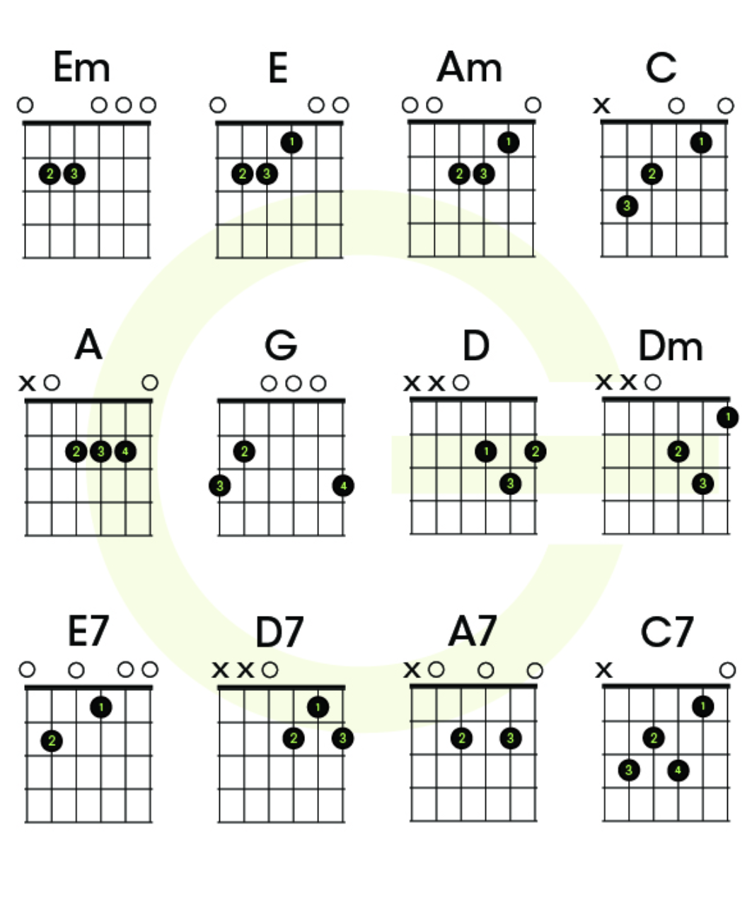

### Module 0

#### How to Tune A Guitar

- Poly-tuner or Snark
- GuitarTuna app
- Tuner/Apps only work if guitar is roughly out of tune or else we might need to listen to sound and tunes while replacing strings.
- Learn how to use your ear to tune a guitar
- Always use one-string at a time ! Look up Rest Stroking in Classical Guitar.

#### How to Hold Your Guitar

- put the guitar on right leg as a beginner, experts use left leg to easy access to higher notes
- use your right rest on the guitar, in case of electric guitar rest the wrist
- guitar is held in place by right hand and leg and back straight
- don’t lean over the guitar ! don’t look at strings.

#### Positive Finger Placement

- first few weeks your finger will hurt
- how much pressure applied on a portion of fret changes the sounds
- to play a note more clearer keep fingers towards end of fret, requires less pressure/pain

#### Reading Guitar Boxes

- Let’s take chord D for Example
    - Horizontal Lines : fret
    - Vertical Lines : Strings
    - Dark first Horizontal Line : Nut
    - 1, 2, 3 : which fingers where (T-thumb, 1-index, 2-driving, 3-ring, 4-pinky) [Note in piano : 1-thumb...]
    - X - won’t play that string
    - 0 - play that string openly

#### How to Hold Guitar Pick

- using a pick is helpful while learning strumming pattern and song playing
- use absolute thinnest pick

#### How to Strum Without Pick

 

