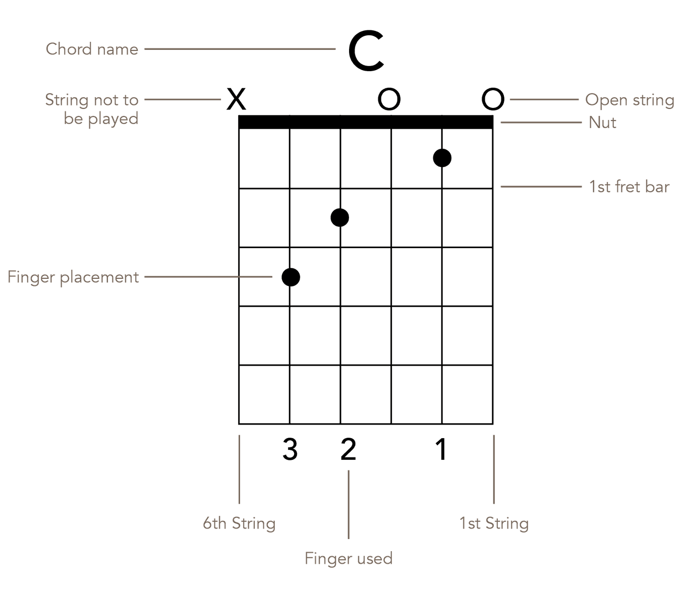

# Module 0 - Setup & Basics

## How to Tune a Guitar

- Use a clip-on tuner (Snark) or app (GuitarTuna) for everyday tuning.
- Tuners work well when the guitar is slightly out of tune - if replacing strings, you may need to use your ear first to get close.
- Tune one string at a time. Look up **rest stroking** in classical guitar for right-hand technique while tuning.
- Long-term goal: develop ear tuning (relative tuning by matching intervals between strings).

## How to Hold Your Guitar

- As a beginner, rest the guitar on your **right leg**; advanced players use the left leg for easier access to higher frets.
- Rest your right forearm on the body of the guitar. For electric, rest the wrist near the bridge.
- The guitar is held in place by your right arm, your leg, and your body - keep your back straight.
- Don't lean over to look at the strings.

## Positive Finger Placement

- Your fingertips will hurt for the first few weeks - this is normal and will pass.
- Pressing harder doesn't always help; pressing *closer to the fret* (towards the body side of the fret) produces a cleaner note with less pressure.

## Reading Chord Boxes

- Horizontal lines = frets; top thick line = nut
- Vertical lines = strings (low E on left, high e on right)
- Numbered dots = which finger to use (1=index, 2=middle, 3=ring, 4=pinky)
- **X** = don't play that string; **0** = play it open

## How to Hold a Guitar Pick

- Using a pick helps when learning strumming patterns and playing songs.
- Start with the **thinnest pick** you can find - it's more forgiving and easier to strum with.

## How to Strum Without a Pick

- Use the nail of your index finger for downstrokes, the flesh of your thumb for upstrokes.
- Alternatively, use all four fingers brushing downward (folk/classical style).
