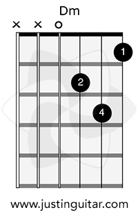

# Module 4 - Rhythm & Technique

## Beginner Finger Stretches

- Not a speed exercise - do it slowly with intention.
- Keep fingers parallel to one another and roughly where they should be on the fret.
- The exercise is a **stretch**, not a pain exercise. Back off if it hurts.
- Spider exercise: fret four consecutive frets (n, n+1, n+2, n+3) across all six strings.

## The Dm Chord



- Many players use fingers 1-2-3, but beginners should try **1-2-4** - using the pinky helps develop it early.
- Exercises: **One Minute Changes** (Dm ↔ other chords) and **Perfect Chord Exercise** (check every string rings clean).

## Using a Metronome

[JustinGuitar lesson on metronome](https://www.justinguitar.com/guitar-lessons/meet-the-metronome-b1-403)

A metronome develops your **internal sense of rhythm** - the ability to keep steady time even without a click.

**Three Rules:**

1. **Practice at different tempos** - not just fast.
2. **Accentuate the beat** - feel the pulse, don't just follow it.
3. **Accuracy over speed** - clean is always better than fast.

Try: [JustinGuitar metronome](https://geni.us/jgtr-time)

## The Strumming Pattern

[JustinGuitar lesson](https://www.justinguitar.com/guitar-lessons/the-strumming-pattern-b1-404)

**Step 1** - Four even downstrokes per bar, count aloud: 1, 2, 3, 4

**Step 2**

```
Count:   1   2 + 3 + 4
Pattern: D   D U D U D
```

**Step 3** (introduce gaps - keep your hand moving but miss the strings on muted beats)

```
Count:   1   2 + + 4
Pattern: D   D U u D
```

- Target tempo: **80-100 BPM** on the metronome.
- Keep your strumming arm moving even on rests - the motion stays constant, only the contact changes.

---

## Not Yet Covered

- Module 4 songs
- Modules 5-9 (Grade 1)
