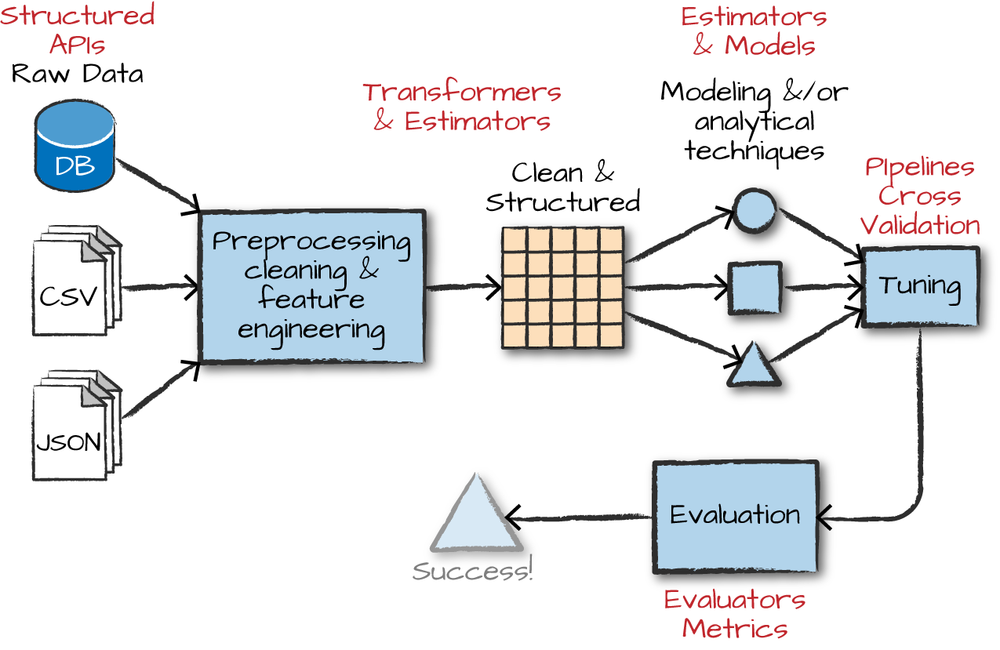
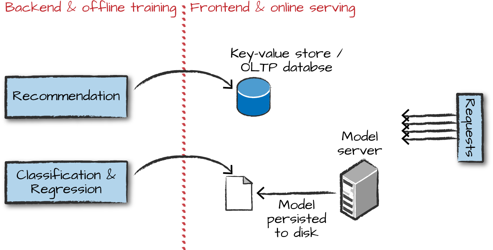

# Advanced Analytics and Machine Learning Overview

Beyond large-scale SQL analysis and streaming, Spark also provides support for statistics, machine learning, and graph analytics. These encompass a set of workloads that we will refer to as advanced analytics.

## A Short Primer on Advanced Analytics

- Advanvced Analytics refers to techniques solving core problems of deriving insights and making predictions or recommendation based on data.
- Commong Tasks involve :
    - Supervised Learning, including Classification and Regression, where gol is to predict a label for each data point based on various features
    - Recommendation Engines to suggest products to user’s based on behaviour
    - Unsuperivised leraning, including clustering, anomaly detection and topic modelling, which goal is discover structure in data.
    - Graph Analytic tasks such as searching for patterns in a social network.
- Great Resources
    - [*An Introduction to Statistical Learning*](http://www-bcf.usc.edu/~gareth/ISL/) by Gareth James, Daniela Witten, Trevor Hastie, and Robert Tibshirani. We refer to this book as “ISL.”
    - [*Elements of Statistical Learning*](https://web.stanford.edu/~hastie/ElemStatLearn/) by Trevor Hastie, Robert Tibshirani, and Jerome Friedman. We refer to this book as “ESL.”
    - [*Deep Learning*](http://www.deeplearningbook.org/) by Ian Goodfellow, Yoshua Bengio, and Aaron Courville. We refer to this book as “DLB.”

### Supervised Learning

- goal : using historical data that already has labels, train a model to predict values of those labels based on various features of data points.
- This training process usually proceeds through an iterative optimization algorithm such as gradient descent, starting with basic model and improving it by configuring internal parameters during each training iteration.

#### Classification

- act of training an algorithm to predict a dependent variable that is *categorical*
- Most common case is *Binary Classifier*, where resulting model makes prediction that a item belongs to one of two groups. Eg. selecting a spam mail.
- If we have more that two categories we call it *multiclass classification*
- Use Cases
    - Predicting Diseases: Historical data of behaviour and physiological attributes of set of patients.
    - Classifying Images
    - Predicting Customer Churn : predicting which customer is likely to stop using a service
    - Buy or won’t buy

#### Regression

- In classification, dependent variable was discrete. In regression we try to predict a continous variable (real number)
- Typical Examples:
    - Predicting Sales
    - Predicting Height
    - Predicting Number of Viewers of a Show

### Recommendation

- By studying people’s explicit preferences (ratings, etc) or implicit ones (tracking, etc) for various products or items to make recommendations
- Common use case for Spark and well suited for Big Data
- Examples:
    - Movie Recommendations
    - Product Recommendations

### Unsupervised Learning

- act of trying to find patterns or discover underlying structure in a given set of data.
- Examples:
    - Anomaly Detection
    - User Segmentation
    - Topic Modelling

### Graph Analytics

- study of structures in which we specify vertices(objects) and edges(relationships)
- E.g. Vertices maybe users and products and edges represent purchase.
- Examples:
    - Fraud Prediction : Read Capital One Bank’s fraud detection network case
    - Anomaly Detection
    - Classification : classify items based on graph connections
    - Recommendations : Pagerank

### The Advanced Analytics Process


Overall Process involves following steps (with variations sometimes)

- #### Data Collection

    - Gathering data is the first task, Spark is good at collecting data from variety of data sources

- #### Data Cleaning

    - We need to clean and inspect collected data. We perform *exploratory data analysis* (EDA).
    - We discard the data we don’t require and proceed with a clean data.

- #### Feature Engineering

    - We convert clean data into suitable format for machine learning algorithms.
    - Its a very important step
    - It includes tasks like *normalizing data*, *adding variables to represent interactions of other variables*, *manipulating categorical variables*, *convert to proper format to train*
    - In spark all variable usually have to be input of vectors of double.

- #### Training Models

    - train the model to predict the correct output, given some input.
    - During the training process, the parameters inside of the model will change according to how well the model performed on the input data.
    - The output of the training process is what we call a model

- #### Model Tuning and Evaluation

    - We usually split training data into Train-Test Split and use Test data to evaluate model performance
    - Depending on requirements we tune the model (hyperparameter tuning) to help us achieve require efficiency

- #### Leveraging Model and/or insights

    - After running the model through the training process and ending up with a well-performing model, you are now ready to use it! Taking your model to production can be a significant challenge in and of itself.

## Spark’s Advanced Analytics Toolkit

### What is MLlib ?

- MLlib is a package built on Spark, provides interfaces for gathering and cleaning data, feature engineering and feature selection, training and tuning large-scale supervised and unsupervised machine learning models, and using those models in production.
- Actually there are two packages : `org.apache.spark.ml` includes interface for use with DataFrames. Lower-level package, `org.apache.spark.mllib` includes interface for low-level RDDs APIs. (NOTE: now its in maintenance mode and only recieves bug fixes)

### When and Why should you use MLlib (vs scikit-learn, TensorFlow, or foo package)

- There are several tools for performing machine learning tasks on single machine. When we hit scalibility issues with data we can take advantage of Spark’s ability.
- Two use cases :
    - Spark for preprocessing and feature generation ot reduce time to prepare data.
    - Input data or model size becomes too inconvinient to use on one machine making distributed machine learning simple.
- There are few caveats tho :
    - Spark does not provide a built-in way to serve low-latency predictions  from a model, so you may want to export the model to another serving  system or a custom application to do that
    - Spark is not as efficient in training Deep Learning models.
        - Deep learning models benefit heavily from random access to elements of datasets to perform shuffling. RDDs are designed for streaming not random access
        - Spark Tasks are generally stateless and retryable but deep learning models are stateful.
        - Deep learning is not infinitely scalable, as it affects model convergence. (Spark 3.1 tries to solve to do resource aware scheduling)

## High-Level MLlib Concepts

- MLlib have several fundamental `structural` types : `transformer`, `estimator`, `evaluators` and `pipelines`.



- Transformers: functions that convert raw data in some way. E.g. converting a categorical data into numerical values that can be used in MLlib.
- *Estimators* : one of two things, first a kind of transformer that is initialized with data. Normalization requires two passes over data. (generating initialisor and applying over data), sometimes algorithms that allow users to train a model from data are also called as estimators
- An *evaluator* allows us to see how a given model performs according to criteria we specify  like a receiver operating characteristic (ROC) curve. After we use an  evaluator to select the best model from the ones we tested, we can then  use that model to make predictions.
- each of the transformations, estimations, and evaluations one by one, but together in steps referred as *stages* in a *pipeline*.

#### Low-level data types

- Whenever we pass a set of features into ML model, we must do it as a vector that consists of type `Double`
- Vector can sparse or dense. To create sparse vector specify total size and the indices and values of the non-zero elements. To create a dense vector, we specify an array of all values.
- Sparse is best format when majority of values are zero as this is more compressed representation

````python
from pyspark.ml.linalg import Vectors
denseVec = Vectors.dense(1.0, 2.0, 3.0)
size = 3
idx = [1, 2] # locations of non-zero elements in vector
values = [2.0, 3.0]
sparseVec = Vectors.sparse(size, idx, values)
````

## MLlib in Action

````python
df = spark.read.json("/data/simple-ml")
df.orderBy("value2").show()
````

````text
+-----+----+------+------------------+
|color| lab|value1|            value2|
+-----+----+------+------------------+
|green|good|     1|14.386294994851129|
...
|  red| bad|    16|14.386294994851129|
|green|good|    12|14.386294994851129|
+-----+----+------+------------------+
````

- Above dataset consists of categorical label with good or bad, a categorical variable (color) and two numeric variables. Assume color represents medical health rating. Other two are some numerical measurement.
- Let’s train a classification model which can predict binary variable the label from other values

### Feature Engineering with Transformers

- To conform columns to our requirement for transformer we will use `RFormula`. Declarative language for specify machine learning transformation and is quite simple to understand
- Basic RFormula operators are:
    - `~` : Separate target and terms
    - `+` : Concat terms; “+ 0” means removing the intercept (this means that the *y*-intercept of the line that we will fit will be 0)
    - `-` : Remove a term; “- 1” means removing the intercept (this means that the *y*-intercept of the line that we will fit will be 0—yes, this does the same thing as “+ 0”
    - `:` : Interaction (multiplication for numeric values, or binarized categorical values)
    - `.` : All columns except the target/dependent variable

```python
from pyspark.ml.feature import RFormula
supervised = RFormula(formula="lab ~ . + color:value1 + color:value2")

fittedRF = supervised.fit(df)
preparedDF = fittedRF.transform(df)
preparedDF.show()


+-----+----+------+------------------+--------------------+-----+
|color| lab|value1|            value2|            features|label|
+-----+----+------+------------------+--------------------+-----+
|green|good|     1|14.386294994851129|(10,[1,2,3,5,8],[...|  1.0|
...
|  red| bad|     2|14.386294994851129|(10,[0,2,3,4,7],[...|  0.0|
+-----+----+------+------------------+--------------------+-----+
```

- Notice the column features. RFormula inspects our data during the fit call and ouput an object that will transfom our data according to `RFormulaModel`
- Let’s train the model

````python
# train-test split
train, test = preparedDF.randomSplit([0.7, 0.3])


# Linear Regression Estimator
from pyspark.ml.classification import LogisticRegression
lr = LogisticRegression(labelCol="label",featuresCol="features")
````

- Before training model let’s inspect parameters : also gives idea about options available in for each particular model

````python
print(lr.explainParams())
# fit the linear-regressor
fittedLR = lr.fit(train)

# let's perform prediction using following code snippet
fittedLR.transform(train).select("label", "prediction").show()
+-----+----------+
|label|prediction|
+-----+----------+
|  0.0|       0.0|
...
|  0.0|       0.0|
+-----+----------+
````

- Next is evaluation of model and calculate performance metrics like true positive rate, false negative rate, etc.

### Pipelining Our Workflow

Note that it is essential that instances of transformers or models are *not* reused across different pipelines. Always create a new instance of a model before creating another pipeline.

````python
train, test = df.randomSplit([0.7, 0.3])

# create base stages in our pipeline

rForm = RFormula()
lr = LogisticRegression().setLabelCol("label").setFeaturesCol("features")

from pyspark.ml import Pipeline
stages = [rForm, lr]
pipeline = Pipeline().setStages(stages)
````

### Training and Evaluation

````python
# train on multiple model variation based on hyperparameter tuning

from pyspark.ml.tuning import ParamGridBuilder
params = ParamGridBuilder()\
  .addGrid(rForm.formula, [
    "lab ~ . + color:value1",
    "lab ~ . + color:value1 + color:value2"])\
  .addGrid(lr.elasticNetParam, [0.0, 0.5, 1.0])\
  .addGrid(lr.regParam, [0.1, 2.0])\
  .build()

# we will be training 12 different versions of same model and Evaluate using area
# Under ROC

from pyspark.ml.evaluation import BinaryClassificationEvaluator
evaluator = BinaryClassificationEvaluator()\
  .setMetricName("areaUnderROC")\
  .setRawPredictionCol("prediction")\
  .setLabelCol("label")

````

- use TrainValidationSplit, which will simply perform an arbitrary random split of our data into two different groups, or CrossValidator, which performs K-fold cross-validation by splitting the dataset into k non-overlapping, randomly partitioned folds

````python
from pyspark.ml.tuning import TrainValidationSplit
tvs = TrainValidationSplit()\
  .setTrainRatio(0.75)\
  .setEstimatorParamMaps(params)\
  .setEstimator(pipeline)\
  .setEvaluator(evaluator)

tvsFitted = tvs.fit(train)

evaluator.evaluate(tvsFitted.transform(test)) // 0.9166666666666667
````

### Persisting and Applying Models

- saving to disk, for later use or use in some other model

````python
tvsFitted.write.overwrite().save("/tmp/modelLocation")
````

## Deployment Patterns



- Train ML models offline and then supply it with offline data. Spark is suited for this kind of deployments
- Train models offline and then put results into a database (a key-value store). This is well suited for recommendation but poorly for something like classification or regression where we can’t look up a value for a given user but must calculate based on input
- Train ML algorithm offline, persist models to disk and then use that for serving. This is not a low-latency solution if you use Spark for the serving  part, as the overhead of starting up a Spark job can be high, even if  you’re not running on a cluster. Additionally this does not parallelize  well, so you’ll likely have to put a load balancer in front of multiple  model replicas and build out some REST API integration yourself.
- Manually convert distributed model to one that can run more quickly on single machine, This works well when there is not too much manipulation of raw data in Spark and can be hard to maintain over time.
- Train your ML models online and use it online, This is possible when used in conjunction with Structured Streaming, but can be complex for some models.

