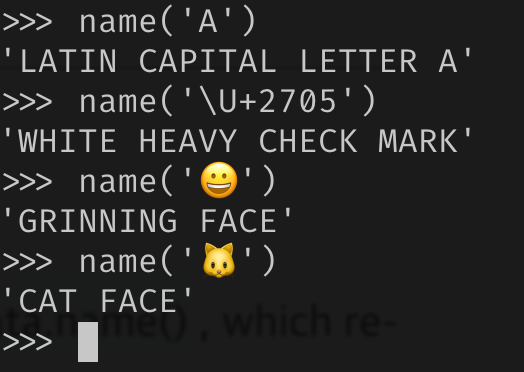

# Unicode Text Versus Bytes

Python3 introduced a sharp disctinction between string of human text and sequences of raw bytes.

## Character Issues

Concept of “string” is simple : a string is a sequence of characters. The problem lies in the definition of character.

Items that we get out of Python3 `str` is Unicode characters, just like the `unicode` obj in python2.

Unicode standard explicitly separates identity or character from specific byte representation

- The identity of character - its *code point* - is a number from 0 to 1,114,111 (base10) shown as 4 to 6 hex digits with `U+` prefix. Ranges from : `U+0000` to `U+10FFFF`

- The actual byte that represent a character depends on *encoding* in use. An Encoding algorithm converts code points to byte sequences & vice-versa. The code point for the letter A (`U++0041`) is encodd as single byte `\x41` in UTF-8 encoding or bytes `\x41\x00` in UTF-16LE Encoding.

````python
s = 'café'
len(s)	# 4
b = s.encode('utf8')
len(b)	# 5
````

## Byte Essentials

- There are two basic built-in types for binary sequences
  - immutable `byte` type (python3+)
  - mutable `bytearray` (python2.6+)
- python docs uses generic term to refer to these as “byte strings”

````python
cafe = bytes('café', encoding='utf8')
cafe	# b'caf\xc3\xa9' # notice 3 (caf) are printable but not the last one
cafe[0]	# 99 return int
cafe[:1]	# b'c'	wait isn't this should be same as above ? returns byte
cafe_arr = bytearray(cafe)	# bytearray(b'caf\xc3\xa9')
cafe_arr[-1:]	# bytearray(b'\xa9')
````

4 different types of display used to represent binary sequences

- for bytes with decimal codes 32-126 (space to tilde) Ascii character itself is used
- for bytes corresponding to tab, newline, carriage return, and `\` the escape sequences are `\t`, `\n`, `\r` and `\\` are used
- If both string delimiters `‘`, `“”` appear in byte sequence then whole sequence is delimited by `‘` and any `‘` inside are escaped using `\'`
- for other byte values a hexadecimal escape sequence is used. `\x00` is null byte

Both `byte` and `bytearray` support every `str` method except those that do fomatting and those that depend on Unicode data, including `casefold`, `isdecimal`, `isidentifier`, `isnumeric`, `isprintable` and `encode`.

All other functions and even `re` works fine on byte sequences.

Binary sequences have a class method that `str` doesn’t have, called from hex which builds a binary sequence by parsing pairs of hex digits optionally separated by spaces.

```python
bytes.fromhex('31 4B CE A9') # b'1K\xce\xa9'
```

## Basic Encoders/Decorders

Python distribution bundles more than 100 codecs (encoder/decoder) for text to byte conversion & vice-versa.

````python
for codec in ['latin_1', 'utf_8', 'utf_16']:
	print(codec, 'El Niño'.encode(codec), sep='\t')
  
latin_1 b'El Ni\xf1o'
utf_8   b'El Ni\xc3\xb1o'
utf_16  b'\xff\xfeE\x00l\x00 \x00N\x00i\x00\xf1\x00o\x00'
````

| Encoding  | Description                                                                       |
|-----------|-----------------------------------------------------------------------------------|
| latin1    | Basis for other encodings, such as cp1252 and Unicode; widely used in Western Europe. |
| cp1252    | Latin1 superset created by Microsoft, adding useful symbols like curly quotes and € (euro). |
| cp437     | Original character set of the IBM PC, with box drawing characters. Incompatible with latin1. |
| gb2312    | Legacy standard to encode simplified Chinese ideographs used in mainland China.      |
| utf-8     | Most common 8-bit encoding on the web, supporting a wide range of characters.         |
| utf-16le  | One form of the UTF 16-bit encoding scheme, supporting code points beyond U+FFFF.     |

## Understanding Encode/Decode Problems

Although there is generic `UnicodeError` exception, the error reported by Python is more specific, either `UnicodeEncodeError` or a `UnicodeDecodeError`.

### Coping with UnicodeEncodeError

Most non-UTF codecs handle only a small subset of Unicode characters. When converting text to bytes, if a character is not defined in target encoding `UnicodeEncodeError` is raised, unless special handling is provided by passing an `errors` args to the encoding method or function.

````python
city = 'São Paulo'
city.encode('utf_8')	# works
city.encode('cp437')	# raises error
city.encode('cp437', errors = 'ignore')	# we could pass option like ignore, replace, xmlcharrefreplace
````

Ascii is common subset of all encodings, so if `str.isascii` is true then your text never raise this error.

### Coping with UnicodeDecodeError

Not every byte holds a valid ASCII character, and not every byte sequence is valid UTF-8 or UTF-16; therefore, when you assume one of these encodings while converting a binary sequence to text, you will get a `UnicodeDecodeError` if unexpected bytes are found.

Note: many 8 bit legacy encoding silently convert without reporting errors so output maybe garbled.

### SyntaxError When Loading Modules with Unexpected Encoding

UTF-8 is the default source encoding for python3, just as ascii was for python2. If you load `a.py` module containing non-UTF-8 data and no encoding declaration you get a message like this :

```python
SyntaxError: Non-UTF-8 code starting with '\xe1' in file ola.py on line
```

Fix is very easy magic `coding` comment.

```python
# coding: cp1252

print('Olá, Mundo!')
```

### How to Discover the Encoding of a Byte Sequence

How do you find the encoding of a byte sequence? Short answer: you can’t. You must be told.

Some communication protocols and file formats, like HTTP and XML, contain headers that explicitly tell us how the content is encoded.

However, considering that human languages also have their rules and restrictions, once you assume that a stream of bytes is human *plain text*, it may be possible to sniff out its encoding using heuristics and statistics.

### BOM: A Useful Gremlin

you may have noticed a couple of extra bytes at the beginning of a UTF-16 encoded sequence.

````python
u16 = 'El Niño'.encode('utf_16')
u16
b'\xff\xfeE\x00l\x00 \x00N\x00i\x00\xf1\x00o\x00'
````

The bytes `b'\xff\xfe`. That is a BOM-byte-order-mark denoting the “little-endian”(least significant byte comes first) byte ordering of the intel CPU where the encoding was performed.

## Handling Text Files


As a thumb rule, `bytes` should be decoded to `str` as early as possible and then all operation should be done on `str` and then converted to `bytes` as late as possible.

Python3 makes it easier because `open()` built-in does the necessary decoding when reading and encoding when writing files in text mode. 

````python
open('cafe.txt', 'w', encoding='utf_8').write('café')
open('cafe.txt').read()	# notice how last char is garbled (default encoding error, windows use codepage 1252) (on linux/unix it should be fine)
````

### Beware of Encoding Defaults

several settings affect the encoding defaults for I/O in Python. NOTE its different in windows but on mac/linux/unix its same (utf_8) everywhere.

## Normalizing Unicode for Reliable Comparisons

String comparisions are complicated by the fact that Unicode has combining characters: diacritics and other marks that attach to the preceding characters, appearing as one when printed.

````python
# two ways to compose café word
s1 = 'café'	# len 4
s2 = 'cafe\N{COMBINING ACUTE ACCENT}'	# len 5
s1 == s2 # False
# In the Unicode standard, sequences like 'é' and 'e\u0301' are called “canonical equivalents,”
````

The solution is to use `unicodedata.normalize()`. Keyboard drivers usually generate composed characters, so text typed by users will be in NFC by default. However, to be safe, it may be good to normalize strings with `normalize('NFC', user_text)` before saving.

````python
from unicodedata import normalize, name
ohm = '\u2126'
name(ohm) # 'OHM SIGN'
ohm_c = normalize('NFC', ohm)
name(ohm_c)	# 'GREEK CAPITAL LETTER OMEGA'
ohm == ohm_c # False
normalize('NFC', ohm) == normalize('NFC', ohm_c) # True
````

### Case Folding

Case folding is essentially converting all text to lowercase, with some additional transformations. It is supported by the `str.casefold()` method.

For any string `s` containing only `latin1` characters, `s.casefold()` produces the same result as `s.lower()`, with only two exceptions—the micro sign `'µ'` is changed to the Greek lowercase mu (which looks the same in most fonts) and the German Eszett or “sharp s” (ß) becomes “ss”

There are nearly 300 code points for which `str.casefold()` and `str.lower()` return different results.

### Extreme “Normalization”: Taking Out Diacritics

The Google Search secret sauce involves many tricks, but one of them  apparently is ignoring diacritics (e.g., accents, cedillas, etc.), at  least in some contexts. Removing diacritics is not a proper form of  normalization because it often changes the meaning of words and may  produce false positives when searching. But it helps coping with some  facts of life: people sometimes are lazy or ignorant about the correct  use of diacritics, and spelling rules change over time, meaning that  accents come and go in living languages.

## Sorting Unicode Text

````python
fruits = ['caju', 'atemoia', 'cajá', 'açaí', 'acerola']
sorted(fruits) # ['acerola', 'atemoia', 'açaí', 'caju', 'cajá']
# but it should be ['açaí', 'acerola', 'atemoia', 'cajá', 'caju']
````

The standard way to sort non-ASCII text in Python is to use the `locale.strxfrm` function which, according to the `locale` module docs, “transforms a string to one that can be used in locale-aware comparisons.”

To enable `locale.strxfrm`, you must first set a suitable locale for your application, and pray that the OS supports it.

````python
import locale
my_locale = locale.setlocale(locale.LC_COLLATE, 'pt_BR.UTF-8')
print(my_locale)
fruits = ['caju', 'atemoia', 'cajá', 'açaí', 'acerola']
sorted_fruits = sorted(fruits, key=locale.strxfrm)
print(sorted_fruits)
````

- since locale settings are global, calling `setlocale` in a library is not recommended
- the locale must be installed on OS
- you must know how to spell the locale name
- locale must be implemented correctly by makes of the OS.

### Sorting with the Unicode Collation Algorithm

James Tauber, prolific Django contributor, must have felt the pain and created pyuca, a pure-Python implementation of the Unicode Collation Algorithm (UCA).

````python
import pyuca
coll = pyuca.Collator()
fruits = ['caju', 'atemoia', 'cajá', 'açaí', 'acerola']
sorted_fruits = sorted(fruits, key=coll.sort_key)
sorted_fruits  # ['açaí', 'acerola', 'atemoia', 'cajá', 'caju']
````

## The Unicode Database

The `unicodedata` module has functions to retrieve character metadata, including `unicodedata.name()`, which returns a character’s official name in the standard.

|  |
| ------------------------------------------------------------ |

## Dual-Mode str and bytes APIs

Python’s standard library has functions that accept `str` or `bytes` arguments and behave differently depending on the type.

### str Versus bytes in Regular Expressions

Regular expressions built with bytes patterns (\d and \w) only match  ASCII characters, while patterns built with str match Unicode digits or letters beyond ASCII. 

Additionally, the re module  offers the re.ASCII flag for str regular expressions, enabling  ASCII-only matching for certain patterns.

### str Versus bytes in os Functions

In the real world of GNU/Linux systems, filenames can contain byte  sequences that are not valid in any sensible encoding scheme, causing  issues with decoding to `str`. To handle this, functions in the `os` module accept filenames or pathnames as either `str` or `bytes`. When called with a `str` argument, they are automatically converted using the codec specified by `sys.getfilesystemencoding()`

However, if dealing with filenames that cannot be handled this way, passing `bytes` arguments to these functions returns `bytes` values, allowing handling of any file or pathname. The `os` module provides `os.fsencode()` and `os.fsdecode()` functions to assist in manual handling of `str` or `bytes` sequences as filenames or pathnames.